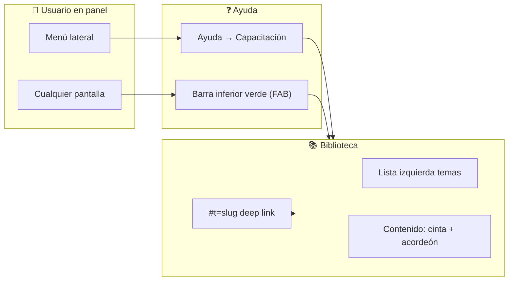
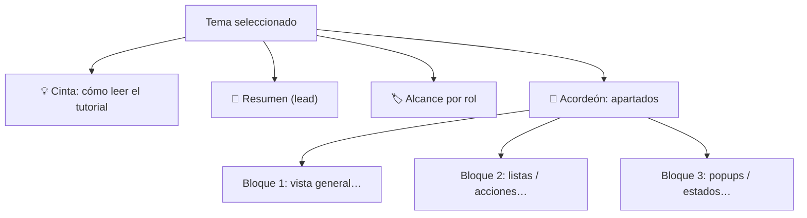
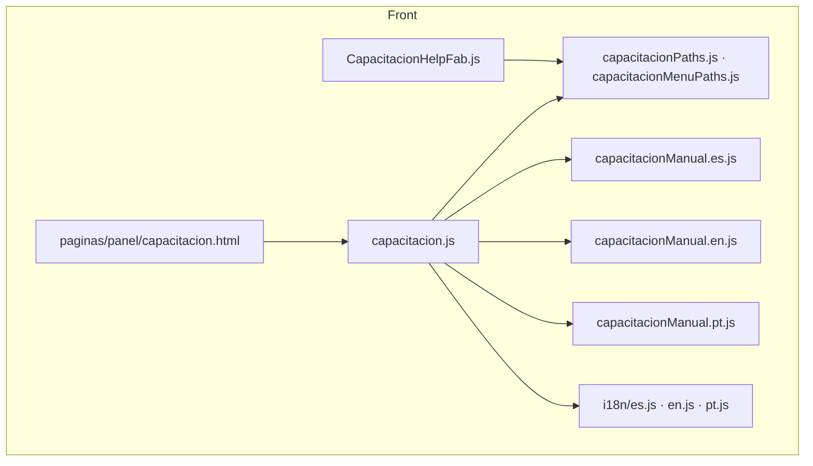
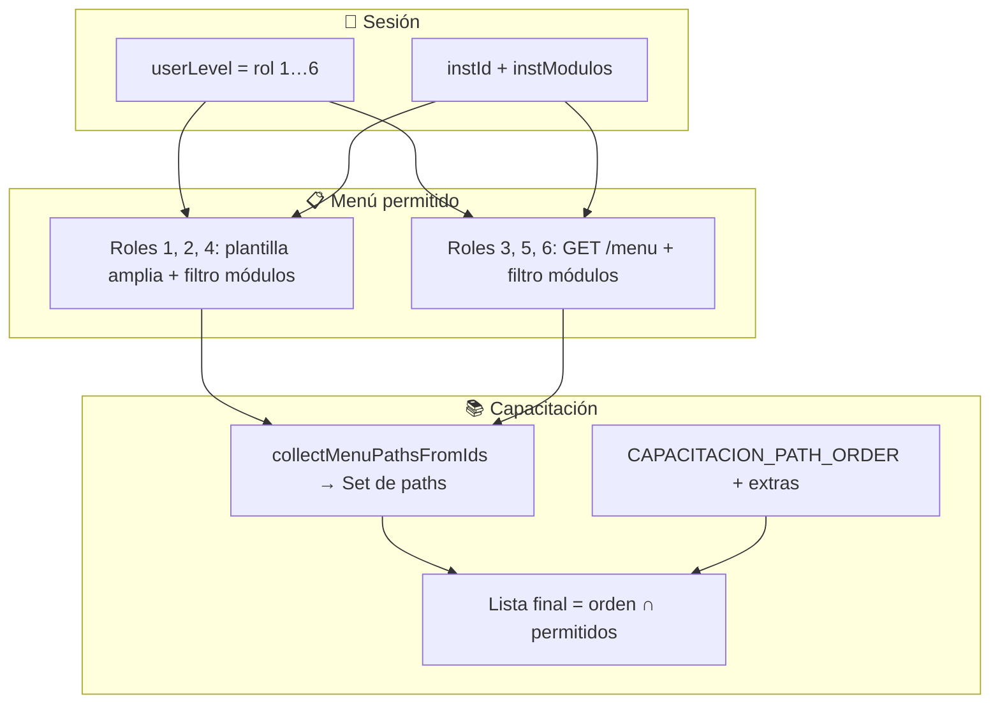
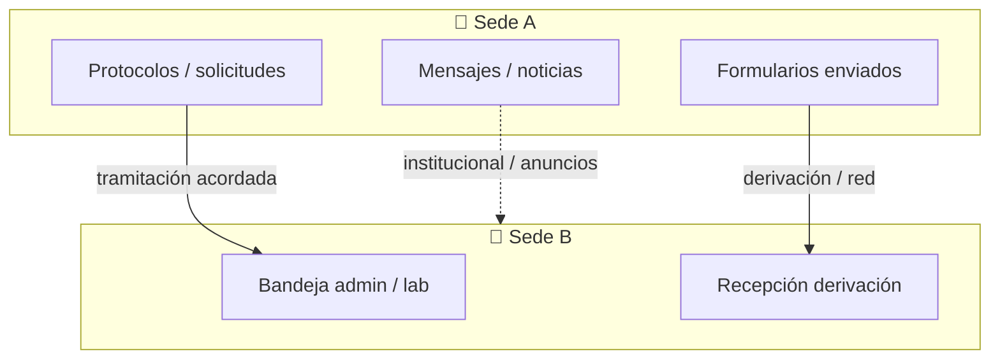

<!--
  CHECKLIST MAESTRO — Capacitación GROBO
  Objetivo: seguimiento de trabajo, calidad del manual y coherencia con el producto.
  Convención: [x] hecho · [ ] pendiente · marcar fecha/nombre en comentarios internos del equipo si lo desean.
-->

<div align="center">

# 📚 Checklist maestro — Capacitación

**Manual por rol · biblioteca `panel/capacitacion` · ayuda contextual (FAB)**

*Documento vivo: marcar casillas a medida que se avanza. Prioridad: claridad para el usuario final.*

</div>

---

## 📖 Índice rápido

| Sección | Contenido |
|--------|-----------|
| [1. Leyenda e iconos](#1--leyenda-e-iconos) | Estados, símbolos y colores semánticos |
| [2. Mapas visuales](#2--mapas-visuales-flujos) | Diagramas de flujo (Mermaid) |
| [3. Patrones de pantalla](#3--patrones-de-ui-en-grobo-listas-popups-crear--editar) | Listas, popups, crear/modificar |
| [4. Para qué sirve cada menú](#4--tabla-maestra-para-qué-sirve-cada-ruta-del-menú) | Tabla maestra por ruta |
| [5. Checklist por módulo](#5--checklist-por-módulo-contenido-del-manual) | Detalle por tema / slug |
| [6. Infraestructura técnica](#6--infraestructura-técnica) | Archivos, i18n, FAB, deep links |
| [7. Calidad y medios](#7--calidad-contenido-capturas-glosario) | Capturas, glosario, revisión |
| [8. QA y accesibilidad](#8--qa-manual-y-accesibilidad) | Pruebas por rol e idioma |
| [9. Extras](#9--extras-superadmin-registro-público-páginas-huérfanas) | QR, registro público, sub-rutas config |
| [10. Roles GROBO (1–6)](#10--roles-grobo-visibilidad-en-capacitación) | **No todos ven lo mismo** · matriz menú/capacitación |
| [11. RED multi-sede](#11--red-multi-sede-checklist-por-rol-y-área) | Protocolos, formularios, mensajes… por rol |

---

## 1 · Leyenda e iconos

### Estados del checklist

| Icono | Significado |
|:-----:|-------------|
| ✅ / `[x]` | Completado en código o contenido base |
| ⬜ / `[ ]` | Pendiente — **acción requerida** |
| 🔄 | En curso (asignar responsable en el equipo) |
| 👀 | Revisión funcional / texto con sede piloto |
| 🖼 | Falta captura, GIF o anotación visual |
| 🌐 | Revisar traducción EN / PT |

### Iconos de menú (referencia rápida)

| Icono | Uso en este doc |
|:-----:|-----------------|
| 🏠 | Dashboard / inicio |
| 👥 | Usuarios |
| 📄 | Protocolos / documentos |
| 🐾 | Animales |
| 🧪 | Reactivos / insumos |
| 📅 | Reservas |
| 🏠‍🔬 | Alojamientos |
| 📊 | Estadísticas |
| ⚙️ | Configuración |
| 📝 | Formularios / pedidos |
| 💬 | Mensajes |
| 📰 | Noticias |
| 💰 | Facturación / precios |
| ❓ | Ayuda (capacitación, soporte, ventas) |
| 🧩 | RED / multi-sede |

---

## 2 · Mapas visuales (flujos)

### 2.1 Vista general: dónde vive la capacitación



### 2.2 Qué ve el usuario dentro de un tema



### 2.3 Archivos clave (mantenimiento)



### 2.4 Cómo se decide “qué temas ve cada usuario” (por rol + módulos)

> **Regla de oro:** la lista izquierda de capacitación **no es** el manual completo para todos: es la **intersección** entre (a) rutas que el rol tiene en el menú, (b) filtros por **módulos contratados** (`instModulos`, `filterMenuIdsByModulos`), (c) reglas de `modulesAccess` para rutas `panel/*`, y (d) el orden `CAPACITACION_PATH_ORDER`, más rutas forzadas (`admin/dashboard` o `panel/dashboard`, `panel/capacitacion`, `capacitacion/tema/red`).



| Símbolo en tablas siguientes | Significado |
|:----------------------------:|-------------|
| **●** | Suele ver el tema en capacitación (plantilla o panel estándar) |
| **◐** | **Condicional:** `menudistr`, módulo desactivado, o `invHasData` (investigador con historial en ese módulo) |
| **○** | No suele aparecer: ese rol no tiene esa ruta en menú |

**Nombres oficiales** (clave `window.txt.roles` en i18n):

| ID | Nombre UI | Perfil operativo (resumen) |
|:--:|-----------|----------------------------|
| **1** | GeckoDev | Maestro / implementación; menú tipo admin amplio + filtros módulo |
| **2** | Superadmin | Administración de sede / institución (alto alcance) |
| **4** | Admin | Administrador de sede |
| **3** | Investigador | Carga protocolos/pedidos; menú **panel** + dropdown investigación |
| **5** | Asistente | Apoyo a investigación; mismo esquema **panel** con permisos según `menudistr` |
| **6** | Laboratorio | Operación bioterio lado “usuario”; panel con módulos acordes |

> Un **investigador** o **laboratorio** **no** ve la misma biblioteca que **Admin** o **GeckoDev**: si falta un tema, en casi todos los casos es **correcto** (no es bug), salvo error de configuración de menú o módulo.

---

## 3 · Patrones de UI en GROBO (listas, popups, crear / editar)

> **Objetivo del manual:** que quien lee sepa *qué es cada cosa en pantalla* y *para qué sirve*, no solo el nombre del menú.

### 3.1 Listas y tablas (grillas)

| Qué suele verse | Para qué sirve | Qué documentar en el manual |
|-----------------|----------------|-----------------------------|
| **Lista / tabla** principal | Ver muchos registros a la vez; ordenar, filtrar | Columnas clave, filtros superiores, paginación si existe |
| **Clic en fila** | Abrir detalle, ficha o modal | “Al hacer clic…” |
| **Botones en toolbar** | Crear, exportar (Excel/PDF), refrescar | Cada botón y cuándo usarlo |
| **Badges / estados** | Saber en qué etapa está un trámite | Tabla “estado → significado” si la sede lo personaliza |

- [ ] ⬜ En cada tema administrativo: ¿el manual nombra **filtros** y **columnas críticas**?
- [ ] ⬜ En temas de pedidos: ¿se explica la **lista** vs el **detalle** del ítem?

### 3.2 Popups, modales y alertas (SweetAlert2, Bootstrap modal, etc.)

| Tipo | Uso típico en GROBO | Qué poner en capacitación |
|------|---------------------|---------------------------|
| **Confirmación** | “¿Seguro que desea…?” antes de borrar o cerrar | Advertir consecuencias (facturación, irreversibilidad) |
| **Formulario en modal** | Crear/editar rápido sin salir de la lista | Campos obligatorios y validaciones visibles |
| **Mensaje de éxito / error** | Feedback tras guardar o fallo API | “Verá un mensaje de…” + qué hacer si falla |
| **Carga (loader)** | Mientras la API responde | Indicar que puede tardar en listas grandes |

**Plantilla sugerida para un bloque del acordeón (popups):**

1. **Disparador:** qué botón o acción abre el popup.  
2. **Campos:** qué debe completar el usuario.  
3. **Guardar / Cancelar:** qué cambia en la lista al confirmar.  
4. **Errores:** mensajes típicos (validación, permiso, sesión).

- [ ] ⬜ Temas con flujos críticos: ¿incluyen sub-apartado **“Ventanas emergentes”** o **“Confirmaciones”**?

### 3.3 Crear y modificar (flujo típico)

```text
┌─────────────────────────────────────────────────────────┐
│  LISTA                         →  [Nuevo] o clic fila   │
├─────────────────────────────────────────────────────────┤
│  FORMULARIO / FICHA / MODAL    →  campos + Guardar      │
├─────────────────────────────────────────────────────────┤
│  FEEDBACK (toast / Swal)       →  éxito o error         │
├─────────────────────────────────────────────────────────┤
│  LISTA actualizada             →  registro nuevo o      │
│                                →  datos actualizados    │
└─────────────────────────────────────────────────────────┘
```

- [ ] ⬜ ¿El manual describe **crear** y **editar** por separado cuando el flujo difiere?
- [ ] ⬜ ¿Se indica si la edición es solo **admin** o también **investigador**?

---

## 4 · Tabla maestra: para qué sirve cada ruta del menú

> Rutas alineadas a `CAPACITACION_PATH_ORDER` + menú `MenuTemplates`.  
> **Slug** = `menuPath` con `/` → `__` (ej. `admin/usuarios` → `admin__usuarios`).

| Ruta `path` | Slug (hash `#t=`) | Para qué sirve (resumen operativo) | Rol típico |
|-------------|-------------------|-----------------------------------|------------|
| `admin/dashboard` | `admin__dashboard` | Punto de entrada admin: atajos y visión del día | Admin sede, superadmin contexto |
| `panel/dashboard` | `panel__dashboard` | Inicio investigador: enlaces a pedidos y actividad | Investigador |
| `capacitacion/tema/red` | `capacitacion__tema__red` | Conceptos RED: sedes, mensajes, facturación cruzada | Todos (lectura) |
| `admin/usuarios` | `admin__usuarios` | Directorio de personas, roles, ficha, exportaciones | Admin |
| `admin/protocolos` | `admin__protocolos` | **Protocolos en operación** (vigencia, especies, vínculo pedidos) | Admin / bioterio |
| `admin/solicitud_protocolo` | `admin__solicitud_protocolo` | **Trámites** de alta/renovación (cola de solicitudes) | Admin / comité (según sede) |
| `admin/animales` | `admin__animales` | Bandeja de pedidos de animales vivos | Bioterio |
| `admin/reactivos` | `admin__reactivos` | Pedidos de reactivos | Lab / depósito |
| `admin/insumos` | `admin__insumos` | Pedidos de insumos | Depósito |
| `admin/reservas` | `admin__reservas` | Agenda salas/equipos (admin) | Infraestructura |
| `admin/alojamientos` | `admin__alojamientos` | Estadías, cajas, cierre facturable | Bioterio |
| `admin/estadisticas` | `admin__estadisticas` | Indicadores y reportes agregados | Dirección / calidad |
| `admin/configuracion/config` | `admin__configuracion__config` | **Hub** de parámetros (submenús múltiples) | Admin configuración |
| `panel/formularios` | `panel__formularios` | Entrada a **animales / reactivos / insumos** (según módulos) | Investigador |
| `panel/misformularios` | `panel__misformularios` | Historial unificado de pedidos propios | Investigador |
| `panel/misalojamientos` | `panel__misalojamientos` | Consulta de alojamientos vinculados | Investigador |
| `panel/misreservas` | `panel__misreservas` | Reservas propias | Investigador |
| `panel/misprotocolos` | `panel__misprotocolos` | Protocolos en los que participa; vigencia | Investigador |
| `admin/precios` | `admin__precios` | Tarifas y listas para facturación | Finanzas / admin |
| `admin/facturacion/index` | `admin__facturacion__index` | Informes contables (subvistas) | Finanzas |
| `admin/historialcontable` | `admin__historialcontable` | Movimientos y auditoría contable | Finanzas |
| `panel/mensajes` | `panel__mensajes` | Mensajería 1:1 | Todos (con módulo) |
| `panel/mensajes_institucion` | `panel__mensajes_institucion` | Canal institucional / RED | Todos (con módulo) |
| `admin/comunicacion/noticias` | `admin__comunicacion__noticias` | **Publicar** noticias del portal | Comunicación / admin |
| `panel/noticias` | `panel__noticias` | **Leer** noticias | Todos (con módulo) |
| `panel/perfil` | `panel__perfil` | Datos personales, idioma, tema | Todos |
| `panel/soporte` | `panel__soporte` | Tickets técnicos Gecko (turnos) | Todos (con módulo) |
| `panel/ventas` | `panel__ventas` | Consulta comercial por correo a ventas | Todos (con módulo) |
| `panel/capacitacion` | `panel__capacitacion` | Esta biblioteca de ayuda | Todos (con módulo) |

**Submenús que no son una ruta única en el orden del manual (documentar dentro del padre):**

| Agrupación | Ítems hijos | Notas |
|------------|-------------|--------|
| **Investigación** (id `55`) | Mis formularios, alojamientos, reservas, protocolos, mensajes | Visibilidad por `pathVisibleForModules` |
| **Contable** (id `202`) | Precios, facturación, historial | Ya listados como rutas propias arriba |
| **Ayuda** (id `998`) | Capacitación, ticket, ventas | Rutas `panel/…` |
| **Perfil** (id `999`) | Mi perfil, salir | `logout` no entra al manual |

---

## 5 · Checklist por módulo (contenido del manual)

> Para **cada** fila: marcar 👀 revisión sede, 🖼 si faltan capturas, 🌐 si hay que pulir EN/PT.

### 5.1 Infraestructura del producto capacitación

| # | Tarea | Estado |
|---|--------|--------|
| 1 | Página `panel/capacitacion` (lista + contenido + Bootstrap bundle) | [x] |
| 2 | Catálogo alineado a `MenuTemplates` + tema `capacitacion/tema/red` | [x] |
| 3 | `admin/dashboard` y `panel/dashboard` inyectados según rol | [x] |
| 4 | Filtrado por `/menu` + `filterMenuIdsByModulos` | [x] |
| 5 | Deep link `#t=slug` | [x] |
| 6 | `CapacitacionHelpFab` (barra inferior) | [x] |
| 7 | Manuales `capacitacionManual.{es,en,pt}.js` | [x] |
| 8 | Acordeones + cinta “cómo leer” + fallback `bodies` | [x] |
| 9 | i18n UI capacitación (banner, FAB, roles_label, RED…) | [x] |

### 5.2 Administración — contenido por tema

| Ruta | Slug | Contenido base | 👀 Revisión sede | 🖼 Medios | Listas / popups documentados |
|------|------|----------------|------------------|-----------|------------------------------|
| `admin/dashboard` | `admin__dashboard` | [x] | [ ] | [ ] | [ ] |
| `admin/usuarios` | `admin__usuarios` | [x] | [ ] | [ ] | [ ] |
| `admin/protocolos` | `admin__protocolos` | [x] | [ ] | [ ] | [ ] |
| `admin/solicitud_protocolo` | `admin__solicitud_protocolo` | [x] | [ ] | [ ] | [ ] |
| `admin/animales` | `admin__animales` | [x] | [ ] | [ ] | [ ] |
| `admin/reactivos` | `admin__reactivos` | [x] | [ ] | [ ] | [ ] |
| `admin/insumos` | `admin__insumos` | [x] | [ ] | [ ] | [ ] |
| `admin/reservas` | `admin__reservas` | [x] | [ ] | [ ] | [ ] |
| `admin/alojamientos` | `admin__alojamientos` | [x] | [ ] | [ ] | [ ] |
| `admin/estadisticas` | `admin__estadisticas` | [x] | [ ] | [ ] | [ ] |
| `admin/configuracion/config` | `admin__configuracion__config` | [x] | [ ] | [ ] | [ ] |
| `admin/precios` | `admin__precios` | [x] | [ ] | [ ] | [ ] |
| `admin/facturacion/index` | `admin__facturacion__index` | [x] | [ ] | [ ] | [ ] |
| `admin/historialcontable` | `admin__historialcontable` | [x] | [ ] | [ ] | [ ] |
| `admin/comunicacion/noticias` | `admin__comunicacion__noticias` | [x] | [ ] | [ ] | [ ] |

### 5.3 Panel investigador / usuario

| Ruta | Slug | Contenido base | 👀 | 🖼 | Listas / popups |
|------|------|----------------|----|----|-----------------|
| `panel/dashboard` | `panel__dashboard` | [x] | [ ] | [ ] | [ ] |
| `panel/formularios` | `panel__formularios` | [x] | [ ] | [ ] | [ ] |
| `panel/misformularios` | `panel__misformularios` | [x] | [ ] | [ ] | [ ] |
| `panel/misalojamientos` | `panel__misalojamientos` | [x] | [ ] | [ ] | [ ] |
| `panel/misreservas` | `panel__misreservas` | [x] | [ ] | [ ] | [ ] |
| `panel/misprotocolos` | `panel__misprotocolos` | [x] | [ ] | [ ] | [ ] |
| `panel/mensajes` | `panel__mensajes` | [x] | [ ] | [ ] | [ ] |
| `panel/mensajes_institucion` | `panel__mensajes_institucion` | [x] | [ ] | [ ] | [ ] |
| `panel/noticias` | `panel__noticias` | [x] | [ ] | [ ] | [ ] |
| `panel/perfil` | `panel__perfil` | [x] | [ ] | [ ] | [ ] |
| `panel/soporte` | `panel__soporte` | [x] | [ ] | [ ] | [ ] |
| `panel/ventas` | `panel__ventas` | [x] | [ ] | [ ] | [x] |
| `panel/capacitacion` | `panel__capacitacion` | [x] | [ ] | [ ] | [ ] |

### 5.4 Transversal

| Ruta | Slug | Contenido base | 👀 | 🖼 |
|------|------|----------------|----|-----|
| `capacitacion/tema/red` | `capacitacion__tema__red` | [x] | [ ] | [ ] |

---

## 6 · Infraestructura técnica

### 6.1 Archivos — checklist de mantenimiento

| Archivo | Responsabilidad | Verificar |
|---------|-----------------|-----------|
| `front/paginas/panel/capacitacion.html` | Layout, Bootstrap CSS+JS, banner i18n | [x] |
| `front/dist/js/pages/usuario/capacitacion.js` | Lista temas, `topicHtml`, hash, idioma manual | [x] |
| `front/dist/js/utils/capacitacionPaths.js` | `pathnameToMenuPath`, `menuPathToSlug` | [x] |
| `front/dist/js/utils/capacitacionMenuPaths.js` | `CAPACITACION_PATH_ORDER`, `collectMenuPathsFromIds` | [x] |
| `front/dist/js/components/CapacitacionHelpFab.js` | FAB contextual + rutas permitidas | [x] |
| `front/dist/js/utils/capacitacionManual.es.js` | Capítulos ES | [x] |
| `front/dist/js/utils/capacitacionManual.en.js` | Capítulos EN | [x] |
| `front/dist/js/utils/capacitacionManual.pt.js` | Capítulos PT | [x] |
| `front/dist/js/utils/i18n/{es,en,pt}.js` | `capacitacion.*`, `titulos_pagina`, menú ayuda | [x] |

### 6.2 Reglas al añadir una pantalla nueva al producto

- [ ] ⬜ Añadir `path` en `MenuTemplates.js` (o venir del backend si aplica).
- [ ] ⬜ Si aplica a investigador: registro en `modulesAccess.js` (`PATH_RULES`).
- [ ] ⬜ Incluir ruta en `CAPACITACION_PATH_ORDER` (posición lógica).
- [ ] ⬜ Crear slug y capítulo en **los tres** `capacitacionManual.*.js`.
- [ ] ⬜ Añadir `titulos_pagina` + `PATH_TO_TITLE_KEY` en `i18n.js` si hay `data-page-title-key`.
- [ ] ⬜ Probar FAB: `pathnameToMenuPath` debe resolver la nueva página.
- [ ] ⬜ Actualizar **esta tabla maestra** (sección 4) y la sub-sección 5 correspondiente.

### 6.3 Deep links de ejemplo (para pruebas)

```text
…/paginas/panel/capacitacion.html#t=admin__protocolos
…/paginas/panel/capacitacion.html#t=admin__solicitud_protocolo
…/paginas/panel/capacitacion.html#t=capacitacion__tema__red
…/paginas/panel/capacitacion.html#t=panel__ventas   ← tras añadir manual
```

---

## 7 · Calidad, contenido, capturas, glosario

### 7.1 Estándar mínimo por capítulo (`CHAPTERS[slug]`)

- [ ] ⬜ **`summary`:** 1–3 frases; responde “¿qué es esta pantalla?”
- [ ] ⬜ **`roles`:** quién debería leerlo; quién **no** debería asumir permisos
- [ ] ⬜ **Cada `block`:** título claro (`h`) + HTML con `<ul>` / pasos donde proceda
- [ ] ⬜ Mención explícita de **lista principal** vs **detalle** / **ficha**
- [ ] ⬜ Si hay **SweetAlert** o **modal Bootstrap**: apartado o viñeta dedicada
- [ ] ⬜ Enlace o referencia a **pantallas relacionadas** (ej. protocolos ↔ solicitud ↔ pedidos)

### 7.2 Glosario sugerido (ampliar en manual o wiki interna)

| Término | Definición corta para el manual |
|---------|----------------------------------|
| **Sede / institución** | Unidad en la que opera el usuario y sus datos |
| **RED** | Varias sedes bajo misma dependencia; flujos pueden cruzarse |
| **Protocolo (operativo)** | Entidad autorizada para pedidos y alojamiento |
| **Solicitud de protocolo** | Trámite para alta/cambio ante comité o admin |
| **Módulo** | Funcionalidad contratable; puede ocultar menús |
| **Slug** | Identificador estable del tema en la URL `#t=` |

### 7.3 Capturas y GIFs (opcional pero recomendado)

- [ ] ⬜ Definir carpeta única: ej. `docs/img/capacitacion/` o CDN institucional
- [ ] ⬜ Nombrar archivos: `{slug}-{pantalla}-{lang}.png`
- [ ] ⬜ En `blocks[].html`, insertar `<figure>` o `` con `alt` descriptivo
- [ ] ⬜ GIF solo para flujos de **más de 3 clics** (crear pedido, enviar formulario)
- [ ] ⬜ **Anonimizar** datos personales en capturas

---

## 8 · QA manual y accesibilidad

### 8.1 Matriz de pruebas rápidas

| Caso | Pasos | Esperado | ⬜ |
|------|--------|----------|---|
| Investigador | Login rol 3–6, abrir capacitación | Solo temas de su menú filtrado + RED | [ ] |
| Admin sede | Login rol 2/4, abrir capacitación | Temas admin + contable + comunicación según API | [ ] |
| FAB | Abrir `admin/usuarios`, mirar barra inferior | Enlace a `#t=admin__usuarios` | [ ] |
| Acordeón | Abrir un tema largo, expandir/colapsar | Bootstrap JS funciona | [ ] |
| Idioma | Cambiar ES → EN → PT | Textos UI + capítulos coherentes | [ ] |
| Hash | Pegar URL con `#t=` | Se selecciona el tema correcto | [ ] |
| Sin tema | Rol sin un módulo | Ese ítem **no** aparece en la lista izquierda | [ ] |

### 8.2 Accesibilidad (mejoras futuras)

- [ ] ⬜ Revisar `aria-label` / `role` en lista de temas y acordeón
- [ ] ⬜ Contraste de la cinta verde y badges en tema claro/oscuro
- [ ] ⬜ Navegación solo teclado en lista lateral

---

## 9 · Extras: superadmin, registro público, páginas huérfanas

| Área | Situación | Acción sugerida |
|------|-----------|-----------------|
| **Superadmin** | FAB suele no aplicar o rutas distintas | [ ] ⬜ Documentar exclusión o mapeo en `pathnameToMenuPath` |
| **Registro / login público** | Sin menú panel | [ ] ⬜ Manual aparte o enlace a groboapp.com |
| **QR / salas** | Pueden no pasar por menú estándar | [ ] ⬜ Entrada “padre” en checklist o FAQ interno |
| **Configuración sub-rutas** | Muchas URLs bajo `admin/configuracion/*` | [ ] ⬜ Ampliar `pathnameToMenuPath` o capítulos hijos en el manual del hub |

---

## 10 · Roles GROBO: visibilidad en capacitación

### 10.1 Matriz **ruta × rol** (lista izquierda del manual)

> Leyenda: **●** típico · **◐** según institución/módulos/menú · **○** no aplica.  
> Ajustar celdas si su `menudistr` otorga excepciones reales.

| Ruta / tema | 1 Gecko | 2 Super | 4 Admin | 3 Inv | 5 Asist | 6 Lab |
|-------------|:---:|:---:|:---:|:---:|:---:|:---:|
| `admin/dashboard` | ● | ● | ● | ○ | ○ | ○ |
| `panel/dashboard` | ○ | ○ | ○ | ● | ● | ● |
| `capacitacion/tema/red` | ● | ● | ● | ● | ● | ● |
| `admin/usuarios` | ● | ● | ● | ○ | ○ | ○ |
| `admin/protocolos` | ● | ● | ● | ○ | ○ | ○ |
| `admin/solicitud_protocolo` | ● | ● | ● | ○ | ○ | ○ |
| `admin/animales` | ◐ | ◐ | ◐ | ○ | ○ | ○ |
| `admin/reactivos` | ◐ | ◐ | ◐ | ○ | ○ | ○ |
| `admin/insumos` | ◐ | ◐ | ◐ | ○ | ○ | ○ |
| `admin/reservas` | ◐ | ◐ | ◐ | ○ | ○ | ○ |
| `admin/alojamientos` | ◐ | ◐ | ◐ | ○ | ○ | ○ |
| `admin/estadisticas` | ◐ | ◐ | ◐ | ○ | ○ | ○ |
| `admin/configuracion/config` | ◐ | ◐ | ◐ | ○ | ○ | ○ |
| `panel/formularios` | ◐ | ◐ | ◐ | ◐ | ◐ | ◐ |
| `panel/misformularios` | ◐ | ◐ | ◐ | ◐ | ◐ | ◐ |
| `panel/misalojamientos` | ◐ | ◐ | ◐ | ◐ | ◐ | ◐ |
| `panel/misreservas` | ◐ | ◐ | ◐ | ◐ | ◐ | ◐ |
| `panel/misprotocolos` | ◐ | ◐ | ◐ | ◐ | ◐ | ◐ |
| `admin/precios` | ◐ | ◐ | ◐ | ○ | ○ | ○ |
| `admin/facturacion/index` | ◐ | ◐ | ◐ | ○ | ○ | ○ |
| `admin/historialcontable` | ◐ | ◐ | ◐ | ○ | ○ | ○ |
| `panel/mensajes` | ◐ | ◐ | ◐ | ◐ | ◐ | ◐ |
| `panel/mensajes_institucion` | ◐ | ◐ | ◐ | ◐ | ◐ | ◐ |
| `admin/comunicacion/noticias` | ◐ | ◐ | ◐ | ◐ | ◐ | ○ |
| `panel/noticias` | ◐ | ◐ | ◐ | ◐ | ◐ | ◐ |
| `panel/perfil` | ● | ● | ● | ● | ● | ● |
| `panel/soporte` | ◐ | ◐ | ◐ | ◐ | ◐ | ◐ |
| `panel/ventas` | ◐ | ◐ | ◐ | ◐ | ◐ | ◐ |
| `panel/capacitacion` | ● | ● | ● | ● | ● | ● |

### 10.2 Checklist de redacción **por perfil** (qué debe aclarar el manual)

#### 🦎 Rol 1 — GeckoDev
- [ ] ⬜ Textos que no asuman **una sola sede** si prueban con `instId` 0 o varias.
- [ ] ⬜ Distinguir “lo que ve un Gecko en soporte” vs “lo que ve un usuario institucional”.
- [ ] ⬜ Si comparten capturas: etiquetar **rol** y **sede** en el pie de figura.

#### 🏛 Rol 2 — Superadmin
- [ ] ⬜ Misma base que Admin (4) pero mencionar **alcance** (varias sedes / políticas) donde aplique.
- [ ] ⬜ Noticias admin (205) y mensajería 204 según `MenuController` / `menudistr`.

#### ⚙️ Rol 4 — Admin
- [ ] ⬜ Cada tema **admin/** debe explicar **impacto en investigadores** (estados de pedido, facturación).
- [ ] ⬜ Configuración: remitir a subsecciones reales (institución, especies, reservas…).
- [ ] ⬜ Contable (202): precios, facturación, historial como **flujo** (orden de uso).

#### 🔬 Rol 3 — Investigador
- [ ] ⬜ Énfasis en **Mis formularios**, **Mis protocolos**, **Centro de solicitudes** y vínculo con admin.
- [ ] ⬜ Dejar claro qué **no** puede tocar (bandejas admin, facturación).
- [ ] ⬜ RED: derivación de formularios / mensajes si su sede lo usa.

#### 📎 Rol 5 — Asistente
- [ ] ⬜ Igual que investigador + **qué permisos extra** puede tener según institución (documentar en sede piloto).
- [ ] ⬜ Si puede enviar formularios a nombre de equipo: indicarlo en manual **Mis formularios**.

#### 🧪 Rol 6 — Laboratorio
- [ ] ⬜ Enfocado en **pedidos entrantes**, **reservas**, **alojamientos** en vista panel si los tiene.
- [ ] ⬜ No mezclar narrativa de “titular de protocolo” si el rol es puramente operativo (validar con RR.HH. / sede).

### 10.3 QA específico “por rol” (marcar en cada release de contenido)

| ⬜ | Acción |
|---|--------|
| [ ] | Iniciar sesión como **3, 5, 6** y anotar lista exacta de temas mostrados; comparar con matriz 10.1 |
| [ ] | Iniciar sesión como **4** (y **2** si aplica) y repetir |
| [ ] | Iniciar sesión como **1** solo en entorno de prueba; validar FAB + capacitación |
| [ ] | Desactivar un módulo (ej. reactivos) en una sede de prueba: confirmar que **desaparece** el tema correspondiente |
| [ ] | Campo `chapter.roles` en `capacitacionManual.*.js` alineado con la matriz (sin prometer pantallas admin a investigador) |

---

## 11 · RED multi-sede: checklist por rol y área

> En RED coexisten **varias sedes** bajo una dependencia. El manual global (`capacitacion__tema__red`) da el marco; **cada área** debe tener matices por rol en los capítulos que correspondan.

### 11.1 Áreas funcionales en RED (inventario para documentar)

| Área | Archivos / módulos típicos (referencia código) | Qué debe explicar el manual |
|------|-----------------------------------------------|-----------------------------|
| **A. Protocolos** | `user/protocols/network-*`, `protocols/transmit`, solicitudes internas | Transmisión entre sedes, estados, **Mis protocolos** vs **Protocolos admin** |
| **B. Formularios y envíos** | `forms/derivation/*`, centro de solicitudes | Derivación, aceptar/devolver, historial; **quién** en cada sede actúa |
| **C. Mensajes** | `comunicacion/mensajes/*` | Mensajes **personales** vs **institucionales** y alcance RED |
| **D. Noticias** | `comunicacion/noticias`, admin noticias | Noticias de sede vs comunicación transversal |
| **E. Facturación / costos** | `admin/facturacion/*`, `historialcontable` | Consolidación por sede, evitar doble imputación entre sedes |
| **F. Alojamientos / logística** | alojamientos, QR, trazabilidad | Si la red comparte políticas de caja o solo datos de lectura |

### 11.2 Matriz **área RED × rol** (contenido a revisar / ampliar)

| Área ↓ / Rol → | 1 Gecko | 2 Super | 4 Admin | 3 Inv | 5 Asist | 6 Lab |
|----------------|:---:|:---:|:---:|:---:|:---:|:---:|
| **A. Protocolos RED** | ◐ | ● | ● | ● | ◐ | ◐ |
| **B. Formularios / derivación** | ◐ | ● | ● | ● | ● | ◐ |
| **C. Mensajes (institucional)** | ◐ | ● | ◐ | ● | ● | ◐ |
| **D. Noticias** | ◐ | ● | ◐ | ● | ● | ● |
| **E. Facturación multi-sede** | ◐ | ● | ● | ○ | ○ | ○ |
| **F. Alojamientos / trazabilidad** | ◐ | ● | ● | ◐ | ◐ | ● |

- **●** = el capítulo del rol debe cubrir explícitamente el matiz RED (o enlace al tema `capacitacion__tema__red`).
- **◐** = solo si la institución contrata / habilita; validar con sede piloto.

### 11.3 Checklist de profundidad RED (por área)

**A. Protocolos**
- [ ] ⬜ Investigador: solicitudes de red, adjuntos, estados “pendiente en sede X”.
- [ ] ⬜ Admin: bandeja que recibe o envía trámites; coherencia con **Solicitud de protocolo** local.
- [ ] ⬜ Diferencia **protocolo operativo** vs **tramitación RED** en textos y capturas.

**B. Formularios / pedidos**
- [ ] ⬜ Flujo **origen → derivación → sede destino** en un diagrama (Mermaid o figura).
- [ ] ⬜ Lista de estados visibles en **Mis formularios** cuando hay derivación.
- [ ] ⬜ Popups de confirmación al derivar / aceptar / rechazar.

**C. Mensajes**
- [ ] ⬜ Cuándo usar mensaje 1:1 vs mensajería institucional en contexto RED.
- [ ] ⬜ “Responder a” y notificaciones por correo si aplica.

**D. Noticias**
- [ ] ⬜ Redactor (admin noticias): segmentación o convención por sede.
- [ ] ⬜ Lector: cómo saber si la noticia afecta solo a su sede.

**E. Facturación**
- [ ] ⬜ Informes por sede / departamento; riesgo de duplicar costos entre sedes.
- [ ] ⬜ Solo roles 2/4 (y 1 en soporte): no mezclar con narrativa de investigador.

**F. Alojamientos**
- [ ] ⬜ Si hay códigos o QR compartidos entre sedes: permisos de lectura.
- [ ] ⬜ Laboratorio (6): qué ve frente a pedidos de otra sede (si aplica).

### 11.4 Diagrama conceptual RED (referencia para documentación)



---

<div align="center">

### 📌 Recordatorio para el equipo de redacción

**Un buen tema de capacitación responde en este orden:**  
**1)** ¿Para qué entro aquí? → **2)** ¿Qué veo (lista, botones)? → **3)** ¿Qué pasa si creo/edito/cierro (popups)? → **4)** ¿A qué otra pantalla me lleva esto?

*Última ampliación: roles 1–6 (visibilidad distinta), RED por área y por rol, diagrama de filtrado menú/módulos.*

</div>
