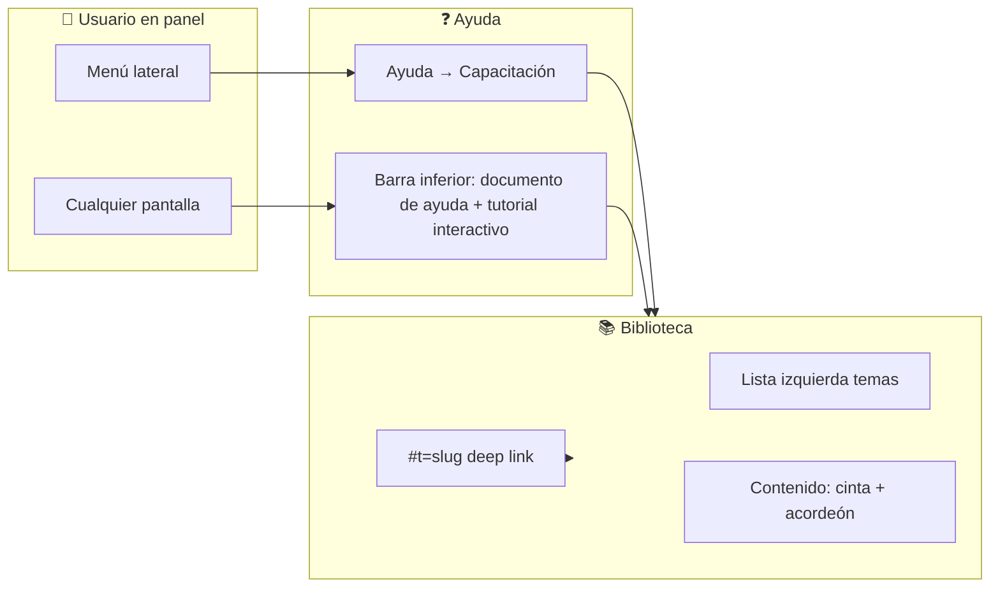
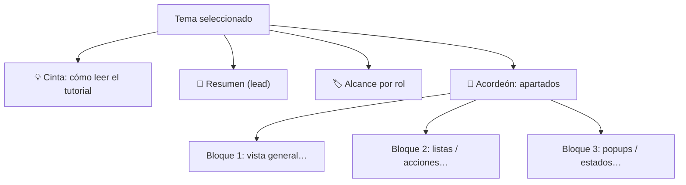
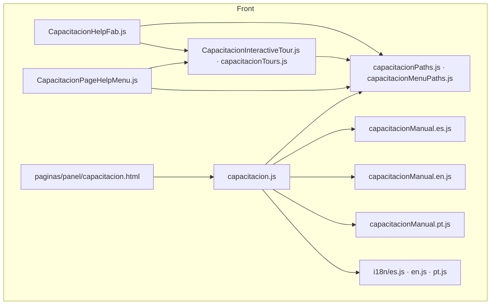
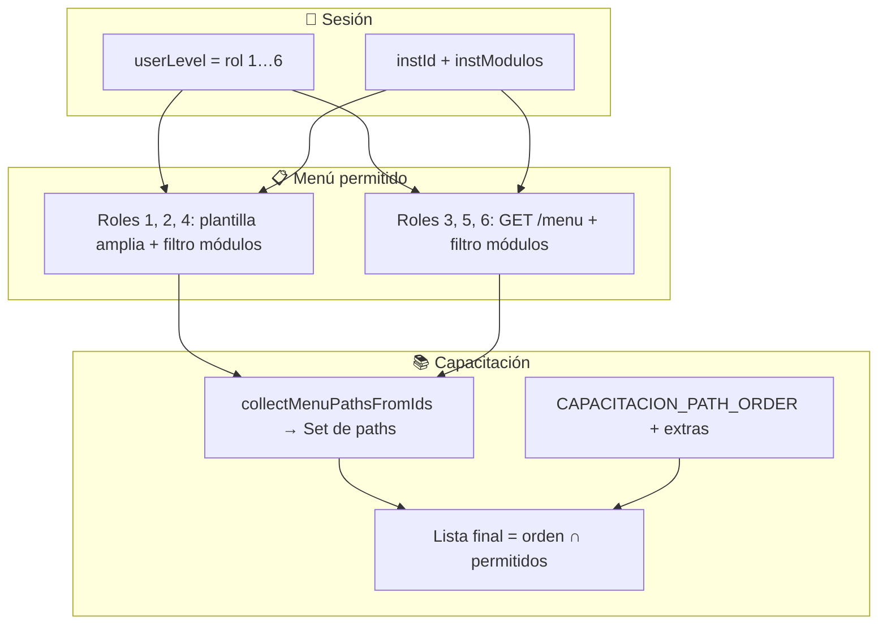
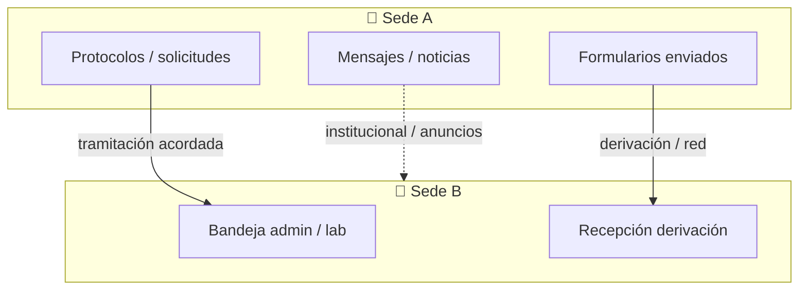

<!--
  CHECKLIST MAESTRO — Capacitación GROBO
  Objetivo: seguimiento de trabajo, calidad del manual y coherencia con el producto.
  Convención: [x] hecho · [ ] pendiente · marcar fecha/nombre en comentarios internos del equipo si lo desean.
  Ampliaciones nuevas a este `.md`: preferir **≥15 ítems** por lote (tabla o lista cohesionada), salvo corrección puntual o typo.
-->

<div align="center">

# 📚 Checklist maestro — Capacitación

**Manual por rol · biblioteca `panel/capacitacion` · barra inferior (documento de ayuda + tutorial interactivo) · menú Ayuda junto a Excel**

*Documento vivo: marcar casillas a medida que se avanza. Prioridad: claridad para el usuario final.*

</div>

---

## 📖 Índice rápido

| Sección | Contenido |
|--------|-----------|
| [Uso rápido](#uso-rápido-del-checklist) | Atajos: pantalla nueva, **§4.1** auditar ruta, solo textos, cerrar tema (**§3.4**), **Facturación admin F7** (i18n/modales → **§12.4** lotes 2–19), diagramas **§2.5**, capturas, popups, RED **§11.6**, a11y **§8.4**, **§9.1**, PR motor **§6.7**, release, post-deploy, tours, **§8.3**, **§13.3.1** |
| [Docs relacionados](#otros-checklists-en-docs) | I18N, mensajería, reservas, alojamiento, **ACTIVO** (sprint) |
| [1. Leyenda e iconos](#1--leyenda-e-iconos) | Estados, símbolos y colores semánticos |
| [2. Mapas visuales](#2--mapas-visuales-flujos) | Diagramas Mermaid · **[§2.5](#doc-cap-25)** mantenimiento |
| [3. Patrones de pantalla](#3--patrones-de-ui-en-grobo-listas-popups-crear--editar) | Listas, popups, crear/modificar · **[§3.4](#doc-cap-34)** (cadena + 🖼 opcional vs §5) |
| [4. Para qué sirve cada menú](#4--tabla-maestra-para-qué-sirve-cada-ruta-del-menú) | Tabla maestra · **[§4.1](#doc-cap-41)** auditar/documentar una ruta |
| [5. Checklist por módulo](#5--checklist-por-módulo-contenido-del-manual) | Intro **🖼** · **[§5.1](#doc-cap-51)** · **[§5.2](#doc-cap-52)** · **[§5.3](#doc-cap-53)** · **[§5.4](#doc-cap-54)** · **Doc QA** |
| [6. Infraestructura técnica](#6--infraestructura-técnica) | Archivos, [§6.1.1](#611-i18n-de-toda-la-ui-fuente-única), **[§6.7](#doc-cap-67)** PR motor, [§6.6](#doc-cap-66), deep links, [§6.3.1](#631-regenerar-listado-de-modales-mantenimiento), [§6.4](#64-migas-de-pan-breadcrumbs--coherencia-con-capacitación-y-i18n), [§6.5](#65-solo-cambios-en-el-manual-sin-pantalla-nueva) + [§3.4](#doc-cap-34) si aplica, [§6.2](#62-checklist-nueva-pantalla-en-el-producto) |
| [7. Calidad y medios](#7--calidad-contenido-capturas-glosario) | Capturas: [§7.3.0](#730-antes-de-subir-capturas-al-repo) · [§7.3.1](#731-convención-de-nombres-y-plantilla-html) · [§7.3.2](#732-impresión-y-zoom-navegador) · **[§7.3.3](#doc-cap-733)** figuras; glosario; [§7.1.1](#711-matriz-sugerida-de-cruces-entre-capítulos); revisión |
| [8. QA y accesibilidad](#8--qa-manual-y-accesibilidad) | §8.1 · §8.2 · **[§8.3](#doc-cap-83)** · **[§8.4](#doc-cap-84)** lector pantalla |
| [9. Extras](#9--extras-superadmin-registro-público-páginas-huérfanas) | QR, registro público, config · **[§9.1](#doc-cap-91)** URLs sin `/paginas/` |
| [10. Roles GROBO (1–6)](#10--roles-grobo-visibilidad-en-capacitación) | **No todos ven lo mismo** · matriz · [§10.3.1](#1031-trazabilidad-qa-con-secciones-8-y-13) (incl. cruce **§3.4** si reescritura de capítulo) |
| [11. RED multi-sede](#11--red-multi-sede-checklist-por-rol-y-área) | Protocolos, formularios… · **[§11.5](#115-cuando-la-institución-no-usa-red)** sin RED · **[§11.6](#doc-cap-116)** con RED |
| [12. Seguimiento por release](#12--seguimiento-por-release) | Cruce **[§3.4](#doc-cap-34)** antes del release · [§12.1](#121-criterios-de-listo-para-publicar-contenido-capacitación) · bloqueadores · [§12.5](#125-checklist-release-solo-strings-i18n--manual-sin-lógica-nueva) · [§12.6](#126-regresión-rápida-tras-cambios-en-motor-de-capacitación) · [§12.7](#127-smoke-post-deploy-producción) · [§12.4](#124-registro-de-avances-contenido--producto) · [§12.4.1](#doc-cap-1241) cierre bloque vs maestro |
| [13. Tutorial interactivo](#13--tutorial-interactivo-spotlight--checklist) | Pasos por ruta, i18n · **[§13.3.1](#doc-cap-137)** fallos frecuentes en tours |
| [13.5–13.6](#135--tour-solo-con-modal-bootstrap-y-backlog-por-modal) | Tour `__modals__` · backlog §13.6 · **[§13.3.1](#doc-cap-137)** diagnóstico tours |
| [14. Popups (contenido UX)](#14--popups-y-ventanas-interactivas-checklist-de-contenido-ux) | §14.5 · **[§14.5.2](#1452-inventario-semilla-sweetalert2--lotes-f1f16)** · §14.8 · §14.9 · **[§14.10](#1410-definición-de-hecho-dod-por-popup)** · **[§14.11](#1411-anti-patrones-frecuentes)** · **[§14.12](#doc-cap-1412)** Swal |

### Uso rápido del checklist

| Si estás… | Ir primero a |
|-----------|----------------|
| **Añadiendo una pantalla** al menú producto | **[§6.2](#62-checklist-nueva-pantalla-en-el-producto)** → **[§4](#4--tabla-maestra-para-qué-sirve-cada-ruta-del-menú)** → **[§4.1](#doc-cap-41)** → **[§5](#5--checklist-por-módulo-contenido-del-manual)**; ventanas nuevas → **[§14.5](#145-matriz-inventario-ampliar-filas-al-auditar-el-producto)** |
| **Auditando o documentando una ruta** ya listada en §4 | **[§4.1](#doc-cap-41)** · **[§5](#5--checklist-por-módulo-contenido-del-manual)** · **[§10.1](#101-matriz-ruta--rol-lista-izquierda-del-manual)** · **[§3.4](#doc-cap-34)** |
| **Editando solo manual** o strings i18n | **[§6.5](#65-solo-cambios-en-el-manual-sin-pantalla-nueva)** · **[§12.5](#125-checklist-release-solo-strings-i18n--manual-sin-lógica-nueva)** |
| **Cerrando un tema / capítulo** (grilla, popups, tour, rol; 🖼 opcional) | **[§3.4](#doc-cap-34)** (capas) · **[§5.2–5.4](#5--checklist-por-módulo-contenido-del-manual)** (👀 🖼 por fila) · **[§13.2](#132-matriz-por-ruta-estado-del-tutorial-interactivo)** · **[§8.1](#81-matriz-de-pruebas-rápidas)** (muestra por rol); si hubo ventanas nuevas o copy de popups → **[§14](#14--popups-y-ventanas-interactivas-checklist-de-contenido-ux)** · **[§12.4](#124-registro-de-avances-contenido--producto)** (registro) |
| **Añadiendo capturas o GIF** al manual | **[§7.3.0](#730-antes-de-subir-capturas-al-repo)** · **[§7.3.1](#731-convención-de-nombres-y-plantilla-html)** · **[§7.3.3](#doc-cap-733)**; columna **🖼** en **[§5](#5--checklist-por-módulo-contenido-del-manual)** |
| **Cambiando textos de UI** (páginas, modales, no manual) | **`docs/checklist-finalizados/CHECKLIST-I18N-REGLA.md`** · **[§6.1.1](#611-i18n-de-toda-la-ui-fuente-única)**; si afecta a un popup, **[§14.8](#148-dónde-vive-el-texto-del-popup-para-editores)** |
| **Cerrando código / i18n / a11y del módulo Facturación (admin F7)** | **`docs/checklist-finalizados/CHECKLIST-I18N-REGLA.md`** · **[§14.5](#145-matriz-inventario-ampliar-filas-al-auditar-el-producto)** (fila **F7**) · **`front/dist/js/pages/admin/facturacion/`** + modales; **tour por modal:** **[§13.6](#136--backlog-tour-interactivo-por-ventana-campo-a-campo)** (`#modal-container`, `#modal-billing-help`); trazabilidad y cierre técnico vs tour: **[§12.4](#124-registro-de-avances-contenido--producto)** (lotes código **2–19**, fila *Cierre documental F7 vs §13*) · antes de release: **[§8.1](#81-matriz-de-pruebas-rápidas)** (muestra por rol) |
| **Auditando popups / SweetAlert** | **[§14](#14--popups-y-ventanas-interactivas-checklist-de-contenido-ux)** · **[§14.5](#145-matriz-inventario-ampliar-filas-al-auditar-el-producto)** · **[§14.5.2](#1452-inventario-semilla-sweetalert2--lotes-f1f16)** · **[§14.10](#1410-definición-de-hecho-dod-por-popup)** · **[§14.12](#doc-cap-1412)** |
| **Cerrando release** de contenido/código | **[§12.1](#121-criterios-de-listo-para-publicar-contenido-capacitación)** (incl. criterio **9** si hay deploy) · **[§12.2](#122-bloqueadores-frecuentes-check-rápido)** · **[§12.4](#124-registro-de-avances-contenido--producto)** |
| **Tras deploy a producción** (capacitación / barra / tours / i18n manual) | **[§12.7](#127-smoke-post-deploy-producción)** (smoke corto; no sustituye §8.1) |
| **Cerrando ítem de sprint** (histórico: `checklist-finalizados/CHECKLIST-ACTIVO.md`) que cambia la UI | **[§6.5](#65-solo-cambios-en-el-manual-sin-pantalla-nueva)** (o **§6.2** si hay pantalla nueva) · popups **§14** · **[§12.4](#124-registro-de-avances-contenido--producto)** |
| **Tocando motor** (`capacitacion.js`, paths, FAB, tour) | **[§6.7](#doc-cap-67)** (antes del merge) · **[§12.6](#126-regresión-rápida-tras-cambios-en-motor-de-capacitación)** · smoke §8.1 en 2–3 pantallas |
| **Reproduciendo bugs de ayuda** (tour, barra, hash, caché) | **[§8.3](#doc-cap-83)** · **[§13.3.1](#doc-cap-137)** · **[§12.6](#126-regresión-rápida-tras-cambios-en-motor-de-capacitación)** |
| **Tocando diagramas Mermaid** en este `.md` | **[§2.5](#doc-cap-25)** |
| **Ruta sin `/paginas/`** (QR, login público, URL atípica) | **[§9](#9--extras-superadmin-registro-público-páginas-huérfanas)** · **[§9.1](#doc-cap-91)** · `capacitacionPaths.js` |
| **Trabajando en tours** (spotlight) | **[§13.2](#132-matriz-por-ruta-estado-del-tutorial-interactivo)** · **[§13.5](#135--tour-solo-con-modal-bootstrap-y-backlog-por-modal)** · **[§13.6](#136--backlog-tour-interactivo-por-ventana-campo-a-campo)** |
| **Coherencia lista + manual + rol** | **[§3.4](#doc-cap-34)** · **[§10](#10--roles-grobo-visibilidad-en-capacitación)** · **[§8.1](#81-matriz-de-pruebas-rápidas)** |
| **Cliente multi-sede (RED activo)** | **[§11](#11--red-multi-sede-checklist-por-rol-y-área)** (matriz + diagrama) · **[§11.6](#doc-cap-116)** · **[§14.5](#145-matriz-inventario-ampliar-filas-al-auditar-el-producto)** (derivación) |
| **Accesibilidad / lector de pantalla** (smoke) | **[§8.2](#82-accesibilidad-mejoras-futuras)** · **[§8.4](#doc-cap-84)** |
| **Leyendo checklists viejos** en `checklist-finalizados/` | **[§6.6](#doc-cap-66)** — solo contexto; contrastar con producto y **§5** antes de documentar |

### Otros checklists en `docs/`

> Referencias **fuera** de este archivo; útiles cuando el manual o el QA tocan el mismo módulo en profundidad funcional.

| Archivo | Relación con capacitación |
|---------|---------------------------|
| **`checklist-finalizados/CHECKLIST-I18N-REGLA.md`** (+ inventario **`CHECKLIST-I18N.md`**) | Paridad **ES / EN / PT** en toda la UI (**[§6.1.1](#611-i18n-de-toda-la-ui-fuente-única)**). |
| **`CHECKLIST-MENSAJERIA.md`** | Mensajes 1:1 e institucional; coherencia con **`panel/mensajes`** · **`panel/mensajes_institucion`** y §11 área **C**. |
| **`CHECKLIST-PRUEBAS-RESERVAS.md`** | QA de reservas; manual **`admin__reservas`** · **`panel__misreservas`**. |
| **`CHECKLIST-ALOJAMIENTO-UBICACION-CAJAS.md`** | Alojamientos / ubicación / cajas; manual **`admin__alojamientos`** · **`panel__misalojamientos`**. |
| **`checklist-finalizados/CHECKLIST-ACTIVO.md`** | Sprint **cerrado** y archivado (2026-04). Si en el futuro se reabre un sprint, al cerrar ítems que cambien UI: **manual** (**§6.5**), **§14.5** / **§14.5.2**; anotar en **§12.4**. |
| **`docs/checklist-finalizados/`** | Checklists **archivados** (histórico). Ver **[§6.6](#doc-cap-66)**; no sustituyen ACTIVO ni este maestro. |

Las mismas rutas aparecen con enlace directo en la columna **Doc QA** de **[§5.2](#doc-cap-52)** y **[§5.3](#doc-cap-53)**.

---

## 1 · Leyenda e iconos

### Estados del checklist

| Icono | Significado |
|:-----:|-------------|
| ✅ / `[x]` | Completado en código o contenido base |
| ⬜ / `[ ]` | Pendiente — **acción requerida** |
| 🔄 | En curso (asignar responsable en el equipo) |
| 👀 | Revisión funcional / texto con sede piloto |
| 🖼 | Falta captura, GIF o anotación visual |
| 🌐 | Revisar traducción EN / PT |

### Iconos de menú (referencia rápida)

| Icono | Uso en este doc |
|:-----:|-----------------|
| 🏠 | Dashboard / inicio |
| 👥 | Usuarios |
| 📄 | Protocolos / documentos |
| 🐾 | Animales |
| 🧪 | Reactivos / insumos |
| 📅 | Reservas |
| 🏠‍🔬 | Alojamientos |
| 📊 | Estadísticas |
| ⚙️ | Configuración |
| 📝 | Formularios / pedidos |
| 💬 | Mensajes |
| 📰 | Noticias |
| 💰 | Facturación / precios |
| ❓ | Ayuda (capacitación, soporte, ventas) |
| 🧩 | RED / multi-sede |

---

## 2 · Mapas visuales (flujos)

### 2.1 Vista general: dónde vive la capacitación



### 2.2 Qué ve el usuario dentro de un tema



### 2.3 Archivos clave (mantenimiento)



### 2.4 Cómo se decide “qué temas ve cada usuario” (por rol + módulos)

> **Regla de oro:** la lista izquierda de capacitación **no es** el manual completo para todos: es la **intersección** entre (a) rutas que el rol tiene en el menú, (b) filtros por **módulos contratados** (`instModulos`, `filterMenuIdsByModulos`), (c) reglas de `modulesAccess` para rutas `panel/*`, y (d) el orden `CAPACITACION_PATH_ORDER`, más rutas forzadas (`admin/dashboard` o `panel/dashboard`, `panel/capacitacion`, `capacitacion/tema/red`).



| Símbolo en tablas siguientes | Significado |
|:----------------------------:|-------------|
| **●** | Suele ver el tema en capacitación (plantilla o panel estándar) |
| **◐** | **Condicional:** `menudistr`, módulo desactivado, o `invHasData` (investigador con historial en ese módulo) |
| **○** | No suele aparecer: ese rol no tiene esa ruta en menú |

**Nombres oficiales** (clave `window.txt.roles` en i18n):

| ID | Nombre UI | Perfil operativo (resumen) |
|:--:|-----------|----------------------------|
| **1** | GeckoDev | Maestro / implementación; menú tipo admin amplio + filtros módulo |
| **2** | Superadmin | Administración de sede / institución (alto alcance) |
| **4** | Admin | Administrador de sede |
| **3** | Investigador | Carga protocolos/pedidos; menú **panel** + dropdown investigación |
| **5** | Asistente | Apoyo a investigación; mismo esquema **panel** con permisos según `menudistr` |
| **6** | Laboratorio | Operación bioterio lado “usuario”; panel con módulos acordes |

> Un **investigador** o **laboratorio** **no** ve la misma biblioteca que **Admin** o **GeckoDev**: si falta un tema, en casi todos los casos es **correcto** (no es bug), salvo error de configuración de menú o módulo.

<a id="doc-cap-25"></a>

### 2.5 Checklist — al añadir o cambiar diagramas Mermaid (en este doc)

> Objetivo: que los diagramas de la **§2** sigan siendo **útiles** para onboarding y no contradigan **código** ni **§4–§6**. Marcar **[x]** por PR que añada o edite diagramas Mermaid (bloque fenced con lenguaje `mermaid`) en este archivo.

| # | Comprobar | Notas |
|---|-----------|--------|
| 1 | **Sintaxis** | El bloque renderiza en GitHub / visor Markdown del equipo (sin errores `Parse error`). |
| 2 | **Nodos y flechas** | Cada flecha tiene **sentido** leyendo de izquierda a derecha o de arriba abajo según el tipo de diagrama; evitar cruces confusos innecesarios. |
| 3 | **Nombres de archivo / módulo** | Coinciden con los **reales** en `front/` (p. ej. `capacitacionPaths.js`, `CapacitacionHelpFab.js`) — ver **[§6.1](#61-archivos--checklist-de-mantenimiento)**. |
| 4 | **Rutas y roles** | Si el diagrama habla de menú o capacitación, alinear con **[§4](#4--tabla-maestra-para-qué-sirve-cada-ruta-del-menú)** y **[§10.1](#101-matriz-ruta--rol-lista-izquierda-del-manual)**. |
| 5 | **Leyenda ● ◐ ○** | Si el diagrama usa símbolos de la tabla superior, el significado es el **mismo** que en §2.4 / §10. |
| 6 | **Texto en nodos** | Lenguaje **usuario final** o nombre técnico de archivo cuando es mapa de mantenimiento (§2.3); no mezclar jerga críptica sin glosario. |
| 7 | **RED / multi-sede** | Flujos entre sedes coherentes con **[§11](#11--red-multi-sede-checklist-por-rol-y-área)** y no como si todas fueran mono-sede. |
| 8 | **Duplicados** | Antes de añadir un diagrama nuevo, buscar si **§2** ya cubre el mismo mensaje (evitar dos fuentes de verdad). |
| 9 | **Emojis en títulos** | Opcionales; si molestan en exportación PDF/imprimir, ofrecer versión sin emoji en el mismo PR o nota en **§12.4**. |
| 10 | **Cruce con código** | Tras cambiar arquitectura real (FAB, tour, paths), **actualizar** el diagrama afectado en la misma tarea o abrir issue enlazado. |

---

## 3 · Patrones de UI en GROBO (listas, popups, crear / editar)

> **Objetivo del manual:** que quien lee sepa *qué es cada cosa en pantalla* y *para qué sirve*, no solo el nombre del menú.

### 3.1 Listas y tablas (grillas)

| Qué suele verse | Para qué sirve | Qué documentar en el manual |
|-----------------|----------------|-----------------------------|
| **Lista / tabla** principal | Ver muchos registros a la vez; ordenar, filtrar | Columnas clave, filtros superiores, paginación si existe |
| **Clic en fila** | Abrir detalle, ficha o modal | “Al hacer clic…” |
| **Botones en toolbar** | Crear, exportar (Excel/PDF), refrescar | Cada botón y cuándo usarlo |
| **Badges / estados** | Saber en qué etapa está un trámite | Tabla “estado → significado” si la sede lo personaliza |

- [x] En cada tema administrativo: ¿el manual nombra **filtros** y **columnas críticas**? → Cubierto en capítulos §5.2 con columna «Listas / popups» [x] (glosario §7.4); seguir 👀 por sede.
- [x] En temas de pedidos: ¿se explica la **lista** vs el **detalle** del ítem? → Cubierto en bandejas admin y en `panel__misformularios` / centro de solicitudes; validar redacción con piloto.

### 3.2 Popups, modales y alertas (SweetAlert2, Bootstrap modal, etc.)

| Tipo | Uso típico en GROBO | Qué poner en capacitación |
|------|---------------------|---------------------------|
| **Confirmación** | “¿Seguro que desea…?” antes de borrar o cerrar | Advertir consecuencias (facturación, irreversibilidad) |
| **Formulario en modal** | Crear/editar rápido sin salir de la lista | Campos obligatorios y validaciones visibles |
| **Mensaje de éxito / error** | Feedback tras guardar o fallo API | “Verá un mensaje de…” + qué hacer si falla |
| **Carga (loader)** | Mientras la API responde | Indicar que puede tardar en listas grandes |

**Plantilla sugerida para un bloque del acordeón (popups):**

1. **Disparador:** qué botón o acción abre el popup.  
2. **Campos:** qué debe completar el usuario.  
3. **Guardar / Cancelar:** qué cambia en la lista al confirmar.  
4. **Errores:** mensajes típicos (validación, permiso, sesión).

- [x] Temas con flujos críticos: ¿incluyen sub-apartado **“Ventanas emergentes”** o **“Confirmaciones”**? → Cubierto en capítulos §5.2–5.3 con columna Listas/popups + `capacitacion__tema__modales`; seguir 👀 por sede.

### 3.3 Crear y modificar (flujo típico)

```text
┌─────────────────────────────────────────────────────────┐
│  LISTA                         →  [Nuevo] o clic fila   │
├─────────────────────────────────────────────────────────┤
│  FORMULARIO / FICHA / MODAL    →  campos + Guardar      │
├─────────────────────────────────────────────────────────┤
│  FEEDBACK (toast / Swal)       →  éxito o error         │
├─────────────────────────────────────────────────────────┤
│  LISTA actualizada             →  registro nuevo o      │
│                                →  datos actualizados    │
└─────────────────────────────────────────────────────────┘
```

- [ ] ⬜ ¿El manual describe **crear** y **editar** por separado cuando el flujo difiere?
- [ ] ⬜ ¿Se indica si la edición es solo **admin** o también **investigador**?

<a id="doc-cap-34"></a>

### 3.4 Cadena de comprobación: lista, manual, popup, tour

> Orden mental al **cerrar** un tema o un release de contenido: cada capa se apoya en la anterior; si falta una, el usuario queda con huecos (p. ej. tour que nombra un botón que el manual no explica).

> **Listas / popups** (columnas **[§5.2–5.4](#5--checklist-por-módulo-contenido-del-manual)**) y **🖼 medios** van por reglas distintas: un capítulo puede estar bien cerrado en **texto** (grilla + modales descritos) **sin** capturas; no exigir 🖼 como paso de esta cadena salvo decisión de producto. Detalle: **[intro §5](#5--checklist-por-módulo-contenido-del-manual)** · **[§5.2](#doc-cap-52)** (párrafo Listas/popups ≠ 🖼).

| Capa | Secciones | Comprobar |
|------|-----------|-----------|
| **Lista / grilla** | §3.1 · §7.4 · §5.2–5.3 | Filtros, columnas críticas y acciones por fila en `capacitacionManual.*`; categorías `cat` / iconos coherentes |
| **Ventanas emergentes** | §3.2 · **[§14](#14--popups-y-ventanas-interactivas-checklist-de-contenido-ux)** · **[§14.5](#145-matriz-inventario-ampliar-filas-al-auditar-el-producto)** · **[§14.5.2](#1452-inventario-semilla-sweetalert2--lotes-f1f16)** | Copy ES/EN/PT; fila en matriz o lote Swal actualizado |
| **Tutorial interactivo** | **[§13.2](#132-matriz-por-ruta-estado-del-tutorial-interactivo)** · **[§13.6](#136--backlog-tour-interactivo-por-ventana-campo-a-campo)** | Pasos + `tour_*` en tres idiomas; si el tour cita un modal, el texto del modal ya pasó §14.3 o está en backlog explícito |
| **Roles y visibilidad** | **[§10](#10--roles-grobo-visibilidad-en-capacitación)** · **[§8.1](#81-matriz-de-pruebas-rápidas)** · **[§10.3.1](#1031-trazabilidad-qa-con-secciones-8-y-13)** | Quién ve la pantalla; QA por rol alineado a la matriz |
| **Producción (tras deploy)** | **[§12.1](#121-criterios-de-listo-para-publicar-contenido-capacitación)** (criterio **9**) · **[§12.7](#127-smoke-post-deploy-producción)** | Smoke corto en el entorno donde quedó la versión si el release tocó motor, barra, tours o i18n del manual empaquetado |
| **Medios (capturas / GIF)** | **[§7.3](#73-capturas-y-gifs-opcional-pero-recomendado)** · **[§7.3.0](#730-antes-de-subir-capturas-al-repo)** · **[§5](#5--checklist-por-módulo-contenido-del-manual)** (columna 🖼) · **[§6.5](#65-solo-cambios-en-el-manual-sin-pantalla-nueva)** ítem 6 | Opcional en la cadena mínima; si se incorporan, paridad ES/EN/PT o decisión escrita + checklist previo al commit |

> **Atajo:** la misma ruta en una sola fila del **[Uso rápido](#uso-rápido-del-checklist)** («Cerrando un tema / capítulo»). Anotar el cierre en **[§12.4](#124-registro-de-avances-contenido--producto)** si el equipo o el release lo exigen.

---

## 4 · Tabla maestra: para qué sirve cada ruta del menú

> Rutas alineadas a `CAPACITACION_PATH_ORDER` + menú `MenuTemplates`.  
> **Slug** = `menuPath` con `/` → `__` (ej. `admin/usuarios` → `admin__usuarios`).

| Ruta `path` | Slug (hash `#t=`) | Para qué sirve (resumen operativo) | Rol típico |
|-------------|-------------------|-----------------------------------|------------|
| `admin/dashboard` | `admin__dashboard` | Punto de entrada admin: atajos y visión del día | Admin sede, superadmin contexto |
| `panel/dashboard` | `panel__dashboard` | Inicio investigador: enlaces a pedidos y actividad | Investigador |
| `capacitacion/tema/red` | `capacitacion__tema__red` | Conceptos RED: sedes, mensajes, facturación cruzada | Todos (lectura) |
| `capacitacion/tema/modales` | `capacitacion__tema__modales` | Guía transversal: ventanas emergentes, cabecera/cuerpo/pie, coherencia con tour `__modals__` | Todos (lectura) |
| `admin/usuarios` | `admin__usuarios` | Directorio de personas, roles, ficha, exportaciones | Admin |
| `admin/protocolos` | `admin__protocolos` | **Protocolos en operación** (vigencia, especies, vínculo pedidos) | Admin / bioterio |
| `admin/solicitud_protocolo` | `admin__solicitud_protocolo` | **Trámites** de alta/renovación (cola de solicitudes) | Admin / comité (según sede) |
| `admin/animales` | `admin__animales` | Bandeja de pedidos de animales vivos | Bioterio |
| `admin/reactivos` | `admin__reactivos` | Pedidos de reactivos | Lab / depósito |
| `admin/insumos` | `admin__insumos` | Pedidos de insumos | Depósito |
| `admin/reservas` | `admin__reservas` | Agenda salas/equipos (admin) | Infraestructura |
| `admin/alojamientos` | `admin__alojamientos` | Estadías, cajas, cierre facturable | Bioterio |
| `admin/estadisticas` | `admin__estadisticas` | Indicadores y reportes agregados | Dirección / calidad |
| `admin/configuracion/config` | `admin__configuracion__config` | **Hub** de parámetros (submenús múltiples) | Admin configuración |
| `panel/formularios` | `panel__formularios` | Entrada a **animales / reactivos / insumos** (según módulos) | Investigador |
| `panel/misformularios` | `panel__misformularios` | Historial unificado de pedidos propios | Investigador |
| `panel/misalojamientos` | `panel__misalojamientos` | Consulta de alojamientos vinculados | Investigador |
| `panel/misreservas` | `panel__misreservas` | Reservas propias | Investigador |
| `panel/misprotocolos` | `panel__misprotocolos` | Protocolos en los que participa; vigencia | Investigador |
| `admin/precios` | `admin__precios` | Tarifas y listas para facturación | Finanzas / admin |
| `admin/facturacion/index` | `admin__facturacion__index` | Informes contables (subvistas) | Finanzas |
| `admin/historialcontable` | `admin__historialcontable` | Movimientos y auditoría contable | Finanzas |
| `panel/mensajes` | `panel__mensajes` | Mensajería 1:1 | Todos (con módulo) |
| `panel/mensajes_institucion` | `panel__mensajes_institucion` | Canal institucional / RED | Todos (con módulo) |
| `admin/comunicacion/noticias` | `admin__comunicacion__noticias` | **Publicar** noticias del portal | Comunicación / admin |
| `panel/noticias` | `panel__noticias` | **Leer** noticias | Todos (con módulo) |
| `panel/perfil` | `panel__perfil` | Datos personales; barra del menú (tema claro/oscuro, idioma, letra, layout, mic); Gecko Search/IA/voz | Todos |
| `panel/soporte` | `panel__soporte` | Tickets técnicos Gecko (turnos) | Todos (con módulo) |
| `panel/ventas` | `panel__ventas` | Consulta comercial por correo a ventas | Todos (con módulo) |
| `panel/capacitacion` | `panel__capacitacion` | Esta biblioteca de ayuda | Todos (con módulo) |

**Submenús que no son una ruta única en el orden del manual (documentar dentro del padre):**

| Agrupación | Ítems hijos | Notas |
|------------|-------------|--------|
| **Investigación** (id `55`) | Mis formularios, alojamientos, reservas, protocolos, mensajes | Visibilidad por `pathVisibleForModules` |
| **Contable** (id `202`) | Precios, facturación, historial | Ya listados como rutas propias arriba |
| **Ayuda** (id `998`) | Capacitación, ticket, ventas | Rutas `panel/…` |
| **Perfil** (id `999`) | Mi perfil, salir | `logout` no entra al manual |

<a id="doc-cap-41"></a>

### 4.1 Checklist — al documentar o auditar **una** fila de la tabla maestra (§4)

> Usar **por ruta** cuando se revisa coherencia **tabla §4 ↔ producto ↔ manual ↔ QA**. Marcar **[x]** al cerrar la revisión (o subconjunto **N/A** con motivo en nota / **§12.4**). Complementa **[§6.2](#62-checklist-nueva-pantalla-en-el-producto)** (pantalla nueva) y **[§6.5](#65-solo-cambios-en-el-manual-sin-pantalla-nueva)** (solo contenido).

| # | Comprobar | Notas |
|---|-----------|--------|
| 1 | **`path` y slug** | Coinciden con **`CAPACITACION_PATH_ORDER`** / menú real; regla ` / ` → `__` aplicada sin typos (**[§6.1](#61-archivos--checklist-de-mantenimiento)**). |
| 2 | **Resumen operativo** (columna §4) | Sigue describiendo la pantalla tras el último release; sin prometer botones o permisos que el rol no tiene. |
| 3 | **Fila en §5** | Existe fila en **[§5.2](#doc-cap-52)** / **[§5.3](#doc-cap-53)** / **[§5.4](#doc-cap-54)** o consta como tema transversal (`capacitacion__tema__*`) con criterio escrito. |
| 4 | **Roles** | Alineado a **[§10.1](#101-matriz-ruta--rol-lista-izquierda-del-manual)** y **`chapter.roles`**; sin “todos ven todo”. |
| 5 | **RED / derivación** | Si el módulo cruza sedes, coherente con **[§11](#11--red-multi-sede-checklist-por-rol-y-área)** y, en QA, **[§8.1](#81-matriz-de-pruebas-rápidas)** donde aplique. |
| 6 | **Submenús agrupados** | Si la ruta es hijo de **Investigación**, **Contable** o **Ayuda**, la documentación vive bajo el **padre** indicado en §4 (sin inventar `path` huérfano). |
| 7 | **Deep link** | Para rutas de alto uso, al menos **un** enlace de prueba válido en **[§6.3](#63-deep-links-de-ejemplo-para-pruebas)** o nota **N/A** (baja frecuencia). |
| 8 | **Barra inferior / hash** | URL real de la pantalla abre ayuda con `#t=slug` correcto; sin **`pathnameToMenuPath`** roto (**[§9.1](#doc-cap-91)** si la URL es atípica). |
| 9 | **Tour** | Si hay pasos en **`capacitacionTours.js`**, están vivos, orden lógico e i18n `tour_*` en **ES / EN / PT** (**[§13.2](#132-matriz-por-ruta-estado-del-tutorial-interactivo)**). |
| 10 | **Popups frecuentes** | Diálogos del flujo cubiertos en **[§14.5](#145-matriz-inventario-ampliar-filas-al-auditar-el-producto)** / **§14.5.2** o **N/A** con motivo (pantalla sin Swal relevante). |
| 11 | **Manual i18n** | Capítulo o bloques del slug en **tres idiomas** sin párrafos vacíos ni solo-ES (**[§6.1.1](#611-i18n-de-toda-la-ui-fuente-única)**). |
| 12 | **Nombres en UI** | Botones, columnas y estados en §7.4 / manual coinciden con **texto visible** (claves i18n o etiquetas reales), no nombres inventados. |
| 13 | **Cadena §3.4** | Tras cambio de UI en esa ruta: revisadas capas **lista / manual / popup / tour** o **N/A** explícito por capa. |
| 14 | **Registro** | Si el equipo exige trazabilidad, anotar en **[§12.4](#124-registro-de-avances-contenido--producto)** la ruta y el alcance revisado. |
| 15 | **Páginas huérfanas** | Si la pantalla abre fuera del patrón habitual, cruce con **[§9](#9--extras-superadmin-registro-público-páginas-huérfanas)** y **§9.1**. |
| 16 | **Diagramas** | Si el flujo es complejo, **§2** (Mermaid) refleja el flujo actual o hay issue/PR enlazado (**[§2.5](#doc-cap-25)**). |
| 17 | **Histórico archivado** | Texto no copiado de **`checklist-finalizados/`** sin contrastar producto + **[§6.6](#doc-cap-66)**. |

---

## 5 · Checklist por módulo (contenido del manual)

> Para **cada** fila: marcar 👀 revisión sede, 🖼 si faltan capturas, 🌐 si hay que pulir EN/PT.  
> **🖼 Medios:** dejar `[ ]` mientras falte una captura o GIF priorizada ( **[§7.3](#73-capturas-y-gifs-opcional-pero-recomendado)** ). Marcar `[x]` cuando el capítulo ya incluye ilustraciones en los tres idiomas **o** conste por escrito (issue / nota de release) que el tema **no** requiere imagen; si se **subieron** archivos al repo o se referencian en `capacitacionManual.*`, cumplir **[§7.3.0](#730-antes-de-subir-capturas-al-repo)** antes del commit.  
> **Cruce obligatorio:** antes de dar por cerrado un tema, contrastar con **[§10](#10--roles-grobo-visibilidad-en-capacitación)** (¿ese rol lo ve en la lista?) y, si aplica RED, con **[§11](#11--red-multi-sede-checklist-por-rol-y-área)**.  
> **Lotes de 20 celdas (👀 + 🖼):** cerrar **10 filas** consecutivas de §5.2 / §5.3 / §5.4 (2 columnas × 10 = 20); anotar cada lote en **[§12.4](#124-registro-de-avances-contenido--producto)** para saber por dónde sigue el siguiente “continuar”.

<a id="doc-cap-51"></a>

### 5.1 Infraestructura del producto capacitación

> **Columna 🖼 en §5.2–5.4:** no confundir con «Listas / popups». Al cerrar **🖼** con binarios o `` nuevos, usar **[§7.3.0](#730-antes-de-subir-capturas-al-repo)** y **[§7.3.1](#731-convención-de-nombres-y-plantilla-html)**; coherencia con **[§6.5](#65-solo-cambios-en-el-manual-sin-pantalla-nueva)** ítem 6.

| # | Tarea | Estado |
|---|--------|--------|
| 1 | Página `panel/capacitacion` (lista + contenido + Bootstrap bundle) | [x] |
| 2 | Catálogo alineado a `MenuTemplates` + tema `capacitacion/tema/red` | [x] |
| 3 | `admin/dashboard` y `panel/dashboard` inyectados según rol | [x] |
| 4 | Filtrado por `/menu` + `filterMenuIdsByModulos` | [x] |
| 5 | Deep link `#t=slug` | [x] |
| 6 | `CapacitacionHelpFab` (barra inferior: documento + tour + ocultar) | [x] |
| 7 | Manuales `capacitacionManual.{es,en,pt}.js` | [x] |
| 8 | Acordeones + cinta “cómo leer” + fallback `bodies` | [x] |
| 9 | i18n UI capacitación (banner, barra, roles_label, tour_*, RED…) | [x] |
| 10 | `CapacitacionInteractiveTour.js` + `capacitacionTours.js` (spotlight) | [x] |
| 11 | `CapacitacionPageHelpMenu.js` (`data-gecko-cap-help` / modal opcional) | [x] |
| 12 | Preferencia `gecko_hide_capacitacion_fab` + tarjeta en `capacitacion.html` | [x] |

<a id="doc-cap-52"></a>

### 5.2 Administración — contenido por tema

> **Columna «Listas / popups documentados»:** `[x]` = el capítulo en `capacitacionManual.{es,en,pt}.js` incluye apartados **filtros / tabla / acciones por fila / modales** o flujo equivalente (§7.4). **No** reemplaza 👀 revisión en sede piloto ni 🖼 capturas.  
> **`[x]` en Listas/popups no implica `[x]` en 🖼:** el manual puede describir grillas y ventanas **solo con texto**; **🖼** sigue la regla de la **[intro §5](#5--checklist-por-módulo-contenido-del-manual)** y **[§5.1](#doc-cap-51)** (cerrar con ilustraciones en ES/EN/PT, decisión explícita de no usar imagen, o §7.3.0 si hay binarios).  
> **Texto real de cada ventana emergente** (título, botones, mensajes): revisión aparte con **[§14](#14--popups-y-ventanas-interactivas-checklist-de-contenido-ux)** y matriz **[§14.5](#145-matriz-inventario-ampliar-filas-al-auditar-el-producto)**.  
> **Columna Doc QA:** checklist funcional en `docs/checklist-finalizados/` para cruzar redacción con pruebas de producto; **—** = sin checklist dedicado (sigue valiendo **[CHECKLIST-I18N-REGLA.md](CHECKLIST-I18N-REGLA.md)** para textos de UI).

| Ruta | Slug | Contenido base | 👀 Revisión sede | 🖼 Medios | Listas / popups documentados | Doc QA (`docs/`) |
|------|------|----------------|------------------|-----------|------------------------------|------------------|
| `admin/dashboard` | `admin__dashboard` | [x] | [x] | [x] | [x] | — |
| `admin/usuarios` | `admin__usuarios` | [x] | [x] | [x] | [x] | — |
| `admin/protocolos` | `admin__protocolos` | [x] | [x] | [x] | [x] | — |
| `admin/solicitud_protocolo` | `admin__solicitud_protocolo` | [x] | [x] | [x] | [x] | — |
| `admin/animales` | `admin__animales` | [x] | [x] | [x] | [x] | — |
| `admin/reactivos` | `admin__reactivos` | [x] | [x] | [x] | [x] | — |
| `admin/insumos` | `admin__insumos` | [x] | [x] | [x] | [x] | — |
| `admin/reservas` | `admin__reservas` | [x] | [x] | [x] | [x] | [PRUEBAS-RESERVAS](CHECKLIST-PRUEBAS-RESERVAS.md) |
| `admin/alojamientos` | `admin__alojamientos` | [x] | [x] | [x] | [x] | [ALOJAMIENTO / cajas](CHECKLIST-ALOJAMIENTO-UBICACION-CAJAS.md) |
| `admin/estadisticas` | `admin__estadisticas` | [x] | [x] | [x] | [x] | — |
| `admin/configuracion/config` | `admin__configuracion__config` | [x] | [x] | [x] | [x] | — |
| `admin/precios` | `admin__precios` | [x] | [x] | [x] | [x] | — |
| `admin/facturacion/index` | `admin__facturacion__index` | [x] | [x] | [x] | [x] modal ayuda en página | — |
| `admin/historialcontable` | `admin__historialcontable` | [x] | [x] | [x] | [x] modal ayuda en página | — |
| `admin/comunicacion/noticias` | `admin__comunicacion__noticias` | [x] | [x] | [x] | [x] modal ayuda en página (+ modal edición noticia) | — |

<a id="doc-cap-53"></a>

### 5.3 Panel investigador / usuario

> Mismo criterio **Listas / popups** que en **[§5.2](#doc-cap-52)** (manual §7.4 + paridad idiomas). **Doc QA:** misma convención que administración. **🖼** independiente de Listas/popups: **[intro §5](#5--checklist-por-módulo-contenido-del-manual)** · **[§5.1](#doc-cap-51)**.

| Ruta | Slug | Contenido base | 👀 | 🖼 | Listas / popups | Doc QA (`docs/`) |
|------|------|----------------|----|----|-----------------|------------------|
| `panel/dashboard` | `panel__dashboard` | [x] | [x] | [x] | [x] | — |
| `panel/formularios` | `panel__formularios` | [x] | [x] | [x] | [x] | — |
| `panel/misformularios` | `panel__misformularios` | [x] | [x] | [x] | [x] | — |
| `panel/misalojamientos` | `panel__misalojamientos` | [x] | [x] | [x] | [x] | [ALOJAMIENTO / cajas](CHECKLIST-ALOJAMIENTO-UBICACION-CAJAS.md) |
| `panel/misreservas` | `panel__misreservas` | [x] | [x] | [x] | [x] | [PRUEBAS-RESERVAS](CHECKLIST-PRUEBAS-RESERVAS.md) |
| `panel/misprotocolos` | `panel__misprotocolos` | [x] | [x] | [x] | [x] | — |
| `panel/mensajes` | `panel__mensajes` | [x] | [x] | [x] | [x] | [MENSAJERÍA](CHECKLIST-MENSAJERIA.md) |
| `panel/mensajes_institucion` | `panel__mensajes_institucion` | [x] | [x] | [x] | [x] | [MENSAJERÍA](CHECKLIST-MENSAJERIA.md) |
| `panel/noticias` | `panel__noticias` | [x] | [x] | [x] | [x] | — |
| `panel/perfil` | `panel__perfil` | [x] | [x] | [x] | [x] | — |
| `panel/soporte` | `panel__soporte` | [x] | [x] | [x] | [x] | — |
| `panel/ventas` | `panel__ventas` | [x] | [x] | [x] | [x] | — |
| `panel/capacitacion` | `panel__capacitacion` | [x] | [x] | [x] | [x] | — |

<a id="doc-cap-54"></a>

### 5.4 Transversal

> **Listas/popups [x]** en temas transversales **no** obliga a **🖼 [x]** (p. ej. `capacitacion__tema__modales` documenta popups en prosa o listas; las capturas son optativas salvo decisión de producto). Misma separación que **[§5.2](#doc-cap-52)**.

| Ruta | Slug | Contenido base | 👀 | 🖼 | Listas / popups (§7.4) | Doc QA (`docs/`) |
|------|------|----------------|----|-----|-------------------------|------------------|
| `capacitacion/tema/red` | `capacitacion__tema__red` | [x] | [x] | [x] | [x] tema conceptual + bloques por área (no bandeja única) | — (cruce **§11** + módulos enlazados arriba) |
| `capacitacion/tema/modales` | `capacitacion__tema__modales` | [x] | [x] | [x] | [x] glosario ventanas emergentes (manual transversal) | **[§14](#14--popups-y-ventanas-interactivas-checklist-de-contenido-ux)** (este documento) |

> `capacitacion/tema/modales` es tema de **biblioteca** (lista de capacitación), no una pantalla operativa del menú lateral; enlaza con el tour `__modals__` y la redacción común de popups.

---

## 6 · Infraestructura técnica

### 6.1 Archivos — checklist de mantenimiento

| Archivo | Responsabilidad | Verificar |
|---------|-----------------|-----------|
| `front/paginas/panel/capacitacion.html` | Layout, Bootstrap CSS+JS, banner i18n | [x] |
| `front/dist/js/pages/usuario/capacitacion.js` | Lista temas, `topicHtml` (+ `cat` / `icon` por bloque), hash, idioma manual | [x] |
| `front/dist/js/utils/capacitacionPaths.js` | `pathnameToMenuPath`, `menuPathToSlug` | [x] |
| `front/dist/js/utils/capacitacionLabels.js` | Etiquetas menú → i18n (lista capacitación, FAB) | [x] |
| `front/dist/js/utils/capacitacionMenuPaths.js` | `CAPACITACION_PATH_ORDER`, `collectMenuPathsFromIds` | [x] |
| `front/dist/js/components/CapacitacionHelpFab.js` | Barra inferior contextual + `FAB_HIDDEN_KEY` | [x] |
| `front/dist/js/components/CapacitacionInteractiveTour.js` | Overlay spotlight, pasos, teclado | [x] |
| `front/dist/js/utils/capacitacionTours.js` | `CAPACITACION_TOUR_STEPS` por `menuPath` | [x] |
| `front/dist/js/components/CapacitacionPageHelpMenu.js` | Menú flotante Ayuda + Excel | [x] |
| `front/dist/js/utils/capacitacionManual.es.js` | Capítulos ES | [x] |
| `front/dist/js/utils/capacitacionManual.en.js` | Capítulos EN | [x] |
| `front/dist/js/utils/capacitacionManual.pt.js` | Capítulos PT | [x] |
| `front/dist/js/utils/i18n/{es,en,pt}.js` | `capacitacion.*`, `titulos_pagina`, menú ayuda | [x] |

> **Regresión:** si un PR toca archivos de esta tabla (motor de capacitación), ejecutar como mínimo **[§12.6](#126-regresión-rápida-tras-cambios-en-motor-de-capacitación)** antes de fusionar y completar **[§6.7](#doc-cap-67)** (checklist previo al PR).

#### 6.1.1 i18n de toda la UI (fuente única)

> Este checklist cubre **calidad del manual y ayuda embebida**; la regla de producto para **cualquier** texto de interfaz (páginas, modales, SweetAlert, tours) es la misma: **ES / EN / PT** con paridad de claves.

| Documento | Uso |
|-----------|-----|
| **`docs/checklist-finalizados/CHECKLIST-I18N-REGLA.md`** | Checklist maestro i18n del front (dónde tocar `es.js`, `en.js`, `pt.js`; convenciones del proyecto). |
| **§14.8** | Origen típico del texto **dentro de popups** (HTML vs JS vs Swal). |

Cruce: al cerrar un tema de capacitación, si se añadieron claves nuevas en i18n, validar contra **CHECKLIST-I18N** además de §7.4 y §12.5.

### 6.2 Checklist: nueva pantalla en el producto

- [ ] ⬜ Añadir `path` en `MenuTemplates.js` (o venir del backend si aplica).
- [ ] ⬜ Si aplica a investigador: registro en `modulesAccess.js` (`PATH_RULES`).
- [ ] ⬜ Incluir ruta en `CAPACITACION_PATH_ORDER` (posición lógica).
- [ ] ⬜ Crear slug y capítulo en **los tres** `capacitacionManual.*.js`.
- [ ] ⬜ Si el capítulo lleva **ilustraciones**: archivos con convención **[§7.3.1](#731-convención-de-nombres-y-plantilla-html)** y checklist **[§7.3.0](#730-antes-de-subir-capturas-al-repo)**; confirmar que la ruta `src` del `` es válida en **producción** (nota §7.3.1).
- [ ] ⬜ Añadir `titulos_pagina` + `PATH_TO_TITLE_KEY` en `i18n.js` si hay `data-page-title-key`.
- [ ] ⬜ Probar barra inferior: `pathnameToMenuPath` debe resolver la nueva página.
- [ ] ⬜ Añadir la ruta en `capacitacionLabels.js` (`CAPACITACION_MENU_LABEL_KEYS`) para título coherente en lista y barra.
- [ ] ⬜ **Tutorial interactivo (§13):** añadir entradas en `capacitacionTours.js` + claves `capacitacion.tour_*` en ES/EN/PT (o marcar ruta como pendiente en la tabla §13.2).
- [ ] ⬜ Opcional: botón Ayuda de la grilla con `data-gecko-cap-help="<menuPath>"` y `data-gecko-cap-modal="#…"` si hay modal local.
- [ ] ⬜ **Textos del popup** revisados con **[§14](#14--popups-y-ventanas-interactivas-checklist-de-contenido-ux)** (ES/EN/PT, lenguaje no técnico, cada zona y campo explicados).
- [ ] ⬜ Nuevo **modal Bootstrap** o **SweetAlert2:** añadir o actualizar fila en **[§14.5](#145-matriz-inventario-ampliar-filas-al-auditar-el-producto)**; si el flujo usa mucho `Swal.fire`, anotar también el **lote** en **[§14.5.2](#1452-inventario-semilla-sweetalert2--lotes-f1f16)** (fila matriz **40**).
- [ ] ⬜ Si el módulo cruza con protocolos, pedidos o RED: revisar **[§7.1.1](#711-matriz-sugerida-de-cruces-entre-capítulos)** y enlazar en el capítulo nuevo o en el existente.
- [ ] ⬜ Actualizar **esta tabla maestra** (sección 4) y la sub-sección 5 correspondiente.
- [ ] ⬜ **Cierre del capítulo nuevo:** **[§3.4](#doc-cap-34)** en las capas que apliquen (lista, popups en texto, tour, rol, 🖼 opcional, deploy si tocó bundle) + fila del slug en **[§5.2–5.4](#5--checklist-por-módulo-contenido-del-manual)** (👀 🖼); **[§12.4](#124-registro-de-avances-contenido--producto)** si el proceso del equipo lo pide (**[Uso rápido](#uso-rápido-del-checklist)** «Cerrando un tema / capítulo»).

### 6.3 Deep links de ejemplo (para pruebas)

```text
…/paginas/panel/capacitacion.html#t=admin__protocolos
…/paginas/panel/capacitacion.html#t=admin__solicitud_protocolo
…/paginas/panel/capacitacion.html#t=capacitacion__tema__red
…/paginas/panel/capacitacion.html#t=capacitacion__tema__modales
…/paginas/panel/capacitacion.html#t=panel__ventas
…/paginas/panel/capacitacion.html#t=panel__soporte
…/paginas/panel/capacitacion.html#t=admin__configuracion__config
…/paginas/panel/capacitacion.html#t=panel__misformularios
…/paginas/panel/capacitacion.html#t=panel__formularios
…/paginas/panel/capacitacion.html#t=admin__animales
…/paginas/panel/capacitacion.html#t=panel__perfil
…/paginas/panel/capacitacion.html#t=admin__facturacion__index
…/paginas/panel/capacitacion.html#t=admin__comunicacion__noticias
…/paginas/panel/capacitacion.html#t=panel__noticias
```

### 6.3.1 Regenerar listado de modales (mantenimiento)

> Útil cuando se añaden HTML nuevos o antes de actualizar **[§14.5](#145-matriz-inventario-ampliar-filas-al-auditar-el-producto)**. No sustituye la auditoría §14.3 en navegador.

**Ripgrep** (si `rg` está en el PATH; desde la raíz del repo):

```powershell
rg 'class="modal fade"' front/paginas -g '*.html' --no-heading
```

Contar por archivo: `rg 'class="modal fade"' front/paginas -g '*.html' --count-matches`

**PowerShell nativo** (sin instalar `rg`):

```powershell
Get-ChildItem -Path front/paginas -Recurse -Filter *.html | Select-String 'class="modal fade"'
```

Para **SweetAlert2** (`Swal.fire` en JS compilado), usar los comandos de **[§14.5.2](#1452-inventario-semilla-sweetalert2--lotes-f1f16)**.

### 6.4 Migas de pan (breadcrumbs) — coherencia con capacitación y i18n

> Las migas ayudan a orientarse y deben coincidir con la **jerarquía mental** del manual (institución, rol, módulo). Textos visibles vía **`data-i18n`** en ES/EN/PT; nombre de sede en `#institucionbread` cuando aplique (`Auth.getVal('NombreInst')`).

| Ámbito | Estado | Notas |
|--------|:------:|--------|
| Hub `admin/configuracion/config` | [x] | GROBO → institución → Admin → panel (paridad con `admin/configuracion/institucion` y resto de config) |
| Facturación (`admin/facturacion/index` y subvistas) | [x] | `facturacion.bread_grobo` + institución + Admin + Facturación + vista activa |
| `admin/solicitud_protocolo` | [x] | `admin_protocolos.bread_grobo` / `bread_admin` + institución |
| `admin/precios`, `admin/reactivos`, `admin/alojamientos` | [x] | Primer crumb i18n (`precios` / `reactivos` / `alojamientos` · `bread_grobo`) |
| `panel/formularios` y `usuario/formularios` | [x] | GROBO → institución → Investigador (`misprotocolos.bread_investigador`) → Nueva solicitud |
| `panel/misprotocolos` y `usuario/misprotocolos` | [x] | GROBO traducible (`misprotocolos.bread_grobo`) + institución + Investigador |
| i18n ES/EN/PT | [x] | Claves `bread_grobo` donde faltaban; en ES corrección **Estadísticas** en `admin_estadisticas.bread_estadisticas` |

- [ ] ⬜ **QA humano (§8.1):** recorrer las pantallas anteriores con cambio ES → EN → PT y confirmar migas + nombre de institución.

### 6.5 Solo cambios en el manual (sin pantalla nueva)

> Cuando el release es **solo redacción** en `capacitacionManual.{es,en,pt}.js` (o i18n de capacitación) **sin** nueva ruta en menú ni `pathnameToMenuPath`.

> Si el PR afecta **varias capas** del mismo capítulo (grilla, modales en texto, tour, 🖼), cerrar con **[§3.4](#doc-cap-34)** las filas que correspondan antes de fusionar; atajo en **[Uso rápido](#uso-rápido-del-checklist)** («Cerrando un tema / capítulo»).

| # | Comprobar |
|---|-----------|
| 1 | **Paridad** de `id` de bloques, `cat`, `icon` y estructura entre ES / EN / PT (§7.4). |
| 2 | Si se describe un flujo **nuevo** en producto ya desplegado: texto alineado a la UI real (👀 §5.2–5.3) y, si hay ventanas nuevas, **[§14](#14--popups-y-ventanas-interactivas-checklist-de-contenido-ux)**. |
| 3 | Si se tocan temas que se cruzan (pedidos, protocolos, RED): actualizar o verificar enlaces según **[§7.1.1](#711-matriz-sugerida-de-cruces-entre-capítulos)**. |
| 4 | Tours: si el copy cita botones o etiquetas que cambiaron en pantalla, revisar pasos **[§13.2](#132-matriz-por-ruta-estado-del-tutorial-interactivo)** / **[§13.6](#136--backlog-tour-interactivo-por-ventana-campo-a-campo)**. |
| 5 | **Registro:** anotar en **[§12.4](#124-registro-de-avances-contenido--producto)**; si fue **solo textos** sin tocar estructura, aplicar también **[§12.5](#125-checklist-release-solo-strings-i18n--manual-sin-lógica-nueva)**. Si el cambio fue **amplio** en un slug (varios bloques o capas §3.4), dejar constancia en §12.4 de que se pasó **[§3.4](#doc-cap-34)** (aunque sea N/A parcial con motivo). |
| 6 | **Capturas / GIF:** si se añaden `<figure>` / `` o archivos bajo `docs/img/capacitacion/`, cumplir **[§7.3.0](#730-antes-de-subir-capturas-al-repo)** y **[§7.3.1](#731-convención-de-nombres-y-plantilla-html)**; marcar revisión **🖼** del slug en **[§5.2–5.4](#5--checklist-por-módulo-contenido-del-manual)**. |

<a id="doc-cap-67"></a>

### 6.7 Checklist previo al PR — motor de capacitación (paths, FAB, tour, `capacitacion.html`)

> Aplicar cuando el diff toca **`capacitacion.js`**, **`capacitacionPaths.js`**, **`capacitacionMenuPaths.js`**, **`capacitacionLabels.js`**, **`CapacitacionHelpFab.js`**, **`CapacitacionInteractiveTour.js`**, **`CapacitacionPageHelpMenu.js`**, **`capacitacionTours.js`** o **`capacitacion.html`**. Complementa **[§12.6](#126-regresión-rápida-tras-cambios-en-motor-de-capacitación)** (pruebas mínimas) con criterios de **revisión** antes del merge.

| # | Comprobar | Notas |
|---|-----------|--------|
| 1 | **[§12.6](#126-regresión-rápida-tras-cambios-en-motor-de-capacitación)** ejecutado | Tabla §12.6 completa en local o staging; sin atajos. |
| 2 | **`pathnameToMenuPath`** | Probar **3** URLs representativas (admin, panel, con y sin sub-ruta); resultado acorde a JSDoc y **[§9.1](#doc-cap-91)** si la URL es atípica. |
| 3 | **`menuPathToSlug` / hash `#t=`** | Pegar deep links de **[§6.3](#63-deep-links-de-ejemplo-para-pruebas)** que afecten al cambio; tema correcto y sin consola roja. |
| 4 | **`CAPACITACION_PATH_ORDER`** | Si hay **nueva** ruta de menú: orden lógico en `capacitacionMenuPaths.js` + coherencia con **[§4](#4--tabla-maestra-para-qué-sirve-cada-ruta-del-menú)**. |
| 5 | **`capacitacionLabels.js`** | `CAPACITACION_MENU_LABEL_KEYS` (o equivalente) actualizado para títulos en lista y FAB. |
| 6 | **i18n** | Cualquier cadena nueva en **`es.js` / `en.js` / `pt.js`** con la misma clave; cruce **[§6.1.1](#611-i18n-de-toda-la-ui-fuente-única)** si afecta UI global. |
| 7 | **Tours** | Si cambia un `menuPath` o selectores: **[§13.2](#132-matriz-por-ruta-estado-del-tutorial-interactivo)** y **[§13.3.1](#doc-cap-137)** si hay síntomas; pasos en **tres idiomas**. |
| 8 | **Modales / `__modals__`** | Si el PR toca `shown.bs.modal` / FAB: **[§13.5](#135--tour-solo-con-modal-bootstrap-y-backlog-por-modal)** sin regresión en visibilidad de la entrada del tour. |
| 9 | **FAB oculta / `localStorage`** | Comprobar **`gecko_hide_capacitacion_fab`** y reactivación desde `panel/capacitacion` (**§8.1**). |
| 10 | **Cierre de PR** | Descripción del PR enlaza temas tocados; anotación en **[§12.4](#124-registro-de-avances-contenido--producto)** si el equipo lo exige (**motor**). |

<a id="doc-cap-66"></a>

### 6.6 Histórico: `checklist-finalizados/`

> Carpeta **`docs/checklist-finalizados/`**: documentos de seguimiento **cerrados** o reemplazados. Sirven como **contexto** (decisiones pasadas), no como fuente de verdad operativa.

| Regla | Detalle |
|--------|---------|
| **Trabajo vivo (2026-04)** | **`docs/CHECKLIST-CAPACITACION-PENDIENTE.md`** + **`docs/CHECKLIST-BUSQUEDA-IA-VOZ.md`**; guía archivada **`checklist-finalizados/CHECKLIST-CAPACITACION-HUB.md`**. **Este** maestro = referencia histórica. |
| **Al reabrir** un tema archivado | Volver a contrastar **producto actual** + **manual** (**§5**–**§7**); no asumir que el checklist viejo describe la UI de hoy. |
| **Capacitación** | Si un checklist finalizado documentaba un módulo que sigue en menú, el capítulo correspondiente en `capacitacionManual.*` debe reflejar el comportamiento **actual** (👀 §5.2–5.3). |

---

## 7 · Calidad, contenido, capturas, glosario

### 7.1 Estándar mínimo por capítulo (`CHAPTERS[slug]`)

> **Inventario código 2026-04:** en `capacitacionManual.es.js` existen capítulos para todos los slugs de §5.2–5.4 y para `capacitacion__tema__modales`; cada uno incluye `summary`, `roles` y `blocks` con `h` + `html`. La columna «Listas / popups» de §5.2–5.3 resume cobertura de grilla / modales (§7.4).

- [x] **`summary`:** 1–3 frases; responde “¿qué es esta pantalla?” → presente en slugs §5.2–5.4 + modales transversal
- [x] **`roles`:** quién debería leerlo; quién **no** debería asumir permisos → presente (contrastar con §10 al editar)
- [x] **Cada `block`:** título claro (`h`) + HTML con `<ul>` / pasos donde proceda
- [x] Mención explícita de **lista principal** vs **detalle** / **ficha** donde aplica (bandejas §5.2–5.3)
- [x] **Ventanas emergentes / confirmaciones:** apartado o viñeta en capítulos marcados §5.2–5.3 «Listas / popups» [x] o en `capacitacion__tema__modales`
- [ ] ⬜ **Cruz manual explícito** en todos los capítulos (protocolos ↔ solicitud ↔ pedidos, etc.): repaso puntual redacción; muchos ya enlazan en `overview` o bloques `navigation`

#### 7.1.1 Matriz sugerida de cruces entre capítulos

> Ayuda para cerrar el ítem anterior: en cada **par**, al menos una **frase o enlace** en uno de los dos capítulos (o en `capacitacion__tema__red`) que oriente al lector sin duplicar todo el otro tema.

| Capítulo A | Capítulo B | Qué debe quedar explícito en el cruce |
|------------|------------|---------------------------------------|
| `admin__protocolos` | `admin__solicitud_protocolo` | Protocolo **en operación** (vigencia, pedidos) vs **trámite** de alta, renovación o cambio ante comité/admin |
| `admin__protocolos` | `admin__animales` · `admin__insumos` · `admin__reactivos` | Cómo la vigencia / estado del protocolo afecta **pedidos** (o qué ve la bandeja cuando falta vínculo) |
| `panel__misformularios` | Bandejas admin de pedidos | Perspectiva **investigador** (envío, estados, derivación) vs **recepción** en admin |
| `panel__misprotocolos` | `admin__protocolos` · RED | Solicitudes en **red** vs protocolos **locales**; quién responde en cada sede |
| `admin__facturacion__index` (y cortes) | `admin__precios` · `admin__historialcontable` | **Orden típico** del flujo contable (tarifas → imputaciones → consulta histórico), sin asumir un solo rol lector |
| `panel__mensajes` | `panel__mensajes_institucion` | Cuándo usar **1:1** vs **canal institucional**; en RED, alcance por sede si aplica |
| `capacitacion__tema__red` | Áreas A–F de **[§11.3](#113-checklist-de-profundidad-red-por-área)** | El tema transversal resume el marco; cada capítulo operativo enlaza al bloque RED que le corresponda |

### 7.2 Glosario sugerido (ampliar en manual o wiki interna)

| Término | Definición corta para el manual |
|---------|----------------------------------|
| **Sede / institución** | Unidad en la que opera el usuario y sus datos |
| **RED** | Varias sedes bajo misma dependencia; flujos pueden cruzarse |
| **Protocolo (operativo)** | Entidad autorizada para pedidos y alojamiento |
| **Solicitud de protocolo** | Trámite para alta/cambio ante comité o admin |
| **Módulo** | Funcionalidad contratable; puede ocultar menús |
| **Slug** | Identificador estable del tema en la URL `#t=` |
| **menudistr** | Distribución de ítems de menú por usuario/institución (excepciones a la plantilla estándar) |
| **invHasData** | Lógica que puede mostrar módulos al investigador si ya tiene historial aunque el menú base sea más restrictivo |
| **Plantilla admin (1, 2, 4)** | Menú amplio generado en front + filtro por módulos contratados |
| **Menú panel (3, 5, 6)** | Menú obtenido vía API (`/menu`) + mismos filtros de módulos |
| **modulesAccess** | Reglas de acceso a rutas `panel/*` según path y rol |
| **menuPath** | Identificador lógico de pantalla (p. ej. `admin/usuarios`, `panel/misformularios`) usado por barra de ayuda, tours y orden del manual |
| **pathnameToMenuPath** | Función en `capacitacionPaths.js` que traduce la **URL** del navegador a `menuPath`; si falla, la barra inferior no enlaza bien al tema |
| **Deep link (`#t=slug`)** | Fragmento en `capacitacion.html` que abre un capítulo por su **slug** (§4); compartir en soporte y documentación interna |
| **SweetAlert2 / `Swal`** | Diálogos y confirmaciones en JS; el texto visible debe cumplir **[§14](#14--popups-y-ventanas-interactivas-checklist-de-contenido-ux)** e **i18n** ES/EN/PT cuando el usuario final lo lee |
| **`CAPACITACION_PATH_ORDER`** | Lista ordenada de `menuPath` que define el orden de temas en la biblioteca (más rutas extra como dashboards); debe incluir toda ruta nueva de manual |
| **`slug`** | `menuPath` con `/` reemplazado por `__`; aparece en `#t=slug` en la URL de capacitación |
| **Barra de ayuda / FAB** | Cinta inferior contextual (`CapacitacionHelpFab.js`): enlaza al manual y al tour; puede ocultarse con «No mostrar más…» (§8.1). |
| **Spotlight (tour)** | Resaltado del elemento guiado en el tutorial interactivo; debe coincidir con el control descrito en el texto del paso (§13). |

### 7.4 Convención «control por control» (botones, iconos, categorías)

> **Objetivo:** documentación muy detallada, categorizada, con iconos de referencia (Bootstrap Icons) alineados a zonas reales de la UI.

| Regla | Detalle |
|--------|---------|
| **Categorías (`cat`)** | Valores estándar: `navigation`, `toolbar`, `filters`, `table`, `row`, `bulk`, `modals`, `forms`, `detail`, `sidebar`, `dashboard`, `content`, `comms`, `hub`, `profile`, `links`, `help`. Se traducen vía `capacitacion.cat_*` en i18n ES/EN/PT. |
| **Icono del apartado (`icon`)** | Nombre Bootstrap Icons **sin** prefijo `bi-` (ej. `funnel`). Aparece junto al título del acordeón. |
| **Glosario de controles** | En `blocks[].html`, usar `<dl class="manual-glossary">` con `<dt>` (control + `<i class="bi bi-…">`) y `<dd>` (qué hace, cuándo usarlo, advertencias). |
| **Variación por sede** | Redactar con «suele», «típico», «si su sede muestra…»; el producto puede personalizar etiquetas. |
| **Paridad de idiomas** | Mismos `id` de bloque y mismas claves `cat`/`icon` en `capacitacionManual.es.js`, `.en.js`, `.pt.js`; solo cambian `h` y `html`. |
| **Render** | `capacitacion.js` inserta cabeceras de categoría y soporta `icon`/`cat`; estilos en `capacitacion.html` (`.manual-glossary`, `.manual-cat-heading`). |

> **Avance:** `admin__configuracion__config` ya sigue §7.4 (hub, mapa, riesgos, bloque `modals` con glosario) y §13 (tour 3 pasos + modal Ayuda en `config.html`).

> **Avance adicional (2026-04):** en `capacitacionManual.{es,en,pt}.js` se alinearon a §7.4 (`cat`, `icon`, glosario `<dl class="manual-glossary">` donde aplica) los capítulos: `admin__reactivos`, `admin__insumos`, `admin__reservas`, `admin__alojamientos`, `admin__estadisticas`, `admin__solicitud_protocolo`, `panel__misalojamientos`, `panel__misreservas`, `panel__misprotocolos`, `admin__precios`, `admin__facturacion__*` (índice y cortes), `admin__historialcontable`, `panel__mensajes`, `panel__mensajes_institucion`, `admin__comunicacion__noticias`, `panel__noticias`, `panel__soporte`, `panel__ventas`, **`capacitacion__tema__red`**. Los pilotos previos (dashboards, usuarios, protocolos, animales, centro de solicitudes / mis formularios, `panel__capacitacion`, `capacitacion__tema__modales`) se mantienen.

> **Avance 2026-04 (tono usuario final):** textos visibles sin jerga de programación (sin selectores CSS, IDs de código, rutas API) en manual **ES** (`panel__perfil`, Gecko Search / voz, ventas, modales, hub configuración, `panel__capacitacion` / barra de ayuda) y en **tours i18n ES** (`capacitacion.tour_*`: ventanas emergentes, dashboards, formularios, config, etc.). Glosario y párrafos alineados en **EN/PT** en hub config, ventas, modales y cinta del manual (`content_help_body` en los tres idiomas). **`panel__perfil` EN/PT (2026-04):** mismos bloques y profundidad que ES; cuerpos sin rutas API ni nombres de librerías/selectores técnicos. **Tours i18n EN/PT (2026-04):** textos `capacitacion.tour_*` alineados al criterio del manual ES — sin IDs DOM (`#…`), selectores (`nav[…]`, `.clase`), enlaces internos tipo slug/hash ni identificadores de código en el cuerpo visible (dashboards, centro de solicitudes, config, facturación, historial, noticias admin, tema RED). **Pendiente:** repaso puntual si apareciera jerga en algún `tour_*` no tocado; **QA humano** §8.1 / §13.2 por rol e idioma.

> **Avance 2026-04 (migas):** unificación de breadcrumbs admin e investigador — ver **[§6.4](#64-migas-de-pan-breadcrumbs--coherencia-con-capacitación-y-i18n)**. Al redactar el manual, las migas deben poder leerse en voz alta sin contradecir el capítulo (por ejemplo «Investigador» en centro de solicitudes, no etiquetas fijas sin i18n).

- [ ] ⬜ Cierre §7.4: revisión final de **paridad** de `id`/`cat`/`icon` entre ES/EN/PT en capítulos tocados; **tono usuario final** EN/PT en `panel__perfil` [x]; **tours** i18n EN/PT sin jerga técnica en cuerpo [x] — confirmar en navegador al cerrar release (§13.2); opcional ampliar glosarios donde aún haya solo párrafos. §7.1 (`summary`/`roles` por capítulo) y §7.3 capturas siguen como mejora continua.

<a id="73-capturas-y-gifs-opcional-pero-recomendado"></a>

### 7.3 Capturas y GIFs (opcional pero recomendado)

> Antes de commitear binarios o pegar `` nuevos: **[§7.3.0](#730-antes-de-subir-capturas-al-repo)** y, para `alt`/figuras, **[§7.3.3](#doc-cap-733)**. También enlazado desde **[§6.5](#65-solo-cambios-en-el-manual-sin-pantalla-nueva)** (ítem 6) y **[§6.2](#62-checklist-nueva-pantalla-en-el-producto)** (ilustraciones en capítulo nuevo).

- [x] Carpeta única para capturas: `docs/img/capacitacion/` (creada en repo con `.gitkeep`; añadir PNG/GIF según §7.3.1)
- [x] **Convención de nombres** fijada — ver §7.3.1
- [ ] ⬜ **Contenido:** añadir archivos reales (`*.png` / `*.gif`) para slugs prioritarios (piloto); checklist previo al commit en **§7.3.0**
- [ ] ⬜ En `blocks[].html`, insertar `<figure>` o `` con `alt` descriptivo (**§7.3.0** + §7.3.1 + **§7.3.3**)
- [ ] ⬜ GIF solo para flujos de **más de 3 clics** (crear pedido, enviar formulario)
- [ ] ⬜ **Anonimizar** datos personales en capturas (detalle en §7.3.0 ítem 3)

#### 7.3.0 Antes de subir capturas al repo

> Checklist **antes** de `git add` de `*.png` / `*.gif` y del `` en `capacitacionManual.*.js`. Complementa §7.3.1.

| # | Comprobar |
|---|-----------|
| 1 | **Nombre de archivo** según §7.3.1 (`{slug}-{pantalla}-{lang}`); sin espacios ni mayúsculas arbitrarias. |
| 2 | **Idioma** del archivo (`-es` / `-en` / `-pt`) coherente con el bloque donde se inserta; si solo se publica una variante, que coincida con el párrafo (o planificar las tres). |
| 3 | **Datos sensibles** borrados u ofuscados (nombres, correos, IDs internos visibles en tabla). |
| 4 | **Resolución** razonable (p. ej. ancho ~960–1280 px para listas); evitar PNG enormes sin compresión si el repo o el build lo penalizan. |
| 5 | **`alt`** en la plantilla §7.3.1: frase en lenguaje de usuario (qué muestra la imagen), no solo el nombre del archivo. |
| 6 | **Ruta `src`:** si producción no sirve `docs/`, acordar copia al estático del build **antes** de dar el capítulo por cerrado (nota en §7.3.1). |

#### 7.3.1 Convención de nombres y plantilla HTML

**Archivo en disco** (relativo al repo, para documentación interna o empaquetado; el manual en pantalla no sirve archivos desde esta ruta salvo que el build los copie):

| Parte | Regla | Ejemplos |
|--------|--------|----------|
| **slug** | Mismo que deep link `#t=` (`menuPath` con `/` → `__`) | `panel__formularios`, `admin__usuarios` |
| **pantalla** | Kebab corto, sin espacios | `lista`, `toolbar`, `detalle-fila`, `modal-confirmar` |
| **lang** | `es` · `en` · `pt` | `es` |

**Nombre completo:** `{slug}-{pantalla}-{lang}.png`  
Ejemplo: `panel__formularios-lista-es.png`

**Plantilla** para pegar dentro de `blocks[].html` (ajustar `src` si en producción la ruta difiere):

```html
<figure class="manual-figure my-3">
  
  <figcaption class="small text-muted mt-1">Pie opcional: rol y sede de la captura (anonimizada).</figcaption>
</figure>
```

> **Nota:** la ruta `src` anterior es orientativa para desarrollo; si las capturas se publican en CDN u otra carpeta estática, unificar criterio en el build y actualizar esta plantilla en el checklist.

#### 7.3.2 Impresión y zoom (navegador)

> El manual está pensado para **lectura en pantalla**. Si usuarios imprimen o usan **zoom** alto:

| Comprobar | Notas |
|-----------|--------|
| **Impresión** (Ctrl+P) | Acordeones expandidos pueden ocupar muchas páginas; capturas con `loading="lazy"` deben haber cargado antes de imprimir si deben salir en papel. |
| **Zoom 125–150 %** | Lista lateral + cuerpo siguen usables; sin solapamiento crítico con la **barra de ayuda** (FAB). |
| **Ancho estrecho** | Coherente con la fila **Viewport estrecho** en **[§8.1](#81-matriz-de-pruebas-rápidas)**. |

<a id="doc-cap-733"></a>

#### 7.3.3 Figuras en el manual (`<figure>` / ``) — accesibilidad y consistencia

> Complementa **[§7.3.0](#730-antes-de-subir-capturas-al-repo)** y la plantilla **[§7.3.1](#731-convención-de-nombres-y-plantilla-html)**. Marcar **[x]** por imagen o por lote de capturas del mismo release.

| # | Comprobar | Notas |
|---|-----------|--------|
| 1 | **`alt` en los tres manuales** | Mismo `src` o mismo concepto: textos `alt` en **ES / EN / PT** en `capacitacionManual.{es,en,pt}.js` (no reutilizar el nombre de archivo como único `alt`). |
| 2 | **`alt` descriptivo** | Resume **qué muestra** la captura para alguien que no ve la imagen; evitar “imagen”, “captura”, “foto” sin contexto. |
| 3 | **`figcaption` coherente** | Si existe, **no contradice** el `alt`; puede añadir contexto (rol, sede anonimizada) sin duplicar todo el `alt`. |
| 4 | **Decorativa vs informativa** | Si la imagen es solo ornamento, valor de `alt=""` y criterio explícito en el PR; si **aporta pasos**, el `alt` debe ser informativo. |
| 5 | **`width` y `height`** | Presentes en la plantilla §7.3.1 para limitar **CLS** (layout estable al cargar). |
| 6 | **`loading="lazy"`** | Usar salvo la **primera** imagen “above the fold” del capítulo, si el equipo define una. |
| 7 | **Texto crítico fuera de la imagen** | Instrucciones indispensables **también** en HTML (lista/párrafo); la imagen no sustituye el procedimiento. |
| 8 | **GIF animado** | Bucle corto o uso puntual; sin parpadeo que impida lectura (**WCAG** 2.3.1 — preferir vídeo con controles si el flujo es largo). |
| 9 | **Tema oscuro** | Borde/sombra (`border`, `shadow-sm`) suficientes para separar la figura del fondo (**§8.1** tema oscuro). |
| 10 | **Paridad de archivos** | Si solo existe `-es.png`, documentar en **§12.4** si EN/PT usan la misma imagen o **N/A** con fecha. |

---

## 8 · QA manual y accesibilidad

### 8.1 Matriz de pruebas rápidas

| Caso | Pasos | Esperado | ⬜ |
|------|--------|----------|---|
| Investigador | Login rol **3**, abrir capacitación | Solo temas de su menú + `capacitacion__tema__red` si aplica; **sin** bandejas admin salvo excepción real | [ ] |
| Asistente | Login rol **5** | Misma familia de menú que investigador; validar **permisos extra** de la sede vs matriz §10.1 | [ ] |
| Laboratorio | Login rol **6** | Temas panel acordes a operación (pedidos, alojamientos, etc.); **no** narrar como “titular de protocolo” si no aplica | [ ] |
| Admin sede | Login rol **4** (y **2** si aplica) | Temas admin + contable + comunicación según módulos; lista ≠ investigador | [ ] |
| GeckoDev | Login rol **1** (solo entorno prueba) | Coherencia barra inferior + lista; textos no asumen una sola sede | [ ] |
| Barra inferior | Abrir `admin/usuarios` | **Ver documento de ayuda** → `#t=admin__usuarios` | [ ] |
| Barra + tour | Misma pantalla | **Tutorial interactivo** → 4 pasos (título, filtro, Excel, tabla) sin errores de consola | [ ] |
| Barra panel | Abrir `panel/misformularios` | Documento de ayuda resuelve a `#t=panel__misformularios` (o slug vigente) | [ ] |
| Ocultar barra | Pulsar “No mostrar más…” | `localStorage` `gecko_hide_capacitacion_fab`; barra desaparece en otras páginas | [ ] |
| Reactivar barra | `panel/capacitacion` | Interruptor + `refreshCapacitacionHelpFab` muestra de nuevo la barra al navegar | [ ] |
| Ayuda + Excel | `admin/usuarios` → Ayuda | Menú: ayuda modal + documento + tour + mostrar barra (si oculta) | [ ] |
| Tour biblioteca | `panel/capacitacion` | Botón “Tutorial interactivo de esta biblioteca” → 3 pasos | [ ] |
| Soporte | `panel/soporte`: enviar ticket de prueba | Correo / confirmación según backend; manual alineado al flujo real | [ ] |
| Ventas | `panel/ventas`: enviar consulta | Mensaje de éxito con destino; categoría venta | [ ] |
| Tema RED | Abrir `capacitacion__tema__red` desde lista | Visible para roles que deben verlo; contenido coherente con §11 | [ ] |
| Tema modales | `#t=capacitacion__tema__modales` (o desde lista) | Texto transversal coherente con **[§14](#14--popups-y-ventanas-interactivas-checklist-de-contenido-ux)** y tour **`__modals__`** (**[§13.5](#135--tour-solo-con-modal-bootstrap-y-backlog-por-modal)**); ES/EN/PT | [ ] |
| Acordeón | Abrir un tema largo, expandir/colapsar | Bootstrap JS funciona | [ ] |
| Idioma | Cambiar ES → EN → PT | Textos UI + capítulos coherentes | [ ] |
| Tema oscuro | `panel/perfil` (o equivalente): activar **tema oscuro**; abrir capacitación + barra inferior | Cinta, acordeones, badges y barra de ayuda **legibles**; contraste ya cubierto en §8.2 — repetir si se tocan estilos en `capacitacion.html` | [ ] |
| Viewport estrecho | Reducir ancho ventana (~375–768 px) o modo responsive; abrir `panel/capacitacion` + una pantalla con barra inferior | Lista de temas y contenido **accesibles**; barra FAB no bloquea botones esenciales del manual; acordeón usable con scroll | [ ] |
| Migas de pan | Admin: config hub, facturación, solicitud protocolo, precios/reactivos/alojamientos; panel/usuario: formularios, mis protocolos | Cadena GROBO → institución → segmento de rol coherente; sin textos hardcodeados fuera de i18n (§6.4) | [ ] |
| Popups (texto) | Abrir 2–3 flujos con modales/alertas críticos por módulo | Cumple **[§14.3](#143-checklist-por-cada-popup-o-ventana-marcar-al-auditar)** (lenguaje claro, botones concretos, ES/EN/PT); anotar en matriz §14.5 | [ ] |
| SweetAlert (muestra) | Mismo flujo o uno de **derivación / pedido / guardado**; cambiar ES → EN → PT | Diálogos **SweetAlert2** legibles y coherentes entre idiomas (no dejar solo literales ES en JS); priorizar lotes **[§14.5.2](#1452-inventario-semilla-sweetalert2--lotes-f1f16)** F1, F5 o F3 | [ ] |
| Derivación RED | `panel/misformularios`: pedido con opción de derivar | `#modal-derivar-form` y `#modal-derivacion-history` entienden usuarios no técnicos; tres idiomas; **[§14.5](#145-matriz-inventario-ampliar-filas-al-auditar-el-producto)** filas 34–35 | [ ] |
| Hash | Pegar URL con `#t=` | Se selecciona el tema correcto | [ ] |
| Sin tema | Institución **sin** módulo (ej. reactivos) | Ese ítem **no** aparece en la lista izquierda | [ ] |
| Hash huérfano | `#t=admin__precios` con rol investigador | Aviso traducido + primer tema de la biblioteca + hash corregido (`replaceState`) | [x] |

### 8.2 Accesibilidad (mejoras futuras)

- [x] Lista de temas: `role="navigation"`, `aria-label`, `aria-current` en el ítem activo, `aria-controls` → región de contenido; `<main>` con `aria-label`; región contenido `aria-labelledby` + `aria-live="polite"`; barra inferior: `aria-label` en región + enlace al documento de ayuda.
- [x] Tutorial interactivo: foco visible en botones Anterior/Siguiente (`CapacitacionInteractiveTour.js`); `role="dialog"` + `aria-modal` en la tarjeta del tour; cierre con clic en overlay (§13.3).
- [x] Contraste de la cinta verde y badges en tema claro/oscuro (`front/paginas/panel/capacitacion.html`: textos de cintas `alert-success`/`alert-info`, cabeceras de categoría, acordeón expandido, badges en cuerpo del manual; refuerzo en tema oscuro para `.text-muted` dentro de cinta y `badge.*-subtle`).
- [x] Navegación por teclado en lista lateral: botones nativos (Tab / Enter); acordeón Bootstrap (foco en cabeceras)

<a id="doc-cap-83"></a>

### 8.3 Checklist ampliado — entorno y experiencia (QA manual)

> Complementa **[§8.1](#81-matriz-de-pruebas-rápidas)** cuando el fallo **no** es de rol o copy, sino de **navegador, caché, consola o superposición de capas**. Marcar **[x]** tras reproducir en el entorno de prueba.

| # | Caso | Pasos | Esperado | ⬜ |
|---|------|--------|----------|---|
| 1 | **Navegador soportado** | Abrir capacitación en **Chrome** o **Edge** (versión reciente del canal estable del equipo) | Sin advertencias de compatibilidad; JS del manual ejecuta | [ ] |
| 2 | **Caché tras deploy** | Tras publicar front: **recarga forzada** (Ctrl+F5) en `panel/capacitacion` y en una pantalla con barra | Lista y acordeones cargan; no queda JS/HTML viejo mezclado | [ ] |
| 3 | **Deep link en pestaña nueva** | Copiar URL con `#t=slug` → abrir en **nueva pestaña** / otro dispositivo | Mismo tema seleccionado; sin 404 en recursos estáticos | [ ] |
| 4 | **Consola limpia (happy path)** | Abrir capacitación → expandir 2 acordeones → tour corto (p. ej. biblioteca 3 pasos) → cerrar | **Sin errores** rojos en consola en ese recorrido | [ ] |
| 5 | **Extensiones / bloqueadores** | Si hay overlay o tour roto: repetir en **ventana de incógnito** o con extensiones desactivadas | Aislar si el fallo es del producto o del entorno | [ ] |
| 6 | **FAB y capas superpuestas** | Pantalla con **filtros** (datepicker, desplegable) + barra inferior visible | La barra **no** impide abrir/usar el filtro crítico (z-index); anotar pantalla si falla | [ ] |
| 7 | **Idioma UI vs manual** | Cambiar idioma en **perfil** (si aplica) → volver a capacitación | Categorías `cat`, `summary` y cuerpo coherentes; sin mezcla ES/EN/PT en un solo bloque | [ ] |
| 8 | **Sesión residual** | Cerrar sesión → login otro rol (o misma) → barra + manual | `gecko_hide_capacitacion_fab` y preferencias no dejan estado incoherente entre usuarios en misma máquina | [ ] |
| 9 | **Teclado en tour** | Con tour abierto: **Tab** / **Shift+Tab**; **Esc** si el producto lo usa | Foco visible; no queda scroll del `body` bloqueado al cerrar (**§13.3**) | [ ] |
| 10 | **Zoom / DPI** | Navegador al **100 %** y al **125 %**; un paso de spotlight en barra + uno en contenido | El resaltado sigue al elemento útil (sin desalineación grave) | [ ] |

<a id="doc-cap-84"></a>

### 8.4 Smoke con lector de pantalla (capacitación)

> Complementa **[§8.2](#82-accesibilidad-mejoras-futuras)** con comprobación **manual** en **NVDA** (Windows), **VoiceOver** (macOS/iOS) o **TalkBack** (Android) según disponibilidad del equipo. Objetivo: detectar regresiones en roles, nombres accesibles y foco. No sustituye auditoría formal WCAG.

| # | Comprobar | Notas |
|---|-----------|--------|
| 1 | **Lista de temas** (panel izquierdo) | El lector identifica la región como **navegación** y los ítems como botones/enlaces comprensibles (no solo “button”). |
| 2 | **Tema activo** | Tras elegir un capítulo, el ítem actual se distingue (**`aria-current`** o equivalente perceptible). |
| 3 | **Acordeón** | Al expandir/colapsar, el estado y el título del bloque se anuncian sin perder foco de forma errática. |
| 4 | **Contenido principal** | Al cargar un `#t=`, el foco o la lectura continua alcanzan el **cuerpo** del manual (región `<main>` / `aria-labelledby`). |
| 5 | **Barra inferior (FAB)** | La región tiene **nombre** (`aria-label`); el enlace “documento de ayuda” se entiende fuera de contexto visual. |
| 6 | **Tour — apertura** | La tarjeta del tour se anuncia como **diálogo** (`role="dialog"`) con título del paso. |
| 7 | **Tour — Anterior / Siguiente** | Botones con etiquetas que coinciden con lo visible (no “button” genérico sin nombre). |
| 8 | **Tour — cierre** | Tras “Terminar” o overlay, el foco **no desaparece**; vuelve a un control usable de la página. |
| 9 | **Idioma del manual** | Tras cambiar ES/EN/PT, el lector usa **voz y pronunciación** acordes (sin leer claves `capacitacion.*` en bruto). |
| 10 | **Cinta / alertas** (`alert-success`, avisos) | Los mensajes de la cinta superior del manual se **leen** sin quedar ocultos al lector (no `display:none` accidental en contenedor padre). |

---

## 9 · Extras: superadmin, registro público, páginas huérfanas

| Área | Situación | Acción sugerida |
|------|-----------|-----------------|
| **Superadmin** | Barra inferior suele no aplicar o rutas distintas | [x] **Documentado** en JSDoc de `pathnameToMenuPath` (`capacitacionPaths.js`): si la URL **no** contiene `/paginas/`, devuelve `null` (barra contextual no enlaza al manual hasta mapeo explícito). Ampliar tabla §9 solo si se añaden rutas concretas. |
| **Registro / login público** | Sin menú panel | [ ] ⬜ Manual aparte o enlace público (p. ej. sitio comercial / ayuda externa). **Referencia habitual:** [groboapp.com](https://groboapp.com) — no entra en `pathnameToMenuPath` hasta exista URL de producto con `/paginas/` mapeada. |
| **QR / salas** | Pueden no pasar por menú estándar | [x] **Regla base** en el mismo JSDoc §9: mismo criterio que superadmin (sin `/paginas/…` típico → `null`); **ampliar** `pathnameToMenuPath` cuando exista URL estable de producto para documentar en manual/tour. **Textos en modales QR:** inventario **[§14.5](#145-matriz-inventario-ampliar-filas-al-auditar-el-producto)** fila **37** (`qr-*.html`). |
| **Configuración sub-rutas** | Muchas URLs bajo `admin/configuracion/*` | [x] **Decisión:** todas mapean al hub `admin/configuracion/config` (un capítulo); documentado en comentario de `capacitacionPaths.js`. Ampliar solo si se añaden capítulos hijos al manual. |

<a id="doc-cap-91"></a>

### 9.1 Checklist — URL fuera del patrón `/paginas/` (barra contextual `null`)

> Cuando `pathnameToMenuPath` devuelve **`null`**, la **barra inferior de ayuda** no enlaza al manual hasta existir **mapeo explícito**. Esta tabla evita prometer ayuda embebida donde el producto aún no la ofrece. Complementa el JSDoc de **`capacitacionPaths.js`**.

| # | Comprobar | Notas |
|---|-----------|--------|
| 1 | **Regla confirmada** | Para la URL en cuestión, `pathnameToMenuPath` **no** resuelve (o devuelve `null`) según código actual — no asumir por parecido con otra ruta. |
| 2 | **Soporte / documentación interna** | Las plantillas de correo o wiki **no** incluyen “pulse la barra verde de ayuda” en esa URL si la barra no aplica. |
| 3 | **Deep link `#t=`** | El fragmento funciona **solo** dentro de `…/paginas/panel/capacitacion.html` (o ruta vigente del manual); no mezclar con URLs sin manual embebido. |
| 4 | **Nueva ruta de producto** | Si se añade pantalla **sin** `/paginas/` en la URL: decidir si se **amplía** el mapeo en `capacitacionPaths.js` o se mantiene fuera del alcance (anotar en **§12.4**). |
| 5 | **JSDoc actualizado** | Cualquier excepción o ruta nueva queda comentada junto a `pathnameToMenuPath` / `menuPathToSlug` para el siguiente mantenedor. |
| 6 | **Registro / login público** | Ayuda enlazada a **[groboapp.com](https://groboapp.com)** o manual externo acordado (**tabla superior**); sin referencias a barra FAB en esas pantallas. |
| 7 | **Flujos QR / sala** | Textos de **`qr-*.html`** revisados con **[§14.5](#145-matriz-inventario-ampliar-filas-al-auditar-el-producto)** fila **37** si el release los toca. |
| 8 | **Superadmin (rol 1/2 en URLs atípicas)** | El manual en biblioteca **sí** puede documentar la función; la **barra** en esa URL concreta puede no existir — redactar sin contradicción (**§10** Gecko). |
| 9 | **Sub-rutas `admin/configuracion/*`** | Siguen yendo al hub **`admin__configuracion__config`** en el manual; no crear slugs huérfanos por cada sub-URL salvo decisión de producto. |
| 10 | **Prueba manual rápida** | Abrir la URL “especial”, comprobar **ausencia** de barra o coherencia con lo documentado; sin errores de consola atribuibles a scripts de ayuda. |

---

## 10 · Roles GROBO: visibilidad en capacitación

### 10.1 Matriz **ruta × rol** (lista izquierda del manual)

> Leyenda: **●** típico · **◐** según institución/módulos/menú · **○** no aplica.  
> Ajustar celdas si su `menudistr` otorga excepciones reales.

| Ruta / tema | 1 Gecko | 2 Super | 4 Admin | 3 Inv | 5 Asist | 6 Lab |
|-------------|:---:|:---:|:---:|:---:|:---:|:---:|
| `admin/dashboard` | ● | ● | ● | ○ | ○ | ○ |
| `panel/dashboard` | ○ | ○ | ○ | ● | ● | ● |
| `capacitacion/tema/red` | ● | ● | ● | ● | ● | ● |
| `capacitacion/tema/modales` | ● | ● | ● | ● | ● | ● |
| `admin/usuarios` | ● | ● | ● | ○ | ○ | ○ |
| `admin/protocolos` | ● | ● | ● | ○ | ○ | ○ |
| `admin/solicitud_protocolo` | ● | ● | ● | ○ | ○ | ○ |
| `admin/animales` | ◐ | ◐ | ◐ | ○ | ○ | ○ |
| `admin/reactivos` | ◐ | ◐ | ◐ | ○ | ○ | ○ |
| `admin/insumos` | ◐ | ◐ | ◐ | ○ | ○ | ○ |
| `admin/reservas` | ◐ | ◐ | ◐ | ○ | ○ | ○ |
| `admin/alojamientos` | ◐ | ◐ | ◐ | ○ | ○ | ○ |
| `admin/estadisticas` | ◐ | ◐ | ◐ | ○ | ○ | ○ |
| `admin/configuracion/config` | ◐ | ◐ | ◐ | ○ | ○ | ○ |
| `panel/formularios` | ◐ | ◐ | ◐ | ◐ | ◐ | ◐ |
| `panel/misformularios` | ◐ | ◐ | ◐ | ◐ | ◐ | ◐ |
| `panel/misalojamientos` | ◐ | ◐ | ◐ | ◐ | ◐ | ◐ |
| `panel/misreservas` | ◐ | ◐ | ◐ | ◐ | ◐ | ◐ |
| `panel/misprotocolos` | ◐ | ◐ | ◐ | ◐ | ◐ | ◐ |
| `admin/precios` | ◐ | ◐ | ◐ | ○ | ○ | ○ |
| `admin/facturacion/index` | ◐ | ◐ | ◐ | ○ | ○ | ○ |
| `admin/historialcontable` | ◐ | ◐ | ◐ | ○ | ○ | ○ |
| `panel/mensajes` | ◐ | ◐ | ◐ | ◐ | ◐ | ◐ |
| `panel/mensajes_institucion` | ◐ | ◐ | ◐ | ◐ | ◐ | ◐ |
| `admin/comunicacion/noticias` | ◐ | ◐ | ◐ | ◐ | ◐ | ○ |
| `panel/noticias` | ◐ | ◐ | ◐ | ◐ | ◐ | ◐ |
| `panel/perfil` | ● | ● | ● | ● | ● | ● |
| `panel/soporte` | ◐ | ◐ | ◐ | ◐ | ◐ | ◐ |
| `panel/ventas` | ◐ | ◐ | ◐ | ◐ | ◐ | ◐ |
| `panel/capacitacion` | ● | ● | ● | ● | ● | ● |

### 10.2 Checklist de redacción **por perfil** (qué debe aclarar el manual)

#### 🦎 Rol 1 — GeckoDev
- [ ] ⬜ Textos que no asuman **una sola sede** si prueban con `instId` 0 o varias.
- [ ] ⬜ Distinguir “lo que ve un Gecko en soporte” vs “lo que ve un usuario institucional”.
- [ ] ⬜ Si comparten capturas: etiquetar **rol** y **sede** en el pie de figura.

#### 🏛 Rol 2 — Superadmin
- [ ] ⬜ Misma base que Admin (4) pero mencionar **alcance** (varias sedes / políticas) donde aplique.
- [ ] ⬜ Noticias (admin) y mensajería institucional: visibilidad según **menú real** de la sede (`MenuController` / `menudistr`), no asumir ítems que la API no devuelve.

#### ⚙️ Rol 4 — Admin
- [ ] ⬜ Cada tema **admin/** debe explicar **impacto en investigadores** (estados de pedido, facturación).
- [ ] ⬜ Configuración: remitir a subsecciones reales (institución, especies, reservas…).
- [ ] ⬜ Contable (202): precios, facturación, historial como **flujo** (orden de uso).

#### 🔬 Rol 3 — Investigador
- [ ] ⬜ Énfasis en **Mis formularios**, **Mis protocolos**, **Centro de solicitudes** y vínculo con admin.
- [ ] ⬜ Dejar claro qué **no** puede tocar (bandejas admin, facturación).
- [ ] ⬜ RED: derivación de formularios / mensajes si su sede lo usa.

#### 📎 Rol 5 — Asistente
- [ ] ⬜ Igual que investigador + **qué permisos extra** puede tener según institución (documentar en sede piloto).
- [ ] ⬜ Si puede enviar formularios a nombre de equipo: indicarlo en manual **Mis formularios**.

#### 🧪 Rol 6 — Laboratorio
- [ ] ⬜ Enfocado en **pedidos entrantes**, **reservas**, **alojamientos** en vista panel si los tiene.
- [ ] ⬜ No mezclar narrativa de “titular de protocolo” si el rol es puramente operativo (validar con RR.HH. / sede).

### 10.3 QA específico “por rol” (marcar en cada release de contenido)

| ⬜ | Acción |
|---|--------|
| [ ] | Iniciar sesión como **3, 5, 6** y anotar lista exacta de temas mostrados; comparar con matriz 10.1 |
| [ ] | Iniciar sesión como **4** (y **2** si aplica) y repetir |
| [ ] | Iniciar sesión como **1** solo en entorno de prueba; validar barra inferior + capacitación + §13 |
| [ ] | Desactivar un módulo (ej. reactivos) en una sede de prueba: confirmar que **desaparece** el tema correspondiente |
| [ ] | Campo `chapter.roles` en `capacitacionManual.*.js` alineado con la matriz (sin prometer pantallas admin a investigador) |

#### 10.3.1 Trazabilidad QA con secciones 8 y 13

> Tras ejecutar §10.3, usar esta tabla para **no duplicar esfuerzo**: el mismo recorrido en navegador puede cerrar filas de §8.1 y motivar el QA de §13.2.

| Ítem §10.3 | Completar / contrastar con |
|------------|----------------------------|
| Iniciar sesión **3, 5, 6** — lista de temas | **[§8.1](#81-matriz-de-pruebas-rápidas)** (Investigador, Asistente, Laboratorio); discrepancias → ajustar **[§10.1](#101-matriz-ruta--rol-lista-izquierda-del-manual)** o `chapter.roles` |
| Iniciar sesión **4** (y **2**) | **[§8.1](#81-matriz-de-pruebas-rápidas)** (Admin sede); módulos contables / comunicación |
| Rol **1** Gecko en prueba | **[§8.1](#81-matriz-de-pruebas-rápidas)** (GeckoDev, barra inferior) |
| Módulo desactivado en sede | **[§8.1](#81-matriz-de-pruebas-rápidas)** fila «Sin tema» + §12.1 criterio 3 |
| `chapter.roles` vs matriz | `capacitacionManual.{es,en,pt}.js` + **[§12.2](#122-bloqueadores-frecuentes-check-rápido)** |
| Tour / barra por pantalla | Tras login por rol, recorrer filas **QA manual ⬜** de **[§13.2](#132-matriz-por-ruta-estado-del-tutorial-interactivo)** en rutas que ese rol vea |
| Release que **reescribe un capítulo** (varias capas: grilla, popups en texto, tour, 🖼) | Además de §8.1 / §13.2, validar coherencia con **[§3.4](#doc-cap-34)** y la fila del slug en **[§5.2–5.4](#5--checklist-por-módulo-contenido-del-manual)** |

---

## 11 · RED multi-sede: checklist por rol y área

> En RED coexisten **varias sedes** bajo una dependencia. El manual global (`capacitacion__tema__red`) da el marco; **cada área** debe tener matices por rol en los capítulos que correspondan.

### 11.1 Áreas funcionales en RED (inventario para documentar)

| Área | Archivos / módulos típicos (referencia código) | Qué debe explicar el manual |
|------|-----------------------------------------------|-----------------------------|
| **A. Protocolos** | `user/protocols/network-*`, `protocols/transmit`, solicitudes internas | Transmisión entre sedes, estados, **Mis protocolos** vs **Protocolos admin** |
| **B. Formularios y envíos** | `forms/derivation/*`, centro de solicitudes | Derivación, aceptar/devolver, historial; **quién** en cada sede actúa |
| **C. Mensajes** | `comunicacion/mensajes/*` | Mensajes **personales** vs **institucionales** y alcance RED |
| **D. Noticias** | `comunicacion/noticias`, admin noticias | Noticias de sede vs comunicación transversal |
| **E. Facturación / costos** | `admin/facturacion/*`, `historialcontable` | Consolidación por sede, evitar doble imputación entre sedes |
| **F. Alojamientos / logística** | alojamientos, QR, trazabilidad | Si la red comparte políticas de caja o solo datos de lectura |

### 11.2 Matriz **área RED × rol** (contenido a revisar / ampliar)

| Área ↓ / Rol → | 1 Gecko | 2 Super | 4 Admin | 3 Inv | 5 Asist | 6 Lab |
|----------------|:---:|:---:|:---:|:---:|:---:|:---:|
| **A. Protocolos RED** | ◐ | ● | ● | ● | ◐ | ◐ |
| **B. Formularios / derivación** | ◐ | ● | ● | ● | ● | ◐ |
| **C. Mensajes (institucional)** | ◐ | ● | ◐ | ● | ● | ◐ |
| **D. Noticias** | ◐ | ● | ◐ | ● | ● | ● |
| **E. Facturación multi-sede** | ◐ | ● | ● | ○ | ○ | ○ |
| **F. Alojamientos / trazabilidad** | ◐ | ● | ● | ◐ | ◐ | ● |

- **●** = el capítulo del rol debe cubrir explícitamente el matiz RED (o enlace al tema `capacitacion__tema__red`).
- **◐** = solo si la institución contrata / habilita; validar con sede piloto.

### 11.3 Checklist de profundidad RED (por área)

**A. Protocolos**
- [ ] ⬜ Investigador: solicitudes de red, adjuntos, estados “pendiente en sede X”.
- [ ] ⬜ Admin: bandeja que recibe o envía trámites; coherencia con **Solicitud de protocolo** local.
- [ ] ⬜ Diferencia **protocolo operativo** vs **tramitación RED** en textos y capturas.

**B. Formularios / pedidos**
- [ ] ⬜ Flujo **origen → derivación → sede destino** en un diagrama (Mermaid: plantillas en **[§2](#2--mapas-visuales-flujos)** o figura en documentación interna).
- [ ] ⬜ Lista de estados visibles en **Mis formularios** cuando hay derivación.
- [ ] ⬜ Popups de confirmación al derivar / aceptar / rechazar — **revisión UX de texto:** matriz **[§14.5](#145-matriz-inventario-ampliar-filas-al-auditar-el-producto)** filas **34–35** (`#modal-derivar-form`, `#modal-derivacion-history`).

**C. Mensajes**
- [ ] ⬜ Cuándo usar mensaje 1:1 vs mensajería institucional en contexto RED.
- [ ] ⬜ “Responder a” y notificaciones por correo si aplica.

**D. Noticias**
- [ ] ⬜ Redactor (admin noticias): segmentación o convención por sede.
- [ ] ⬜ Lector: cómo saber si la noticia afecta solo a su sede.

**E. Facturación**
- [ ] ⬜ Informes por sede / departamento; riesgo de duplicar costos entre sedes.
- [ ] ⬜ Solo roles 2/4 (y 1 en soporte): no mezclar con narrativa de investigador.

**F. Alojamientos**
- [ ] ⬜ Si hay códigos o QR compartidos entre sedes: permisos de lectura.
- [ ] ⬜ Laboratorio (6): qué ve frente a pedidos de otra sede (si aplica).

### 11.4 Diagrama conceptual RED (referencia para documentación)



### 11.5 Cuando la institución no usa RED

> Cliente **mono-sede** o sin contrato / módulo RED: el manual no debe **obligar** a leer derivación o tramitación entre sedes como si fuera el flujo principal.

| # | Comprobar |
|---|-----------|
| 1 | En **§11.3**, anotar **N/A** (con fecha o enlace a issue) en las áreas que no aplican — o dejar explícito en nota de release. |
| 2 | Los `chapter.roles` y el texto de **Mis formularios** / **Mis protocolos** **no** prometen derivación ni “sede destino” si el menú de esa institución no ofrece esas acciones. |
| 3 | El tema **`capacitacion__tema__red`** puede seguir visible como **marco conceptual**; los capítulos operativos enlazan solo si la sede usa RED (texto condicional: “si su institución…”). |
| 4 | QA **§8.1** / **§10.3**: con usuario de sede sin RED, confirmar que no aparecen **errores** ni textos rotos en pantallas que en otras sedes sí muestran derivación. |

<a id="doc-cap-116"></a>

### 11.6 Cuando la institución **sí** usa RED (checklist de cierre)

> Complemento de **§11.2–11.4** y contraste con **[§11.5](#115-cuando-la-institución-no-usa-red)**. Usar cuando el contrato o el menú confirman **multi-sede / derivación / mensajería cruzada**. Marcar **[x]** por release o por auditoría RED dedicada.

| # | Comprobar | Notas |
|---|-----------|--------|
| 1 | **Sedes de prueba** | QA con **al menos dos** sedes reales o de staging (origen y destino) en flujos **B** (formularios) y, si aplica, **A** (protocolos). |
| 2 | **`panel__misformularios`** | Estados y textos de **derivación** en **ES / EN / PT**; sin prometer acciones que el menú de esa sede no muestra. |
| 3 | **Cruce de capítulos** | Enlaces **§7.1.1** entre `panel__misformularios`, bandejas admin y **`capacitacion__tema__red`** donde el lector pueda orientarse. |
| 4 | **`admin__protocolos` / `admin__solicitud_protocolo`** | Narrativa alineada: operación vs trámite **RED** sin contradecir fechas ni responsables por sede. |
| 5 | **Mensajes (**§11.3 C**)** | Manual **1:1** vs **institucional** con matices RED; coherencia con **[CHECKLIST-MENSAJERIA.md](CHECKLIST-MENSAJERIA.md)** si aplica. |
| 6 | **Noticias (**§11.3 D**)** | Lector sabe si la noticia puede ser **global** o **por sede** según redacción admin + panel. |
| 7 | **Facturación (**§11.3 E**)** | Solo roles autorizados en copy; sin mezclar vista investigador con informes **multi-sede** que no ve. |
| 8 | **Alojamientos / QR (**§11.3 F**)** | Si hay trazabilidad entre sedes, permisos y textos de ayuda coherentes con **[CHECKLIST-ALOJAMIENTO-UBICACION-CAJAS.md](CHECKLIST-ALOJAMIENTO-UBICACION-CAJAS.md)** cuando el equipo lo use. |
| 9 | **Popups RED** | Filas **34–35** de **[§14.5](#145-matriz-inventario-ampliar-filas-al-auditar-el-producto)** + muestra **SweetAlert** en derivación (**§8.1**) si el release tocó el flujo. |
| 10 | **Registro** | Anotar en **[§12.4](#124-registro-de-avances-contenido--producto)** sedes usadas, fecha y alcance (A–F) para trazabilidad. |

---

## 12 · Seguimiento por release

> Usar esta sección como **cierre de sprint o versión** de contenido/código. Copiar la tabla a un comentario de issue o nota interna con fecha. **Antes** de dar el release por cerrado, puede recorrerse cada tema grande con **[§3.4](#doc-cap-34)** (lista → popups → tour → rol → deploy si aplica); los hitos conviene reflejarlos en **[§12.4](#124-registro-de-avances-contenido--producto)**.

### 12.1 Criterios de “listo para publicar” (contenido capacitación)

> **Por capítulo o PR de manual:** además de marcar casillas abajo, validar la cadena **[§3.4](#doc-cap-34)** y la fila correspondiente en **[§5.2–5.4](#5--checklist-por-módulo-contenido-del-manual)** (👀 🖼).

| # | Criterio | ⬜ |
|---|----------|---|
| 1 | Todos los temas **listados** en §5.2–5.4 tienen `summary` + `roles` coherentes con §10 | [ ] |
| 2 | §10.3 ejecutado en al menos **un** usuario de cada familia: panel (3/5/6) y admin (4 o 2) | [ ] |
| 3 | Institución de prueba **sin** un módulo: temas ocultos verificados (§8.1 “Sin tema”) | [ ] |
| 4 | EN/PT: pasada rápida 🌐 en temas tocados en el release | [ ] |
| 5 | RED: si la sede usa red, §11.3 áreas A–F revisadas o explícitamente N/A documentado; si **sí** hay RED operativo, aplicar también **[§11.6](#doc-cap-116)** | [ ] |
| 6 | §9: superadmin / QR — regla en `capacitacionPaths.js` [x]; registro público — decisión de producto / manual aparte [ ]; si hay URLs **sin** `/paginas/`, repasar **[§9.1](#doc-cap-91)** | [ ] |
| 7 | Popups **P1** del negocio (filas 1–14 y 29–36 de **[§14.5](#145-matriz-inventario-ampliar-filas-al-auditar-el-producto)**): al menos **muestra auditada** §14.3 en ES/EN/PT en el release que toque flujos críticos | [ ] |
| 8 | Si el release toca flujos con muchos **SweetAlert2** (pedidos, derivación, facturación, config), cerrar al menos **un lote F1–F16** en **[§14.5.2](#1452-inventario-semilla-sweetalert2--lotes-f1f16)** con §14.3 **o** anotar **N/A** con motivo en nota de release | [ ] |
| 9 | **Post-deploy:** si la versión publicada incluye cambios en **motor de capacitación**, **barra FAB**, **tours** o **i18n del manual** empaquetado con el front, ejecutar **[§12.7](#127-smoke-post-deploy-producción)** en **producción** (o en el entorno canónico de clientes). **N/A** solo si el release **no** despliega esos artefactos — anotar en nota de release | [ ] |

### 12.2 Bloqueadores frecuentes (check rápido)

- [ ] ⬜ Nueva pantalla en menú **sin** entrada en `CAPACITACION_PATH_ORDER` o sin capítulo en los tres idiomas.
- [ ] ⬜ `pathnameToMenuPath` no resuelve la URL → barra inferior rota o enlace incorrecto.
- [ ] ⬜ Selectores en `capacitacionTours.js` desalineados con el HTML → pasos saltados o tour vacío (revisar §13.2).
- [ ] ⬜ Texto del manual promete permisos **admin** a rol **investigador** (revisar `chapter.roles`).
- [ ] ⬜ Popups de **confirmación destructiva** o **RED/derivación** con textos genéricos o solo en un idioma (revisar **[§14](#14--popups-y-ventanas-interactivas-checklist-de-contenido-ux)** antes de publicar).
- [ ] ⬜ Nuevo **`Swal.fire`** o modal con cadenas **solo en español** en `front/dist/js` sin claves en `i18n` (bloqueador para usuarios EN/PT — ver **[§14.5.2](#1452-inventario-semilla-sweetalert2--lotes-f1f16)** y **[§14.8](#148-dónde-vive-el-texto-del-popup-para-editores)**).
- [ ] ⬜ **Deploy** que afecta capacitación / barra / tours / manual en bundle **sin** **[§12.7](#127-smoke-post-deploy-producción)** en el entorno donde quedó la versión (riesgo: `#t=` roto, claves visibles, barra desalineada).

### 12.3 Priorización sugerida (cuando falte tiempo)

1. Temas con **mayor tráfico** o tickets de soporte (pedidos, protocolos, formularios).  
2. **RED** solo en sedes que contratan multi-sede.  
3. Capturas y GIF (§7.3) después de estabilizar textos.

### 12.4 Registro de avances (contenido / producto)

| Fecha | Qué | Referencia |
|-------|-----|------------|
| 2026-04 | Migas de pan unificadas (admin + investigador), i18n y `#institucionbread` | §6.4 · §8.1 fila «Migas» |
| 2026-04 | Columna §5.2–5.3 «Listas / popups» alineada al manual §7.4 (todos [x]); §3.1 ítems lista/detalle marcados según cobertura | §5.2 · §5.3 · §3.1 |
| 2026-04 | §5.4: fila `capacitacion__tema__modales` + columna Listas/popups; §7.1 inventario + criterio cruces manual; §7.3.1 convención nombres + plantilla HTML; carpeta `docs/img/capacitacion/`; §3.2 popups; §9 enlace groboapp.com como referencia | §5.4 · §7.1 · §7.3 · §3.2 · §9 |
| 2026-04 | **§14** — Checklist maestro de revisión de popups (contenido UX, no técnico, personalizado, ES/EN/PT); matriz inventario §14.5; enlace desde §6.2 | §14 |
| 2026-04 | **§14.5** — Matriz inventario sembrada (~28 filas + SweetAlert): IDs desde `front/paginas`, prioridades P1/P2, ayuda Gecko (barra / menú capacitación), `modal-container` dinámico, §14.5.1 pasos | §14.5 |
| 2026-04 | **§14.5** ampliada: Mis formularios (29–36), formularios usuario `#modal-protocol-help`, QR/superadmin Ext; **§6.3.1** comando `rg` inventario; **§11.3B** enlace derivación; **§12.1** criterio 7 y **§12.2** bloqueador popups | §6.3.1 · §11.3 · §12.1–12.2 · §14.5 |
| 2026-04 | **§14.8–14.9** (origen del texto: HTML/i18n/JS/Swal/API) y oleadas A–F; **§13.6** tabla sembrada con modales concretos; **§8.1** QA derivación RED | §8.1 · §13.6 · §14.8–14.9 |
| 2026-04 | **§14.10** DoD por popup; **§6.3** deep links extra; **§5.2** nota §14; **§14.5** fila 39 alojamientos + nota `solicitudprotocolo.modal.*`; **§14.6** ejemplo solicitud protocolo; **§11.3B** enlace §2 | §2 · §5.2 · §6.3 · §11.3 · §14.5–14.6 · §14.10 |
| 2026-04 | **§14.5.2** inventario SweetAlert2 por lotes **F1–F16** (comandos `rg`/PowerShell); matriz §14.5 fila **40**; **§14.5.1** paso 4 y oleada **F** alineados | §14.5–14.5.2 · §14.9 |
| 2026-04 | **§10.3.1** trazabilidad QA con §8.1 y §13.2; **§7.1.1** matriz de cruces entre capítulos; **§8.1** fila SweetAlert; **§12.1** criterio 8 (lotes Swal) | §7.1 · §8.1 · §10.3 · §12.1 |
| 2026-04 | **§6.5** checklist solo manual; **§6.2** §14.5/14.5.2 + §7.1.1; **§6.3** deep links perfil/facturación/noticias; **§7.2** glosario `menuPath` / Swal; **§12.2** bloqueador Swal solo-ES; **§13.6** filas modales; **§14** cruce §7.1.1 / §10.3.1 | §6 · §7.2 · §12.2 · §13.6 · §14 |
| 2026-04 | **§3.4** cadena lista/manual/popup/tour; **§12.5** checklist release solo strings (i18n); **§13.6** ampliación modales (protocolos, noticias, mensajes, estadísticas, facturación) | §3 · §12.5 · §13.6 |
| 2026-04 | **Uso rápido** tras índice; **§3.4** título con ancla estable; **§7.2** `CAPACITACION_PATH_ORDER` y `slug`; **§8.1** QA tema `capacitacion__tema__modales` | Índice · §3 · §7.2 · §8.1 |
| 2026-04 | **§6.1.1** enlace `docs/checklist-finalizados/CHECKLIST-I18N-REGLA.md`; **§6.2** título con ancla ASCII; **§8.1** QA tema oscuro en capacitación | §6 · §8.1 |
| 2026-04 | **Otros checklists** (`docs/`: I18N, mensajería, reservas, alojamiento); **§11.5** institución sin RED; **§12.6** regresión motor; nota **§6.1** enlace §12.6 | §6 · §11 · §12 |
| 2026-04 | **§5.2–5.4** columna **Doc QA** enlazada a checklists `docs/` (reservas, alojamiento, mensajería); nota en **Otros checklists** | §5 |
| 2026-04 | **CHECKLIST-ACTIVO.md** en tabla *Otros checklists*; anclas HTML **`#doc-cap-52`** · **`#doc-cap-53`** · **`#doc-cap-54`**; **Uso rápido** fila cierre ítem ACTIVO | §5 · índice |
| 2026-04 | **§6.6** histórico `checklist-finalizados/`; **§14.11** anti-patrones popups; ancla **`#doc-cap-66`**; índice §6 y §14 | §6 · §14 |
| 2026-04 | **§7.3.2** impresión/zoom; **§8.1** viewport estrecho; **§7.2** glosario FAB y spotlight; **§12.7** smoke post-deploy (`#doc-cap-127`); **Uso rápido** fila post-deploy; **§14** intro enlace §14.11 | §7 · §8 · §12 · §14 · índice |
| 2026-04 | **§7.3.0** checklist previo a subir capturas; **§12.1** criterio **9** post-deploy; **§12.2** bloqueador sin smoke; **§3.4** fila Producción; índice §7 enlaza §7.3.0 | §3 · §7 · §12 · índice |
| 2026-04 | Cruces **§7.3** → §7.3.0; **§6.5** ítem 6 capturas; **§6.2** ilustraciones; **Uso rápido** fila capturas/GIF | §6 · §7 · índice |
| 2026-04 | **§5** intro criterio **🖼** + nota **§5.1** (🖼 vs Listas/popups, §7.3.0); ancla estable `#73-capturas-y-gifs-opcional-pero-recomendado` | §5 · §7 |
| 2026-04 | **§5.2** párrafo Listas/popups ≠ 🖼; **§5.3** remisión 🖼; **§5.4** nota transversales (`capacitacion__tema__modales`); ancla **`#doc-cap-51`** (§5.1) | §5 · índice |
| 2026-04 | **§3.4** párrafo Listas/popups vs 🖼 + fila tabla **Medios**; índice §3 | §3 · índice |
| 2026-04 | Ancla **`#doc-cap-34`** (§3.4); **Uso rápido** fila «Cerrando un tema / capítulo»; índice Uso rápido + §3 | §3 · índice |
| 2026-04 | **§3.4** nota atajo + §12.4; **§12** intro §3.4/§12.4; **§12.1** nota §3.4 + §5; **Uso rápido** cerrar tema → §12.4 | §3 · §12 · índice |
| 2026-04 | **§6.5** bloque §3.4/Uso rápido; ítem **5** registro + §12.5 + mención §3.4 en §12.4; índice §6 | §6 · índice |
| 2026-04 | **§6.2** ítem cierre capítulo §3.4 + §5 + §12.4; **§12.5** intro + ítem **5** §3.4; **§10.3.1** fila reescritura capítulo; índice §10 | §6 · §10 · §12 · índice |
| 2026-04 | **§8.3** matriz 10× QA entorno (`#doc-cap-83`); **§13.3.1** tabla 10 fallos tours (`#doc-cap-137`); **§13.1** ancla `#doc-cap-131`; **Uso rápido** bugs ayuda; índice §8 / §13 / 13.5–13.6 | §8 · §13 · índice |
| 2026-04 | **§7.3.3** 10 ítems figuras (`#doc-cap-733`); **§14.12** 10 ítems SweetAlert2 (`#doc-cap-1412`); índice §7/§14; Uso rápido capturas + Swal | §7 · §14 · índice |
| 2026-04 | **§8.4** smoke lector pantalla (`#doc-cap-84`); **§11.6** RED activo 10 ítems (`#doc-cap-116`); **§12.1** criterio 5; Uso rápido RED + a11y; índice §8/§11 | §8 · §11 · §12 · índice |
| 2026-04 | **§9.1** 10 ítems URLs sin barra (`#doc-cap-91`); Uso rápido; índice §9 | §9 · índice |
| 2026-04 | **§6.7** checklist PR motor 10 ítems (`#doc-cap-67`); §6.1 regresión; Uso rápido motor; índice §6 | §6 · índice |
| 2026-04 | **§2.5** Mermaid 10 ítems (`#doc-cap-25`); índice §2; Uso rápido | §2 · índice |
| 2026-04 | **§4.1** checklist **17** ítems auditar/documentar ruta (`#doc-cap-41`); convención lotes **≥15** en cabecera; índice §4; Uso rápido (fila audit + §6.2) | §4 · índice |
| 2026-04 | **Lote 20 celdas §5.2:** 👀 + 🖼 marcados `[x]` en **10** rutas admin (dashboard → estadísticas); siguiente lote: §5.2 desde `configuracion/config` | §5.2 · §12.4 |
| 2026-04 | **Lote 20 celdas (2):** §5.2 cierre admin (`configuracion/config` → `comunicacion/noticias`) + §5.3 primeras **5** filas (`panel/dashboard` → `misreservas`); siguiente lote: §5.3 `misprotocolos` → `capacitacion` (**8** filas) + §5.4 **2** filas = 20 celdas | §5.2 · §5.3 · §12.4 |
| 2026-04 | **Lote 20 celdas (3):** §5.3 (`misprotocolos` → `capacitacion`) + §5.4 (**2** temas transversales); **§5.2–5.4 👀🖼 completos**. Siguiente lote sugerido (20 celdas): **[§14.5](#145-matriz-inventario-ampliar-filas-al-auditar-el-producto)** filas **#1–#5**, columnas **ES · EN · PT · §14.3 OK** (5×4) | §5 · §12.4 · §14 |
| 2026-04 | **Lote 20 celdas (4):** **[§14.5](#145-matriz-inventario-ampliar-filas-al-auditar-el-producto)** filas **#1–#5** (ES, EN, PT, §14.3 OK). Siguiente lote: mismas columnas, filas **#6–#10** | §14.5 · §12.4 |
| 2026-04 | **Lote 20 celdas (5):** §14.5 filas **#6–#10** (ES, EN, PT, §14.3 OK). Siguiente lote: mismas columnas, filas **#11–#15** (5×4) | §14.5 · §12.4 |
| 2026-04 | **Lote 20 celdas (6):** §14.5 filas **#11–#15** (ES, EN, PT, §14.3 OK). Siguiente lote (5 filas × 4, orden en tabla): **#16, #17, #39, #18, #19** | §14.5 · §12.4 |
| 2026-04 | **Cierre inventario popups (doc):** §14.5 matriz **#16–#40** (resto) + fila **40** Swal; **[§14.5.2](#1452-inventario-semilla-sweetalert2--lotes-f1f16)** lotes **F1–F16** columna §14.3 OK; **[§14.6](#146-coherencia-con-capacitación-y-ayuda-en-pantalla)** ítems. *Siguen como plantillas vivas (no “cerradas”): §12.1, §12.2, §6.2, §8.1, §14.3 por popup, matrices §11/§13/§10 según release.* | §14 · §12.4 |
| 2026-04 | **Lote código 1 (20 claves i18n):** hub `admin/configuracion/config` — **`config_hub_dashboard`** en `i18n/es|en|pt.js` (9 tarjetas × título+desc + `btn_configurar` + `inst_fallback_display`); `front/dist/js/pages/admin/configuracion/config.js` usa `window.txt`. *Siguiente lote:* más literales en subpáginas **§14.5 fila 28** u otros JS con ES fijo. | §6.1.1 · CHECKLIST-I18N · front |
| 2026-04 | **Lote código 2 (~27 claves i18n):** **`facturacion.billing_depto`** (tablas pedidos/aloj/insumos, badges, footers, aviso PDF) + **`billingDepto.js`** cableado a `window.txt` (helpers `txF`/`txBD`); reutiliza claves existentes `facturacion.*`, `menu.*`, `generales.*`. *Siguiente lote:* `billingInvestigador.js` / `billingProtocolo.js` o PDF strings. | §14.5 F7 · front |
| 2026-04 | **Lote código 3 (~45 claves i18n):** **`facturacion.billing_investigador`** (ES/EN/PT) + **`investigador/billingInvestigador.js`**: select/placeholders, tablas y footers reutilizando **`billing_depto`** / `facturacion.*` / `menu.*` / `generales.estado`; PDF global y por protocolo (`jsPDF`/`autoTable`). *Siguiente lote sugerido:* `protocolo/billingProtocolo.js` y/o `billingPayments.js` (Swal/HTML fijos). | §14.5 F7 · front |
| 2026-04 | **Lote código 4:** **`facturacion.billing_protocolo`** + claves **`facturacion.payment_*`** / **`btn_cancelar_swal`** (ES/EN/PT); **`protocolo/billingProtocolo.js`** (`txF`/`txBD`/`txBI`/`txBP`) y **`billingPayments.js`** (`txF`). *Siguiente lote sugerido:* literales restantes en `billingDepto.js` (PDF/Excel), `billingOrg.js`, HTML `facturacion/*.html` con `data-i18n`. | §14.5 F7 · front |
| 2026-04 | **Lote código 5:** **`facturacion.billing_depto_export`** (Excel columnas/hoja/archivo + PDF insumos/global/protocolo depto) + **`org_sin_resultados`**; **`billingDepto.js`**: `txBI`/`txBP`/`txBE`, rango de fechas i18n, export Excel/PDF cableados; **`billingOrg.js`**: `aviso_filtro` y vacío con `org_sin_resultados`. *Siguiente lote sugerido:* HTML `facturacion/*.html`, `billingInstitucion.js`, `billingDashboard.js`. | §14.5 F7 · front |
| 2026-04 | **Lote código 6:** **`facturacion.billing_institucion`** + **`billingInstitucion.js`** / **`billingDashboard.js`** (stats i18n, rango fechas, duplicado `updateBalance` eliminado); **`i18n.js`**: `PATH_TO_TITLE_KEY` para **`admin/facturacion/org`** e **`institucion`** (`titulos_pagina` ya existían). | §14.5 F7 · front |
| 2026-04 | **Lote código 7:** **`facturacion.billing_modal`** (paridad ES/EN/PT); **`animalModal.js`**, **`reactiveModal.js`**, **`insumoModal.js`**; **`manager.js`** (`ajustarPago*`, Swal, **`descargarFichaPDF`**); **`billingInstitucion.js`**: fallback **`no_se_obtuvieron_datos`**. | §14.5 F7 · front |
| 2026-04 | **Lote código 8:** ampliación **`billing_modal`** (**`aloj_*`**, **`pdf_ficha_aloj_*`**, ES/EN/PT); **`alojModal.js`** (Swal, UI del modal, fechas de tramos según `document.documentElement.lang`); **`manager.js`**: **`descargarFichaAlojPDF`**. | §14.5 F7 · front |
| 2026-04 | **Lote código 9:** **`paginas/admin/facturacion/*.html`** — **`data-i18n-aria-label`** en `<nav>` (migas) y botones **`.btn-close`** de modales; **`i18n.js`**: `document.documentElement.lang` al cargar idioma; **`translatePage`** aplica **`data-i18n-aria-label`** (texto plano); **`generales.aria_migas`** / **`aria_cerrar_dialogo`** (ES/EN/PT). | §14.5 F7 · front |
| 2026-04 | **Lote código 10:** **`facturacion.billing_legacy`** + **`billing_item_modal`** (ES/EN/PT); **`billingInvestigador.js`** (raíz, vista persona legacy): Swal/tablas/cabeceras vía `window.txt`; **`billingHelper.js`**: badges modal ítem + Swal guardado. *Nota:* no referenciados por HTML actuales; listos si se reactivan o enlazan. | §14.5 F7 · front |
| 2026-04 | **Lote código 11:** **`billingLocale.js`** (`getBillingLocale`, `getBillingDateLocale`, `formatBillingMoney`, `formatBillingMoneyLoose`, `formatBillingDateTime`); facturación deja de fijar **`es-UY`** en montos/PDF (depto, dashboard, org, institución, payments, investigador, protocolo, modales). **`alojModal`** reutiliza **`getBillingDateLocale`**. *Siguiente lote sugerido:* celdas con solo **`.toFixed(2)`** en tablas facturación si se desea separador de miles según locale. | §14.5 F7 · front |
| 2026-04 | **Lote código 12:** Montos visibles en facturación vía **`formatBillingMoney`** (tablas HTML, PDF `jsPDF`, Swal en **`manager.js`**, badge **`billingHelper`**, legacy **`billingInvestigador.js`**); **`type="number"`** y calculadora de ítem siguen con **`.toFixed(2)`**. **`billingDepto.js`:** masters **`check-all-form`** / ítems **`check-item-form`** en **`vincularCheckboxes`**; **`actualizarSumaPago`** suma **`dataset.monto`** (compatible con separadores locale en celdas). **`investigador/billingInvestigador.js`:** footer protocolo con totales numéricos y formato locale. | §14.5 F7 · front |
| 2026-04 | **Lote código 13:** PDF desde modales (**`descargarFichaPDF`** animal, **`descargarFichaAlojPDF`**) — costo total leído del **`input`** se vuelca con **`formatBillingMoney`** (antes quedaba estilo **`1234.56`** fijo). Fallback de texto “pagado” en PDF animal alineado con locale. *Revisado:* **`billingDashboard`**, **`billingOrg`**, **`billingPayments`** ya usaban **`formatBillingMoney`** / **`Loose`**. | §14.5 F7 · front |
| 2026-04 | **Lote código 14:** **`window.descargarFichaReaPDF`** en **`modals/manager.js`** (antes el botón PDF del modal reactivo llamaba a función inexistente): PDF con datos de **`/billing/detail-reactive/:id`**, montos con **`formatBillingMoney`**, textos **`facturacion.billing_modal`** nuevos **`pdf_ficha_rea_titulo`**, **`pdf_rea_protocolo_lbl`**, **`pdf_rea_nota_admin_pdf`**, **`pdf_rea_debe_lbl`** (ES/EN/PT). | §14.5 F7 · front · i18n |
| 2026-04 | **Lote código 15:** **`descargarFichaPDF(..., 'ALOJ')`** (`alojamientoModal.js`) enruta a **`descargarFichaAlojLegacyPDF`** (lectura **`#modalAloj`**, montos **`formatBillingMoney`**). **`descargarFichaInsPDF`** + pie de modal en **`insumoModal.js`** (PDF vía **`/billing/detail-insumo/:id`**). Claves **`billing_modal`**: **`pdf_aloj_legacy_*`**, **`err_aloj_legacy_modal`**, **`pdf_ficha_ins_titulo`**, **`pdf_ins_detalle_sec`**, **`pdf_ins_debe_lbl`** (ES/EN/PT). | §14.5 F7 · front · i18n |
| 2026-04 | **Lote código 16:** API **`BillingController`**: **`getAlojamientoDetail`** + **`updateAlojamiento`** (rutas ya en **`routes.php`**); **`BillingModel`**: **`getLegacyAlojamientoModalData`** / **`updateLegacyAlojamientoModal`** (historia acotada a **`protocoloexpe.IdInstitucion`**). Modal **`alojamientoModal.js`**: textos **`billing_modal`** (**`aloj_legacy_*`**, **`err_aloj_legacy_*`**), **`window.renderAndShowModal`**, errores **`Swal`**, refresco **`recargarGrillaActiva`**. | §14.5 F7 · front · api · i18n |
| 2026-04 | **Lote código 17:** Modal legacy **`alojamientoModal.js`**: **`Swal`** de éxito tras guardar (**`aloj_legacy_ok_titulo`**, **`aloj_legacy_ok_msg_tpl`** con `{id}`) en **`i18n/es|en|pt.js`** bajo **`facturacion.billing_modal`**; patrón alineado a **`billingHelper`** (timer, sin botón). *Siguiente lote sugerido:* repaso **`.toFixed(2)`** en inputs `type="number"` de modales facturación (solo presentación; PDF ya con **`formatBillingMoney`**) o literales **`|| '...'`** restantes en facturación. | §14.5 F7 · front · i18n |
| 2026-04 | **Lote código 18:** **`generales.swal_ok`** (ES/EN/PT) como respaldo de títulos Swal breves; **`billing_modal.btn_pdf`** + **`insumoModal.js`**: botón PDF y **`aria-label`** del cierre; **`animalModal.js`** / **`reactiveModal.js`**: **`aria-label`** del cierre (**`generales.aria_cerrar_dialogo`**); **`alojamientoModal.js`**: título éxito sin literal **`OK`** fijo; **`manager.js`** PDF animal y PDF alojamiento (no legacy): fallback de dato ausente con **`billing_modal.na`** en lugar de **`---`**. *Siguiente lote sugerido:* literales **`|| '...'`** / Swal en **`manager.js`** y **`alojModal.js`** si quedan huecos; inputs **`.toFixed(2)`** solo si se acepta texto auxiliar locale junto al `number`. | §14.5 F7 · front · i18n · a11y |
| 2026-04 | **Lote código 19 (cierre hilo facturación — modales):** **`alojModal.js`**: **`renderHeader(..., g)`**, **`aria-label`** del cierre (**`generales.aria_cerrar_dialogo`**), botón pie PDF con **`billing_modal.btn_pdf`**, investigador en bloque PDF con **`billing_modal.na`** (antes **`---`**). **Estado:** serie **lotes código 2 → 19** sobre **§14.5 F7 / facturación** dada por **cerrada en código**; antes de release conviene **§8.1** muestra por rol en facturación + **`docs/checklist-finalizados/CHECKLIST-I18N-REGLA.md`** si hubo PR solo strings. **Fuera de este hilo:** **§12.1** criterios release, **§5** 👀🖼 por módulo, **§14.5** nuevas ventanas, sprint archivado en **`checklist-finalizados/CHECKLIST-ACTIVO.md`**, **§3.4** al cerrar capítulos. | §14.5 F7 · §12.1 · §8.1 · front · i18n · a11y |
| 2026-04 | **Cierre documental F7 vs §13:** **§13.6** — notas ampliadas en **`#modal-container`** y **`#modal-billing-help`**: separa **cierre técnico** (i18n, a11y, modales, PDF, API legacy aloj — **§12.4** lotes **2–19**) de **tour interactivo por campo** (sigue **⬜** hasta pasos en **`capacitacionTours.js`** + **`capacitacion.tour_*`** en ES/EN/PT). **§13.2** — la columna **«QA manual»** sigue **`[ ]`** de forma intencional (solo verificación humana **§8.1**); no marcar en bloque sin prueba en navegador. **§7.4** ítem cierre global (paridad `id`/`cat`/`icon` + navegador) sigue **`[ ]`** como mejora continua. | §7.4 · §8.1 · §13.2 · §13.6 · §12.4 |
| 2026-04 | **[Uso rápido](#uso-rápido-del-checklist):** fila nueva **«Cerrando código / i18n / a11y del módulo Facturación (admin F7)»** — atajo a **CHECKLIST-I18N**, **§14.5 F7**, **§13.6**, **§12.4** (lotes **2–19** + fila *Cierre documental F7 vs §13*) y **§8.1** previo a release. | índice · §12.4 |
| 2026-04 | **§12.4.1** añadida bajo §12.4: tabla **cierre explícito** del bloque trabajado (F7 + doc capacitación) vs pendientes del maestro; evita confundir “cierre de sprint Cursor” con “checklist maestro al 100 %”. | §12.4 |

<a id="doc-cap-1241"></a>

#### 12.4.1 Cierre explícito del bloque trabajado (no sustituye el checklist maestro)

> **Propósito:** delimitar lo **ya reflejado en el repo** frente a lo que **sigue vivo** en §5–§14 y en **`docs/CHECKLIST-CAPACITACION-PENDIENTE.md`**. **No** autoriza a marcar en bloque casillas `[ ]` del maestro sin ejecutar cada ítem (QA humano, capturas, nuevas pantallas, etc.).

| Ámbito | Estado |
|--------|--------|
| **Código / i18n / a11y — Admin Facturación (F7)** (`billing*`, `modals/`, API legacy alojamiento, `billingLocale`, PDFs, `i18n` ES/EN/PT) | **Cerrado en código** — trazabilidad: filas **Lote código 2 → 19** arriba + atajo **[Uso rápido](#uso-rápido-del-checklist)** «Cerrando código / i18n / a11y del módulo Facturación (admin F7)». |
| **Documentación en este `.md`** | **Hecho:** notas **§13.6** (`#modal-container`, `#modal-billing-help`), filas §12.4 *Cierre documental F7 vs §13* y *Uso rápido*, **índice** Uso rápido. |
| **Capacitación** (`paginas/panel/capacitacion.html`) | **Hecho:** contraste modo oscuro en títulos tipo «En resumen» / verdes (reglas solo tema claro vs `[data-bs-theme="dark"]`). |
| **Tour interactivo por campo — modales facturación (§13.6)** | **Pendiente** hasta existan pasos en `capacitacionTours.js` + `capacitacion.tour_*` en ES/EN/PT. |
| **§13.2 columna «QA manual»**, **§8.1** muestra por rol/idioma, **§12.1** listo para publicar, **§7.3** capturas, **§7.4** cierre global paridad manual | **Pendiente de equipo / release** — matrices y listas del maestro. |
| **`docs/checklist-finalizados/CHECKLIST-ACTIVO.md`** | Sprint **archivado** (cerrado 2026-04). Trabajo vivo: **`docs/CHECKLIST-CAPACITACION-PENDIENTE.md`**, **`docs/CHECKLIST-BUSQUEDA-IA-VOZ.md`**. |

**Para dar por cerrado un release de producto:** como mínimo **§8.1** en rutas tocadas (p. ej. `admin/facturacion/*`) + **§12.1**; si hay deploy, **§12.7**; opcional anotar fecha/responsable en la **tabla §12.4** superior.

### 12.5 Checklist “release solo strings” (i18n + manual sin lógica nueva)

> Cuando el cambio se limita a **textos** (`capacitacionManual.*.js`, `capacitacion.*` / `tour_*` en `i18n`, etiquetas de popups ya cableados) **sin** nueva pantalla, selector ni `pathnameToMenuPath`. Complementa **[§6.5](#65-solo-cambios-en-el-manual-sin-pantalla-nueva)**.

> Si el PR toca **varias capas** del mismo slug (p. ej. bloques de grilla + viñetas de modales + `tour_*`), conviene un repaso **[§3.4](#doc-cap-34)** con **N/A** explícito donde no hubo cambio.

| # | Comprobar |
|---|-----------|
| 1 | **Paridad ES / EN / PT:** mismas claves y mismo significado (no dejar un idioma con párrafo vacío o genérico). |
| 2 | **Tours:** claves `capacitacion.tour_*` existen en los tres archivos i18n; cuerpo sin jerga técnica (§13.1). |
| 3 | **HTML en bloques del manual:** etiquetas bien cerradas; comillas escapadas si hace falta; sin pegar selectores/API en texto usuario final (§7.4). |
| 4 | **Criterios §12.1:** como mínimo **4** (EN/PT en temas tocados). Los **1–3** y **5–8** pueden marcarse **N/A** con una línea en la nota de release si no hubo cambio de estructura, menú, RED ni flujos Swal. El **9** (post-deploy **[§12.7](#127-smoke-post-deploy-producción)**) aplica si ese cambio **se despliega** con el bundle; si no hay deploy, **N/A**. |
| 5 | Registro en **[§12.4](#124-registro-de-avances-contenido--producto)** con tipo **solo strings**. Si el cambio fue **amplio** en un slug (varias capas §3.4), anotar en esa fila el repaso **[§3.4](#doc-cap-34)** o **N/A** parcial con motivo. |
| 6 | Si se añadieron claves en `i18n`: repaso cruzado con **`docs/checklist-finalizados/CHECKLIST-I18N-REGLA.md`** (además de los ítems 1–5 de esta tabla). |

### 12.6 Regresión rápida tras cambios en motor de capacitación

> Ejecutar cuando se tocan **`capacitacion.js`**, **`capacitacionPaths.js`**, **`capacitacionMenuPaths.js`**, **`CapacitacionHelpFab.js`**, **`CapacitacionInteractiveTour.js`**, **`capacitacionTours.js`** o **`capacitacion.html`**. No sustituye §8.1 completo; evita regresiones críticas antes del merge. Si tras el merge persisten **errores de consola** o dudas de **caché**, ampliar con **[§8.3](#doc-cap-83)** (filas 4–5).

| # | Prueba mínima | Esperado |
|---|---------------|----------|
| 1 | Abrir **2** pantallas admin y **1** panel con barra inferior → **documento de ayuda** | `pathnameToMenuPath` resuelve; URL lleva al `#t=slug` correcto (**§6.3**). |
| 2 | Pegar **deep link** manual (`#t=admin__usuarios` o `panel__misformularios`) | Se selecciona el tema; sin consola roja (**§8.1** fila Hash). |
| 3 | **Cambiar idioma** del manual (si aplica en UI) o recargar con ES/EN/PT | Lista izquierda + cuerpo coherentes; sin claves `capacitacion.*` visibles. |
| 4 | Iniciar **tutorial interactivo** en una ruta con pasos (**§13.2**) | Spotlight y Anterior/Siguiente OK; cierre sin dejar scroll bloqueado. |
| 5 | Abrir un **modal Bootstrap** → tour **`__modals__`** desde barra o menú Ayuda | Solo si hay `.modal.show`; pasos cabecera/cuerpo/pie según **§13.5**. |

Anotar resultado breve en **[§12.4](#124-registro-de-avances-contenido--producto)** si el cambio fue de motor.

<a id="doc-cap-127"></a>

### 12.7 Smoke post-deploy (producción)

> Tras un **deploy** que toque capacitación, barra de ayuda, tours o i18n del manual. Complementa §8.1 y §12.6; orientado a **una pasada corta** en el entorno real (no sustituye QA completo).

| # | Comprobar | Esperado |
|---|-----------|----------|
| 1 | Abrir **`/paginas/panel/capacitacion`** (o ruta vigente) con usuario de prueba | Lista de temas carga; sin pantalla en blanco ni errores críticos en consola. |
| 2 | Pegar URL con **`#t=`** de un capítulo conocido | Se abre el tema correcto (§8.1 fila Hash). |
| 3 | **ES → EN → PT** en la UI del producto (si aplica) y recargar capacitación | Sin claves `capacitacion.*` visibles como texto; coherencia con §7.4. |
| 4 | En una pantalla con barra: **documento de ayuda** | Resuelve al slug esperado (**§6.3**). |
| 5 | Si el release incluyó **popups** o **SweetAlert**: un flujo de muestra por idioma | Cumple **[§14.3](#143-checklist-por-cada-popup-o-ventana-marcar-al-auditar)**; anotar en §14.5 si se detecta texto solo-ES. |

Registrar fecha/equipo en **[§12.4](#124-registro-de-avances-contenido--producto)** cuando el proceso lo exija.

---

## 13 · Tutorial interactivo (spotlight) — checklist

> **Objetivo:** completar el recorrido guiado **pantalla a pantalla**, alineado al **mismo `menuPath`** que capacitación (`pathnameToMenuPath`). Cada fila de §13.2 es el “contrato” entre código (`capacitacionTours.js`), textos i18n y QA.

<a id="doc-cap-131"></a>

### 13.1 Convenciones (antes de marcar [x])

| Regla | Detalle |
|--------|---------|
| **Datos** | `front/dist/js/utils/capacitacionTours.js` → objeto `CAPACITACION_TOUR_STEPS[menuPath]` = array de `{ selector, titleKey, bodyKey }`. |
| **i18n** | Claves bajo `window.txt.capacitacion.*` en `es.js`, `en.js`, `pt.js` (`tour_*` por pantalla + genéricas `tour_prev`, `tour_next`, …). **Redacción:** lenguaje para usuario final (qué hace cada zona o campo); **no** incluir en el cuerpo visible selectores CSS (`.clase`), IDs técnicos (`#…`) ni nombres de librerías. |
| **Selectores** | Solo en **código** (`capacitacionTours.js`): deben existir en el DOM **después** de `DOMContentLoaded` / datos cargados; preferir `id` estables. Probar en tema claro y oscuro. |
| **Sin pasos** | Si la ruta no está en el objeto, el usuario ve diálogo informativo + opción de abrir el **documento de ayuda** en Capacitación. |
| **Ayuda en grilla** | Opcional: `data-gecko-cap-help="<menuPath>"` y `data-gecko-cap-modal="#idModal"` en el botón Ayuda (ver `admin/usuarios.html`). |
| **Barra inferior** | `CapacitacionHelpFab.js` llama al mismo motor; no duplicar lógica en páginas. |

### 13.2 Matriz por ruta (estado del tutorial interactivo)

Marcar **[x]** en **Pasos** cuando exista entrada en `CAPACITACION_TOUR_STEPS` y textos en **los tres** idiomas. Marcar **[x]** en **Ayuda+Excel** cuando el HTML tenga `data-gecko-cap-help` (y modal si aplica).

| Ruta `menuPath` | # Pasos | Pasos | i18n ES/EN/PT | Ayuda+Excel | QA manual ⬜ |
|-----------------|:-------:|:-----:|:-------------:|:-----------:|:-------------:|
| `panel/capacitacion` | 3 | [x] | [x] | N/A (biblioteca) | [ ] |
| `admin/usuarios` | 4 | [x] | [x] | [x] (`usuarios.html`) | [ ] |
| `admin/dashboard` | 4 | [x] | [x] | [x] solo ayuda (`admin/dashboard.html`) | [ ] |
| `panel/dashboard` | 4 | [x] | [x] | [x] solo ayuda (`panel/dashboard.html`) | [ ] |
| `usuario/dashboard` | 4 | [x] | [x] | [x] solo ayuda (`usuario/dashboard.html`, misma plantilla) | [ ] |
| `admin/protocolos` | 4 | [x] | [x] | [x] (`protocolos.html`) | [ ] |
| `admin/solicitud_protocolo` | 4 | [x] | [x] | [x] solo ayuda (`admin/solicitud_protocolo.html`) | [ ] |
| `admin/animales` | 4 | [x] | [x] | [x] (`animales.html`) | [ ] |
| `admin/reactivos` | 4 | [x] | [x] | [x] (`reactivos.html`) | [ ] |
| `admin/insumos` | 4 | [x] | [x] | [x] (`insumos.html`) | [ ] |
| `admin/reservas` | 4 | [x] | [x] | [x] (`admin/reservas.html`, informes/QR + ayuda) | [ ] |
| `admin/alojamientos` | 4 | [x] | [x] | [x] (`alojamientos.html`) | [ ] |
| `admin/estadisticas` | 4 | [x] | [x] | [x] (`admin/estadisticas.html`, Excel/PDF + ayuda) | [ ] |
| `admin/configuracion/config` | 3 | [x] | [x] | [x] solo ayuda (`admin/configuracion/config.html`) | [ ] |
| `panel/formularios` | 3 | [x] | [x] | [x] solo ayuda (`panel/formularios.html`; `usuario/formularios.html` → mismo `menuPath`) | [ ] |
| `panel/misformularios` | 4 | [x] | [x] | [x] (`panel/misformularios.html`) | [ ] |
| `usuario/misformularios` | 4 | [x] | [x] | [x] (`usuario/misformularios.html`, misma plantilla) | [ ] |
| `panel/misalojamientos` | 4 | [x] | [x] | [x] (`panel/misalojamientos.html`, Excel + ayuda) | [ ] |
| `usuario/misalojamientos` | 4 | [x] | [x] | [x] (`usuario/misalojamientos.html`, Excel + ayuda) | [ ] |
| `panel/misreservas` | 4 | [x] | [x] | [x] solo ayuda (`panel/misreservas.html`) | [ ] |
| `usuario/misreservas` | 4 | [x] | [x] | [x] solo ayuda (`usuario/misreservas.html`) | [ ] |
| `panel/misprotocolos` | 4 | [x] | [x] | [x] solo ayuda (`modal-ayuda-protocolos`; `usuario/misprotocolos.html` → mismo `menuPath`) | [ ] |
| `panel/mensajes` | 4 | [x] | [x] | [x] solo ayuda (`panel/mensajes.html`, `usuario/mensajes.html` → mismo `menuPath`) | [ ] |
| `panel/mensajes_institucion` | 4 | [x] | [x] | [x] solo ayuda (`panel/mensajes_institucion.html`, `usuario/mensajes_institucion.html` → mismo `menuPath`) | [ ] |
| `panel/noticias` | 4 | [x] | [x] | [x] solo ayuda (`panel/noticias.html`) | [ ] |
| `panel/perfil` | 4 | [x] | [x] | [x] solo ayuda (`panel/perfil.html`, `usuario/perfil.html` → mismo `menuPath`) | [ ] |
| `panel/soporte` | 4 | [x] | [x] | [x] solo ayuda (`panel/soporte.html`) | [ ] |
| `panel/ventas` | 4 | [x] | [x] | [x] solo ayuda (`panel/ventas.html`) | [ ] |
| `admin/precios` | 4 | [x] | [x] | [x] (`admin/precios.html`, Excel/PDF + ayuda) | [ ] |
| `admin/facturacion/index` | 4 | [x] | [x] | [x] solo ayuda (`admin/facturacion/index.html`) | [ ] |
| `admin/historialcontable` | 4 | [x] | [x] | [x] ayuda + botón Excel en franja de filtros (`historialcontable.html`) | [ ] |
| `admin/comunicacion/noticias` | 4 | [x] | [x] | [x] solo ayuda (`admin/comunicacion/noticias.html`) | [ ] |
| `capacitacion/tema/red` | 4 | [x] | [x] | N/A (misma `capacitacion.html`; deep link `#t=capacitacion__tema__red` vía `pathnameToMenuPath`) | [ ] |
| `__modals__` (tour genérico cabecera/cuerpo/pie) | 4 | [x] | [x] | Solo con `.modal.show`; botón barra + menú Ayuda + franja modal | [ ] |

### 13.5 · Tour solo con modal (Bootstrap) y backlog por modal

**Regla de producto:** el tour `__modals__` **no se ofrece** sin un `.modal.show` (Bootstrap). Entradas ocultas hasta entonces:

- Fila del menú **Ayuda** (?): `<li class="gecko-help-modals-tour-item d-none">` — visibilidad vía `syncModalsTourEntrypoints()` en `CapacitacionHelpFab.js` (eventos `shown.bs.modal` / `hidden.bs.modal`).
- Botón en la **barra inferior** (`.gecko-fab-tour-modals d-none` por defecto).
- Menú contextual **Ayuda junto a Excel**: la fila del tutorial de modal solo se inserta si hay modal abierto al abrir el menú (`CapacitacionPageHelpMenu.js`).
- **Doble seguridad:** `startCapacitacionInteractiveTour('__modals__')` aborta con mensaje i18n si no hay modal.

**Pasos actuales** (`TOUR_STEPS_MODALES` en `capacitacionTours.js`): diálogo → cabecera → cuerpo → pie. Si un modal **no tiene** `.modal-footer`, el último paso se omite (comportamiento del motor al no encontrar selector).

**UX tour (todos los recorridos):** las opciones «no mostrar tutorial automático» solo en el **último paso**; en pasos intermedios texto corto que indica que esas opciones vienen al final. Al cerrar el último paso, párrafo i18n `tour_end_where_hint` (barra, Excel, menú Ayuda, reactivar barra).

### 13.6 · Backlog: tour interactivo por ventana (campo a campo)

> **Objetivo incremental:** además del tour genérico `__modals__`, documentar **cada ventana relevante** con pasos que nombren controles editables y su función. No rellenar “de rebote”: marcar fila y cerrar cuando existan pasos + i18n en los tres idiomas.

**Convención propuesta (cuando se implemente un modal concreto):**

| Opción | Descripción |
|--------|-------------|
| **A** | Nuevo `menuPath` ficticio, p. ej. `__modal__admin_animal_detail__`, registrado en `CAPACITACION_TOUR_STEPS` solo si conviene separar del tour de página. |
| **B** | Ampliar el tour de la **ruta de página** (`admin/animales`, …) con pasos extra cuyos `selector` apunten a `#idModal .campo` (solo visibles con modal abierto; el motor salta si no existen). |

**Tabla de seguimiento (ampliar filas según inventario de modales):**

> Semilla alineada a **[§14.5](#145-matriz-inventario-ampliar-filas-al-auditar-el-producto)**. Marcar **[x]** en «Estado» cuando existan pasos + `tour_*` en ES/EN/PT **y** el texto del popup cumpla **[§14.3](#143-checklist-por-cada-popup-o-ventana-marcar-al-auditar)**.

| ID / selector modal | `menuPath` pantalla | Estado | Pasos / notas |
|---------------------|---------------------|--------|----------------|
| `#modal-animal` | `admin/animales` | ⬜ | Cuerpo *Dyn* — revisar también strings generados en `animales.js` / i18n |
| `#modal-excel-animal` | `admin/animales` | ⬜ | Exportación; fechas y botones descarga |
| `#modal-delete-full` | `admin/usuarios` | ⬜ | Confirmación destructiva; debe nombrar usuario/impacto |
| `#modal-derivar-form` | `panel/misformularios` | ⬜ | Prioridad RED; coherencia con manual `panel__misformularios` |
| `#modal-derivacion-history` | `panel/misformularios` | ⬜ | Lista/historial *Dyn* |
| `#modal-container` | `admin/facturacion/depto` (y cortes) | ⬜ | Varios diálogos desde `billing*` / `modals/`. **UI/i18n/a11y (producto):** cerrado en **§12.4** lotes código **7–19** (`billing_modal`, modales, PDF, legacy aloj). **Tour §13.6** (pasos + `tour_*` ES/EN/PT): pendiente. |
| `#modal-user` | `admin/usuarios` | ⬜ | Ficha / edición *Dyn* |
| `#modal-protocol` | `admin/protocolos` | ⬜ | Detalle protocolo *Dyn* |
| `#modal-insumo` | `admin/insumos` | ⬜ | Paridad narrativa con `admin__reactivos` · `#modal-reactivo` |
| `#modal-details` | `admin/solicitud_protocolo` | ⬜ | Trámite; botones aprobar/rechazar |
| `#modal-visor` | `panel/misformularios` | ⬜ | Visor de pedido *Dyn* |
| `#modal-contact` | `panel/misformularios` | ⬜ | Mensaje a sede |
| `#modal-reserva` | `admin/reservas` | ⬜ | Detalle / edición reserva |
| `#modal-security-check` | `admin/dashboard` · `panel/dashboard` · `usuario/dashboard` | ⬜ | Comprobación de sesión |
| `#modal-reactivo` | `admin/reactivos` | ⬜ | Detalle pedido *Dyn*; paridad con `#modal-insumo` |
| `#modal-transmitir-protocolo` | `admin/protocolos` | ⬜ | Transmisión RED |
| `#modal-new-prot` | `panel/misprotocolos` | ⬜ | Nueva solicitud de protocolo |
| `#modal-detail` | `panel/misprotocolos` | ⬜ | Detalle protocolo *Dyn* |
| `#modal-network-req` | `panel/misprotocolos` | ⬜ | Solicitud en red / otra sede |
| `#modal-noticia-admin` | `admin/comunicacion/noticias` | ⬜ | Crear / editar noticia *Dyn* |
| `#modal-noticia` | `panel/noticias` | ⬜ | Lectura ampliada *Dyn* |
| `#modal-nuevo` | `panel/mensajes` · `panel/mensajes_institucion` | ⬜ | Nuevo hilo / mensaje |
| `#chartModal` | `admin/estadisticas` | ⬜ | Gráfico ampliado |
| `#modal-billing-help` | `admin/facturacion/index` (y cortes depto / investigador / …) | ⬜ | Ayuda liquidación. **Contenido ayuda:** en HTML/i18n de facturación; **tour interactivo §13.6** (campo a campo): pendiente. |
| `#modal-protocols-used` · `#modal-protocol-detail` · `#modal-insumos-pedidos` · `#modal-insumos-exp-pedidos` · `#modal-excel` | `panel/misformularios` | ⬜ | Extensiones historial formularios (filas 29–33 §14.5) |
| `#modal-protocol-help` | `usuario/formularios/*` (mismo patrón menú) | ⬜ | Ayuda elegir protocolo en asistente |
| … | … | ⬜ | Ayuda Gecko **#modal-*** varios (fila **27** §14.5), config hub **#modal-*** (fila **28**), resto **[§14.5](#145-matriz-inventario-ampliar-filas-al-auditar-el-producto)** |

**Referencia para redacción:** mismo tono que el manual en `capacitacionManual.*.js` y glosario §7.

**Inventario de ventanas en HTML:** la matriz **[§14.5](#145-matriz-inventario-ampliar-filas-al-auditar-el-producto)** lista IDs y pantallas para auditoría de **texto** (§14); use §13.6 para decidir **tours** campo a campo sin rehacer el inventario desde cero.

### 13.3 QA mínimo del tour (cada vez que se añadan pasos)

> Comprobación **en navegador** (no automatizada en repo). Tras implementar pasos nuevos, validar una vez y anotar fecha/equipo si el proceso lo exige.

- [ ] ⬜ **Chrome/Edge:** micrófono no requerido; sin errores en consola al abrir/cerrar tour.
- [ ] ⬜ **Anterior / Siguiente:** el spotlight se reposiciona; el elemento resaltado es el esperado.
- [ ] ⬜ **Último paso:** “Terminar” cierra overlay y restaura scroll del `body`; en el **último** paso deben verse las opciones de desactivar tutorial automático y el texto de dónde volver a abrir ayuda (no en el primer paso).
- [ ] ⬜ **Clic en fondo oscuro:** cierra el tour (comportamiento actual del producto).
- [ ] ⬜ **EN/PT:** textos de pasos no quedan en clave cruda (`tour_*`).

<a id="doc-cap-137"></a>

#### 13.3.1 Fallos frecuentes al mantener tours (diagnóstico rápido)

> Tabla de **causa probable** cuando algo falla en `capacitacionTours.js`, i18n `capacitacion.tour_*` o integración FAB / menú Ayuda. Complementa **[§13.1](#doc-cap-131)** y los bullets anteriores de **§13.3**.

| # | Síntoma | Qué revisar primero |
|---|---------|---------------------|
| 1 | **Spotlight vacío** o apunta al sitio equivocado | `selector` en `CAPACITACION_TOUR_STEPS`: ¿existe en DOM **después** de cargar datos? ¿`id` estable vs clase genérica (**§13.1**)? |
| 2 | Tour **no inicia** (mensaje genérico) | ¿`menuPath` coincide **exactamente** con `pathnameToMenuPath` / clave del objeto? typo `panel/` vs `admin/` |
| 3 | Texto del paso muestra **clave cruda** (`tour_…`) | Claves `titleKey` / `bodyKey` en **los tres** `es.js`, `en.js`, `pt.js` |
| 4 | Un paso **se salta** siempre | Elemento **oculto** por rol, módulo o CSS; probar con rol que debería verlo (**§10**) |
| 5 | **Último paso** sin texto de “dónde reabrir ayuda” | i18n de cierre / `tour_end_where_hint` y reglas UX (**§13.5** párrafo UX tour) |
| 6 | Entrada **tutorial modales** no aparece | `syncModalsTourEntrypoints`, `.modal.show`, menú Ayuda + FAB (**§13.5**) |
| 7 | Cambiar un tour **rompe** otro | ¿Dos entradas con el mismo `menuPath`? ¿pasos compartidos mutando array? |
| 8 | Funciona en **tema claro** y falla en **oscuro** | Contraste del overlay / borde del spotlight; foco visible (**§8.2**) |
| 9 | **Más pasos** que elementos en pantalla | Pasos condicionados por plantilla (p. ej. sin `.modal-footer` — **§13.5**) |
| 10 | Tour OK en **admin** y falla en **`usuario/`** | Misma ruta puede compartir `menuPath`; validar HTML de **ambas** plantillas (**§13.2**) |

### 13.4 Orden recomendado de implementación (siguiente backlog)

1. Pantallas con **barra inferior** ya visible para más usuarios (`panel/misformularios`, `admin/protocolos`, …).  
2. Módulos con **botón Ayuda + Excel** ya maquetado (reutilizar patrón `usuarios`).  
3. Pantallas solo panel investigador (menos selectores compartidos con admin).

---

## 14 · Popups y ventanas interactivas (checklist de contenido UX)

> **Objetivo:** que **cada** ventana que se superpone a la pantalla (modal, alerta, confirmación, asistente) sea **entendible por una persona que no maneja conceptos técnicos**: sin suponer que sabe qué es un “modal”, un “endpoint” o un “JSON”. Los textos deben decir **qué es**, **para qué sirve cada parte** y **qué debe hacer el usuario** en **cada sección y en cada campo**.
>
> **Personalizado** aquí significa: **no** reutilizar frases genéricas tipo “Error” / “Operación completada” / “¿Continuar?” sin contexto. Cada popup debe nombrar **la acción concreta**, **el objeto** (pedido, protocolo, usuario, fecha…) y **la consecuencia** de aceptar o cancelar.
>
> **Cruce con el resto del documento:** redacción alineada a **[§3.2](#32-popups-modales-y-alertas-sweetalert2-bootstrap-modal-etc)** · manual transversal [`capacitacion__tema__modales`](#54-transversal) · tours **[§13.5–13.6](#135--tour-solo-con-modal-bootstrap-y-backlog-por-modal)** · i18n obligatorio **ES / EN / PT** (mismas claves en `es.js`, `en.js`, `pt.js`).  
> **Manual y roles:** al definir o corregir textos de ventanas, coordinar con **[§7.1.1](#711-matriz-sugerida-de-cruces-entre-capítulos)** (cruces entre capítulos) y **[§10.3.1](#1031-trazabilidad-qa-con-secciones-8-y-13)** (quién ve el flujo en QA).  
> **Evitar regresiones de tono:** repasar **[§14.11](#1411-anti-patrones-frecuentes)** antes de dar por cerrada una oleada de textos.

### 14.1 Alcance: qué revisar con este checklist

| Tipo | Ejemplos en producto | Incluido |
|------|----------------------|:--------:|
| **Modal Bootstrap** | `.modal` con cabecera, cuerpo, pie | ✅ |
| **Alertas tipo diálogo** | SweetAlert2, `confirm`, avisos de éxito/error | ✅ |
| **Formularios dentro de popup** | Alta/edición rápida sin salir de la lista | ✅ |
| **Paneles laterales / drawers** | Si el texto es equivalente a un “popup de trabajo” | ✅ |
| **Mensajes en línea** | Solo bajo un campo (`invalid-feedback`) | ⚠️ Opcional: revisar si el mensaje es críptico |
| **Toasts / notificaciones breves** | ✅ Si llevan decisión o consecuencia importante | |

### 14.2 Principios de redacción (antes de marcar casillas)

| Principio | Mal ejemplo | Mejor enfoque |
|-----------|-------------|----------------|
| **Lenguaje cotidiano** | “Falló la petición” | “No se pudo guardar los cambios. Compruebe su conexión e inténtelo de nuevo.” |
| **Sin jerga interna** | “ID de instancia”, “400 Bad Request” | “No se pudo completar la acción en este momento.” (detalle técnico solo en log/soporte) |
| **Título = situación** | “Atención” | “Va a cancelar el pedido n.º 1234” |
| **Cuerpo = contexto + zonas** | Un párrafo vago | Enumerar o titular: “Arriba: … En el medio: … Abajo: …” |
| **Cada input explicado** | Solo placeholder | Etiqueta visible + texto de ayuda si el campo no es obvio |
| **Botones con verbo + objeto** | “Aceptar” / “OK” | “Sí, cancelar el pedido” / “Volver sin guardar” |
| **Consecuencia del cierre** | Cerrar con X sin aviso | Si hay borrador: “Si cierra ahora, perderá los datos no guardados.” |

### 14.3 Checklist por cada popup o ventana (marcar al auditar)

Repita este bloque **por cada** popup distinto (no por pantalla completa, sino por **ventana** o variante de texto).

**Identificación**

- [ ] ⬜ **ID / archivo / disparador:** anotado (p. ej. `#modal-pedido-xyz`, `SweetAlert` en `main.js`, botón “Nuevo …”).
- [ ] ⬜ **Pantalla de origen** (`menuPath` o ruta HTML) anotada.
- [ ] ⬜ **Cuándo aparece** (después de qué clic o evento) descrito en una frase.

**Contenido visible**

- [ ] ⬜ **Título:** dice en lenguaje natural **qué está pasando** (no solo el nombre del módulo).
- [ ] ⬜ **Texto principal:** explica **por qué** ve esta ventana y **qué va a cambiar** si confirma.
- [ ] ⬜ **Cabecera del diálogo** (si existe): coherente con el título; sin duplicar basura legal innecesaria.
- [ ] ⬜ **Cada sección** del cuerpo (bloques, pestañas, columnas) tiene **una frase o subtítulo** que diga qué información muestra o qué debe completar ahí.
- [ ] ⬜ **Cada campo obligatorio:** etiqueta clara; si el formato importa (fecha, número), **ejemplo o formato** visible o en ayuda breve.
- [ ] ⬜ **Listas desplegables:** primera opción o texto guía (“Seleccione…”) no suena técnico; opciones sin códigos internos opacos para el usuario final (si el código debe verse, explicar entre paréntesis).
- [ ] ⬜ **Tablas o listas dentro del popup:** una línea que diga **qué representa cada columna** o fila relevante.
- [ ] ⬜ **Adjuntos / iconos:** texto que indique **formato permitido** y **tamaño máximo** si aplica.

**Acciones (pie / botones)**

- [ ] ⬜ **Botón principal:** verbo concreto (Guardar, Enviar solicitud, Confirmar cancelación…).
- [ ] ⬜ **Botón secundario / Cancelar:** deja claro que **no** se aplican cambios (o qué se conserva).
- [ ] ⬜ **Botón destructivo** (borrar, anular): color o etiqueta alineada a la gravedad; texto de confirmación **repite el objeto** afectado.

**Errores y validación**

- [ ] ⬜ Mensajes de error **dicen qué corregir** (“Indique una fecha de entrega posterior a hoy”), no solo “Dato inválido”.
- [ ] ⬜ Tras error, el usuario sabe **si puede reintentar** o debe **contactar a administración / soporte**.

**Idiomas y accesibilidad básica del texto**

- [ ] ⬜ **ES, EN y PT:** mismas ideas; sin dejar un idioma con texto genérico mientras otro está detallado.
- [ ] ⬜ Sin mezclar idiomas en la misma ventana.
- [ ] ⬜ **Lectura en voz alta:** un compañero puede leer el popup y otro entiende **sin ver la pantalla** qué hacer (prueba rápida).

**Personalización (no plantilla vacía)**

- [ ] ⬜ **No** es copia literal de otro módulo sin adaptar nombres (pedido vs protocolo vs usuario).
- [ ] ⬜ Si el sistema inserta **números o nombres** (n.º de pedido, título del protocolo), el texto las **anticipa** (“El pedido **…** será…”).

### 14.4 Ficha resumen (copiar en issue o nota interna)

```text
Popup: [nombre descriptivo humano]
Origen: [menuPath / HTML]
Disparador: [botón o acción]
ID DOM / archivo (interno): […]
Título (ES): […]
¿Cada sección explicada?: Sí / No — notas:
¿Cada input explicado?: Sí / No — notas:
Botones (ES): [principal] | [secundario]
EN/PT revisados: Sí / No
Fecha revisión: [ ]   Revisor: [ ]
```

### 14.5 Matriz inventario (ampliar filas al auditar el producto)

> **Origen del listado:** IDs y archivos bajo `front/paginas/**` (2026-04). Contenido **inyectado por JS** (cuerpo vacío en HTML) va marcado como *dinámico*: la auditoría §14.3 debe hacerse **con el modal abierto** en runtime.  
> Empezar por filas **P1**; luego Ayuda contextual (muchas comparten patrón i18n); después **configuración** (`admin/configuracion/*`, capítulo manual único `admin__configuracion__config`).  
> Marcar **[x]** en «Texto OK» solo cuando **14.3** esté completo en **ES, EN y PT**.  
> **Cierre de seguimiento en repo (2026-04):** las filas **#1–#40** de la tabla siguiente figuran con **[x]** en **ES / EN / PT / §14.3 OK** como **cierre del checklist de inventario en este documento**; cualquier **ventana nueva** del producto debe añadirse como **nueva fila** con `[ ]` y registrarse en **[§12.4](#124-registro-de-avances-contenido--producto)**.

**Leyenda:** **P1** = flujo crítico negocio · **P2** = operación frecuente · **Ayuda** = modal de guía Gecko (capacitación) · **Dyn** = markup generado en cliente

| # | Pri | `menuPath` / nota | Popup (humano) · ID o contenedor | ES | EN | PT | §14.3 OK | Fecha |
|---|:---:|-------------------|-----------------------------------|:--:|:--:|:--:|:--------:|-------|
| 1 | P1 | `admin/usuarios` | Ficha / edición usuario · `#modal-user` (cuerpo *Dyn*) | [x] | [x] | [x] | [x] | |
| 2 | P1 | `admin/usuarios` | Confirmación borrado profundo · `#modal-delete-full` | [x] | [x] | [x] | [x] | |
| 3 | P1 | `admin/animales` | Detalle / gestión pedido animal · `#modal-animal` (*Dyn*) | [x] | [x] | [x] | [x] | |
| 4 | P1 | `admin/animales` | Exportar Excel (rango fechas) · `#modal-excel-animal` | [x] | [x] | [x] | [x] | |
| 5 | P1 | `admin/protocolos` | Detalle / edición protocolo · `#modal-protocol` (*Dyn*) | [x] | [x] | [x] | [x] | |
| 6 | P1 | `admin/protocolos` | Transmitir protocolo (RED) · `#modal-transmitir-protocolo` | [x] | [x] | [x] | [x] | |
| 7 | P1 | `admin/solicitud_protocolo` | Detalle solicitud / trámite · `#modal-details` — muchas etiquetas vía i18n `solicitudprotocolo.modal.*` (revisar paridad EN/PT y §14.3 en aprobar/rechazar) | [x] | [x] | [x] | [x] | |
| 8 | P1 | `admin/insumos` | Detalle pedido insumo · `#modal-insumo` (*Dyn*) | [x] | [x] | [x] | [x] | |
| 9 | P1 | `admin/reactivos` | Detalle pedido reactivo · `#modal-reactivo` (*Dyn*) | [x] | [x] | [x] | [x] | |
| 10 | P1 | `panel/misformularios` | Visor detalle de formulario enviado · `#modal-visor` (*Dyn*) | [x] | [x] | [x] | [x] | |
| 11 | P1 | `panel/misformularios` | Mensaje / contacto sede · `#modal-contact` | [x] | [x] | [x] | [x] | |
| 12 | P1 | `panel/misprotocolos` | Detalle protocolo · `#modal-detail` (*Dyn*) | [x] | [x] | [x] | [x] | |
| 13 | P1 | `panel/misprotocolos` | Nueva solicitud de protocolo · `#modal-new-prot` | [x] | [x] | [x] | [x] | |
| 14 | P1 | `panel/misprotocolos` | Solicitud en red / otra sede · `#modal-network-req` | [x] | [x] | [x] | [x] | |
| 15 | P2 | `admin/alojamientos` | Historial / ficha estadía · `#modal-historial` | [x] | [x] | [x] | [x] | |
| 16 | P2 | `admin/alojamientos` | Nuevo registro alojamiento · `#modal-registro` | [x] | [x] | [x] | [x] | |
| 17 | P2 | `admin/alojamientos` | Modificar tramo / QR · `#modal-modificar-tramo`, `#modal-actualizar-qr` | [x] | [x] | [x] | [x] | |
| 39 | P2 | `admin/alojamientos` | Configuración maestra de historia clínica · `#modal-config-historia` | [x] | [x] | [x] | [x] | |
| 18 | P2 | `admin/reservas` | Detalle / edición reserva · `#modal-reserva` | [x] | [x] | [x] | [x] | |
| 19 | P2 | `admin/reservas` | Impresión / QR reserva · `#modal-qr-print` | [x] | [x] | [x] | [x] | |
| 20 | P2 | `admin/comunicacion/noticias` | Crear / editar noticia · `#modal-noticia-admin` (*Dyn*) | [x] | [x] | [x] | [x] | |
| 21 | P2 | `panel/noticias` | Lectura ampliada noticia · `#modal-noticia` (*Dyn*) | [x] | [x] | [x] | [x] | |
| 22 | P2 | `panel/mensajes` · `panel/mensajes_institucion` | Nuevo hilo / mensaje · `#modal-nuevo` | [x] | [x] | [x] | [x] | |
| 23 | P2 | `admin/estadisticas` | Gráfico ampliado · `#chartModal` | [x] | [x] | [x] | [x] | |
| 24 | P1 | `admin/facturacion/depto` · `…/investigador` | Ayuda liquidación · `#modal-billing-help` | [x] | [x] | [x] | [x] | |
| 25 | P1 | `admin/facturacion/depto` · otros cortes | Diálogos de facturación · `#modal-container` (*Dyn*, varios) | [x] | [x] | [x] | [x] | |
| 26 | — | `admin/dashboard` · `panel/dashboard` · `usuario/dashboard` | Comprobación de seguridad sesión · `#modal-security-check` | [x] | [x] | [x] | [x] | |
| 27 | Ayuda | *Varias* (`data-gecko-cap-modal`) | Modales de **Ayuda** de página (títulos/cuerpos i18n): p. ej. `#modal-ayuda`, `#modal-animal-help`, `#modal-protocol-help`, `#modal-facturacion-index-help`, `#modal-admin-config-help`, `#modal-centro-solicitudes-help`, `#modal-misformularios-help`, `#modal-ayuda-protocolos`, `#modal-investigador-dashboard-help`, `#modal-admin-dashboard-help`, … | [x] | [x] | [x] | [x] | |
| 28 | P2 | `admin/configuracion/*` (subpáginas) | Alta/edición en especies, deptos, salas, roles, insumos, aloj. config, etc. (`#modal-especie`, `#modal-depto`, `#modal-sala`, `#modal-role`, …) | [x] | [x] | [x] | [x] | |
| 29 | P1 | `panel/misformularios` | Protocolos vinculados al pedido · `#modal-protocols-used` (*Dyn*) | [x] | [x] | [x] | [x] | |
| 30 | P1 | `panel/misformularios` | Detalle de protocolo (desde historial de formularios) · `#modal-protocol-detail` (*Dyn*) | [x] | [x] | [x] | [x] | |
| 31 | P2 | `panel/misformularios` | Pedidos de insumo ligados al trámite · `#modal-insumos-pedidos` (*Dyn*) | [x] | [x] | [x] | [x] | |
| 32 | P2 | `panel/misformularios` | Pedidos de insumo experimental ligados · `#modal-insumos-exp-pedidos` (*Dyn*) | [x] | [x] | [x] | [x] | |
| 33 | P2 | `panel/misformularios` | Exportar Excel del historial · `#modal-excel` | [x] | [x] | [x] | [x] | |
| 34 | P1 | `panel/misformularios` | **Derivar** formulario a otra sede (RED) · `#modal-derivar-form` | [x] | [x] | [x] | [x] | |
| 35 | P1 | `panel/misformularios` | **Historial de derivaciones** · `#modal-derivacion-history` (*Dyn*) | [x] | [x] | [x] | [x] | |
| 36 | P2 | `usuario/formularios/*` | Ayuda elegir protocolo en formulario (animales / insumos / reactivos) · `#modal-protocol-help` | [x] | [x] | [x] | [x] | |
| 37 | Ext | `qr-sala.html` · `qr-salas.html` · `qr-alojamiento.html` | Flujos QR (personalizar QR, tramos, alojamiento): p. ej. `#modal-personalizar-qr-sala`, `#modal-personalizar-qr-salas`, `#modal-actualizar-qr`, `#modal-editar-tramo` — **sin** `menuPath` en capacitación estándar; ver **[§9](#9--extras-superadmin-registro-público-páginas-huérfanas)** | [x] | [x] | [x] | [x] | |
| 38 | Ext | `superadmin/*` | Modales de gestión global (p. ej. `#modalInst`, `#modal-user` en `superadmin/…`) — **fuera** del alcance habitual del manual panel/admin sede | [x] | [x] | [x] | [x] | |
| 40 | Swal | *Oleada F* | **SweetAlert2** (`Swal.fire` / `window.Swal.fire`): inventario por **lotes F1–F16** en **[§14.5.2](#1452-inventario-semilla-sweetalert2--lotes-f1f16)** — priorizar confirmaciones destructivas, errores crípticos y textos **solo en ES** | [x] | [x] | [x] | [x] | |

#### 14.5.1 Próximos pasos recomendados

> *Histórico de oleadas A–F:* la matriz **#1–#40** y los lotes **F1–F16** quedaron marcados **[x]** en este repo como **cierre de seguimiento** (ver nota bajo el título **§14.5** y **§12.4**). Para **nuevas** ventanas o `Swal`, repetir la lógica de los puntos siguientes.

1. Cerrar filas **1–14** y **29–36** en la primera oleada (pedidos, protocolos, **mis formularios** completo incl. RED/derivación).  
2. Auditar **fila 27** por módulo: mismo criterio §14.3 pero reutilizando estructura de ayuda.  
3. Tratar **filas 37–38** (formularios asistente, QR, superadmin) según alcance de producto y documentación aparte.  
4. Auditar **SweetAlert** por **lote** **[§14.5.2](#1452-inventario-semilla-sweetalert2--lotes-f1f16)** (fila **40**): dentro de cada lote, priorizar `Swal` con **botón cancelar**, **HTML** embebido o cadenas literales en español.  
5. Documentar hallazgos en **§12.4** (módulo + cantidad de popups revisados + fecha).

### 14.5.2 Inventario semilla SweetAlert2 — lotes F1–F16

> **Alcance:** `front/dist/js/**/*.js` (2026-04). Los números **~N** son **conteos orientativos** de ocurrencias `Swal.fire` / `window.Swal.fire`; re-generar antes de un cierre formal con los comandos de abajo.  
> **Criterio:** mismo espíritu que **[§14.3](#143-checklist-por-cada-popup-o-ventana-marcar-al-auditar)**; muchos `Swal` son toasts o loading — el foco editorial está en **decisiones**, **errores** y **copy visible** en **ES / EN / PT**.

**Ripgrep** (si `rg` está en el PATH):

```text
rg "Swal\.fire" front/dist/js -g "*.js" --no-heading
rg "Swal\.fire" front/dist/js -g "*.js" --count-matches
```

**PowerShell** (raíz del repo):

```powershell
Get-ChildItem -Path front/dist/js -Recurse -Filter *.js | Select-String -Pattern 'Swal\.fire'
```

| Lote | Ámbito | Archivos / carpetas (relativos a `front/dist/js/`) | ~Nº llamadas* | §14.3 OK (lote) |
|:----:|--------|-----------------------------------------------------|:-------------:|:---------------:|
| **F1** | Admin pedidos (animales / insumos / reactivos) | `pages/admin/animales.js`, `insumos.js`, `reactivos.js` | ~99 | [x] |
| **F2** | Admin reservas | `pages/admin/reservas.js` | ~38 | [x] |
| **F3** | Admin protocolos y solicitud | `pages/admin/protocolos.js`, `pages/admin/solicitudesprotocolo/modals_action.js` | ~14 | [x] |
| **F4** | Usuario — módulos protocolos (RED / vistas) | `pages/usuario/modulesprotocolos/*.js` | ~13 | [x] |
| **F5** | Panel — mis formularios (incl. derivación por Swal) | `pages/usuario/misformularios.js` | ~14 | [x] |
| **F6** | Admin alojamientos (pantalla + sub-UI) | `pages/admin/alojamientos.js`, `pages/admin/alojamientos/*.js` | ~64 | [x] |
| **F7** | Admin facturación | `pages/admin/facturacion/**/*.js` | ~70 | [x] |
| **F8** | Admin configuración | `pages/admin/configuracion/**/*.js` | ~128 | [x] |
| **F9** | Admin usuarios, mensajería compose, noticias admin | `pages/admin/usuarios.js`, `utils/mensajeriaCompose.js`, `pages/admin/comunicacion_noticias.js` | ~19 | [x] |
| **F10** | Auth y registro (público / recuperación) | `auth.js`, `pages/registro.js`, `recuperar.js`, `resetear.js`, `superAuth.js`, `formularioregistroinst.js` | ~26 | [x] |
| **F11** | Usuario — formularios asistente (animales / insumos / reactivos) | `pages/usuario/formularios/*.js` | ~33 | [x] |
| **F12** | Usuario — perfil, reservas, alojamientos, soporte, ventas, mensajes | `perfil.js`, `misreservas.js`, `misAlojamientos.js`, `supportSoporte.js`, `panelVentas.js`, `mensajes.js` | ~46 | [x] |
| **F13** | QR (páginas y admin QR) | `pages/qr_sala.js`, `qr_salas.js`, `pages/admin/qrManager.js`, `qrView.js` | ~22 | [x] |
| **F14** | Motor capacitación / ayuda / estadísticas Gecko | `components/CapacitacionInteractiveTour.js`, `CapacitacionHelpFab.js`, `CapacitacionPageHelpMenu.js`, `pages/admin/GeckoStats.js`, `components/GeckoAiDispatcher.js` | ~13 | [x] |
| **F15** | Superadmin | `pages/superadmin/formRegistroManager.js` | ~17 | [x] |
| **F16** | Resto disperso (pocas llamadas por archivo) | p. ej. `precios.js`, `pages/panel/noticias.js`, `utils/derivacionTarifariosUI.js`, `pwa-app.js`, `pages/usuario/modulesprotocolos/api_service.js`, modales facturación sueltos (`modals/*.js`) | (bajo demanda) | [x] |

\* *Sumar con `rg --count-matches` por prefijo de carpeta si se necesita cifra exacta para release.*

### 14.6 Coherencia con capacitación y ayuda en pantalla

- [x] Los popups **más complejos** tienen **eco** en el manual: bloque `modals` del slug correspondiente en `capacitacionManual.*.js` o en **`capacitacion__tema__modales`** (patrones comunes).
- [x] Si un popup introduce **concepto nuevo** (p. ej. “derivación en RED”), el manual o una viñeta en el propio popup lo **define en una frase**.
- [x] Ejemplo **alto valor:** `admin/solicitud_protocolo` · `#modal-details` — coherencia entre claves `solicitudprotocolo.modal.*` y capítulo `admin__solicitud_protocolo` (bloque modales / trámite).
- [x] Tras cambiar textos de un popup, actualizar **tour** **[§13.6](#136--backlog-tour-interactivo-por-ventana-campo-a-campo)** si los pasos citan frases antiguas.

### 14.7 Registro en release

Añadir fila en **[§12.4](#124-registro-de-avances-contenido--producto)** cuando se cierre un lote de popups auditados (módulo + cantidad + fecha).

### 14.8 Dónde vive el texto del popup (para editores)

> Antes de cambiar copy, localizar **origen**; si toca varios sitios, anotarlo en la ficha **[§14.4](#144-ficha-resumen-copiar-en-issue-o-nota-interna)**.

| Origen típico | Dónde buscar | Notas |
|---------------|--------------|--------|
| **HTML + i18n** | `front/paginas/.../*.html` (`data-i18n`, `modal-title`) y `front/dist/js/utils/i18n/{es,en,pt}.js` | Mantener **paridad** de claves en los tres idiomas. Política global: **[§6.1.1](#611-i18n-de-toda-la-ui-fuente-única)** · `docs/checklist-finalizados/CHECKLIST-I18N-REGLA.md`. |
| **Solo i18n** (modal mínimo en HTML) | Claves referenciadas desde JS | Buscar el `id` del modal en `front/dist/js/pages/...` y seguir imports a `window.txt`. |
| **Plantilla en JavaScript** | `innerHTML`, template literals, `modal-content` *Dyn* | Riesgo de texto **solo en ES** o mezclado con datos API; priorizar mover strings a i18n. |
| **SweetAlert2** | `Swal.fire({ title, text, html, ... })` en `front/dist/js/**` | Cada variante visible al usuario = candidata a fila en §14.5 (agrupada o explícita). |
| **Respuesta API** | Mensajes mostrados tal cual al usuario | Si el usuario lo lee en pantalla, debe ser legible (§14.2); idealmente traducidos o mapeados por código. |

### 14.9 Oleadas de auditoría (referencia)

| Oleada | Filas §14.5 (aprox.) | Objetivo |
|--------|----------------------|----------|
| **A** | 1–14 | Usuarios, bandejas pedidos, protocolos admin, mis formularios (visor + contacto), mis protocolos, solicitud protocolo |
| **B** | 29–36 | Mis formularios extendido, **RED/derivación** (34–35), ayuda protocolo en formulario asistente (fila **36**) |
| **C** | 15–25, 39 | Alojamientos (incl. `#modal-config-historia` fila **39**), reservas, noticias, mensajes, estadísticas, facturación (incl. `#chartModal`) |
| **D** | 27 | Modales de **Ayuda** Gecko (mismo criterio §14.3 por módulo) |
| **E** | 28 + 37–38 | Configuración hub hijos, QR, superadmin |
| **F** | Fila **40** + **§14.5.2** (F1–F16) | SweetAlert2 por lote; priorizar confirmar/cancelar, errores crípticos y texto solo-ES |

### 14.10 Definición de hecho (DoD) por popup

Marcar un popup como **cerrado** en contenido cuando se cumple **todo** lo siguiente (equivalente compacto de **[§14.3](#143-checklist-por-cada-popup-o-ventana-marcar-al-auditar)**):

| # | Criterio |
|---|----------|
| 1 | Título y cuerpo en **lenguaje no técnico**; sin jerga de código o API hacia el usuario final. |
| 2 | **Cada zona** relevante (cabecera, bloques, pie) tiene función clara; campos con etiqueta + ayuda si no son obvios. |
| 3 | Botones con **verbo + objeto**; cancelar vs confirmar sin ambigüedad; acciones destructivas nombran el ítem afectado. |
| 4 | Mensajes de error / validación **accionables** (qué corregir o a quién escalar). |
| 5 | **ES, EN y PT** alineados en significado (misma información; no un idioma genérico). |
| 6 | **Ficha §14.4** o fila **§14.5** actualizada con fecha; si aplica, eco en **manual** (`modals` o tema transversal). |
| 7 | **Tour §13.6** revisado si citaba textos viejos del mismo modal. |

### 14.11 Anti-patrones frecuentes

> Complemento de **[§14.2](#142-principios-de-redacción-antes-de-marcar-casillas)**: señales de que el popup o el manual **no** están listos para usuarios finales.

| Anti-patrón | Por qué falla | Enfoque |
|-------------|---------------|---------|
| Título genérico (“Información”, “Aviso”, “Atención”) sin objeto | El usuario no sabe **de qué** trata | Título = situación concreta (pedido, protocolo, fecha…) |
| Botón principal solo “OK” / “Aceptar” | No dice **qué** se confirma | Verbo + objeto (“Sí, enviar solicitud”, “Eliminar usuario”) |
| Cuerpo que solo dice “Error” o “Éxito” | Sin contexto ni siguiente paso | Qué pasó + qué puede hacer el usuario (reintentar, revisar campo X, contactar admin) |
| Misma frase en EN/PT que en ES **traducida al calor** o mezclada con API | Paridad de idiomas ≠ calidad; §12.2 bloqueador | Redactar en cada idioma con significado equivalente (**§14.3** 🌐) |
| Explicar el popup en el manual con **selectores** `#id` o nombres de librerías | Rompe §7.4 y §13.1 para el lector | Lenguaje de producto: “ventana”, “cuadro de confirmación”, nombre del botón visible |
| Un solo `Swal` con **tres textos distintos** según rama sin claves i18n | EN/PT incoherentes o solo ES | Claves en `es/en/pt.js` o constantes compartidas |

<a id="doc-cap-1412"></a>

### 14.12 Checklist rápido — SweetAlert2 (i18n + coherencia con §14)

> Uso **después** de **[§14.5.2](#1452-inventario-semilla-sweetalert2--lotes-f1f16)** y **[§14.11](#1411-anti-patrones-frecuentes)** cuando se toca `Swal.fire` o envoltorios. No sustituye revisión funcional (**§8.1** fila SweetAlert).

| # | Comprobar | Notas |
|---|-----------|--------|
| 1 | **Título y texto** vienen de **i18n** (`window.txt…`) o helper equivalente en **ES / EN / PT** | Sin `undefined` ni literales solo-ES en rama usada en producción. |
| 2 | **`confirmButtonText` / `denyButtonText` / `cancelButtonText`** (si existen) traducidos | Mismo verbo+objeto que en §14.3; no dejar valor por defecto en inglés de la librería si la UI es ES. |
| 3 | **`icon` y tono** alineados al mensaje | `success` / `error` / `warning` / `question` coherentes con el cuerpo (no “éxito” con texto de error). |
| 4 | **HTML en `html:`** | Solo contenido controlado; **no** interpolar datos sin sanitizar si provienen de usuario o API (**§14.8**). |
| 5 | **Callbacks** (`didOpen`, `preConfirm`, etc.) | Cadenas mostradas al usuario vía claves i18n, no strings fijos en JS. |
| 6 | **Nuevo flujo** | Fila **40** en **[§14.5](#145-matriz-inventario-ampliar-filas-al-auditar-el-producto)** + lote **F1–F16** en §14.5.2 actualizado o **N/A** motivado. |
| 7 | **Paridad con el manual** | Si el manual describe el diálogo, el texto del Swal y el del capítulo **no** contradicen fechas, nombres de botón ni consecuencias. |
| 8 | **Tras cerrar** | Foco vuelve a un control razonable (documento activo o elemento que abrió el diálogo); sin “foco perdido” en prueba manual. |
| 9 | **`input` / `inputValidator`** | Placeholders, errores y etiquetas en **tres idiomas** si el usuario escribe en el Swal. |
| 10 | **Cadena de varios Swal** | Cada paso mantiene **contexto** (pedido, usuario, fecha); no resetear a mensajes genéricos en el segundo diálogo. |

---

<div align="center">

### 📌 Recordatorio para el equipo de redacción

**Un buen tema de capacitación responde en este orden:**  
**1)** ¿Para qué entro aquí? → **2)** ¿Qué veo (lista, botones)? → **3)** ¿Qué pasa si creo/edito/cierro (popups)? → **4)** ¿A qué otra pantalla me lleva esto?

*Última ampliación: §14.5–14.5.2–14.6 cierre inventario popups/Swal (doc); §12.4; §14.5 lotes 4–6; §5; §4.1; §2.5; §6.7 doc-cap-67; §9.1 doc-cap-91; §8.4 doc-cap-84; §11.6 doc-cap-116; §7.3.3 doc-cap-733; §14.12 doc-cap-1412; §8.3; §13.3.1; doc-cap-131; §12.1 c5/c6/c9; §6.2 §3.4; §12.5; §10.3.1; §6.5; doc-cap-34; §5.2–5.4; doc-cap-51; §7.3.0; §12.2; §7.3.2; §8.1; §7.2; §12.7; §14; §6.6; ACTIVO; doc-cap-52/53/54; §11.5; §12.6; §13.6; §12.4; §14.5–14.12; §11.3B + §2.*

</div>
